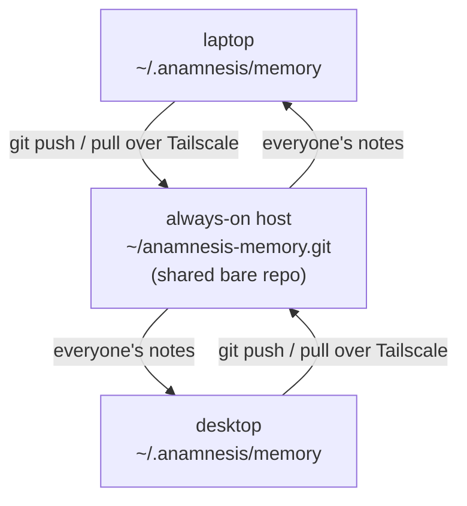

This is the whole point of Anamnesis: what Claude Code learns on your desktop is already there
when you open your laptop. This page walks you through wiring up two (or more) machines so your
memory follows you, no cloud account required.

## What you get

You write code on your desktop. Claude Code captures what it learned (your conventions, a fix that
worked, what you did today) as plain markdown notes. You close the lid, take the train to Amsterdam,
open your laptop, start a new Claude Code session, and that memory is already loaded. You make more
notes there. Back home, your desktop picks them up.

Three plain ideas make this work:

- **Your notes are a folder of markdown files** kept in a git repo at `~/.anamnesis/memory/`.
  Git is the same version-control tool developers use for code; here it just moves your notes
  between machines and keeps a full history.
- **They sync over Tailscale**, a free app that connects your own devices to each other on a
  private network (a "tailnet") so they can reach each other directly, wherever they are. Nothing
  goes through a third party's servers.
- **Only the markdown travels.** The search index (a SQLite database) is rebuilt fresh on each
  machine and never synced, so it can never get corrupted in transit.

<Callout type="info">
You only sync between machines **you own and are signed into**. There is no shared-with-other-people
mode. This is your memory, on your fleet.
</Callout>

## The shape of the setup

You pick one machine that is usually on (a desktop, a home server, a NAS) to hold the shared copy
of your notes. Every machine pushes its new notes there and pulls down everyone else's. That shared
copy is an empty git repo called a "bare repo" (bare just means it has no working files of its own,
it only stores history for others to sync against).



The always-on host can also be one of your everyday machines (your desktop can host the shared repo
and use it at the same time). You just need it reachable when your other machines want to sync.

## The Amsterdam walkthrough

You have a desktop at home and a laptop you take with you. Here is the full setup, start to finish.

### 1. Put every machine on the same tailnet

Install [Tailscale](https://tailscale.com/download) on each machine, then sign in to the **same
account** on every one of them:

```bash
tailscale up
```

Once they are all signed in, run `tailscale status` to see your machines and their names. Tailscale
gives each machine a stable name on your private network (its MagicDNS name), something like
`host.your-tailnet.ts.net`. Note the name of the machine you picked to host the shared repo; you
will use it in step 3.

```bash
tailscale status
```

### 2. Create the shared repo once, on the always-on host

Do this **one time only**, on the host machine (in the Amsterdam story, your home desktop):

```bash
git init --bare -b main ~/anamnesis-memory.git
```

That creates the empty shared repo your other machines will sync against. The `-b main` just names
its default branch `main`, which is what Anamnesis uses.

Then confirm your other machines can actually reach it over SSH. From your laptop, this should log
you in to the host:

```bash
ssh you@host.your-tailnet.ts.net
```

If it does not log you in, add your laptop's public SSH key to the host's
`~/.ssh/authorized_keys` and try again. (SSH is the standard secure way one machine logs in to
another; git uses it to move your notes.)

<Callout type="warn">
Replace `you` with your username on the host, and `host.your-tailnet.ts.net` with the MagicDNS name
from `tailscale status`. These are examples, not literal values.
</Callout>

### 3. Point each machine at the shared repo

On **every** machine (desktop and laptop both), run the installer with `--remote` set to the
SSH address of the shared repo:

```bash
uv run anamnesis init --remote 'you@host.your-tailnet.ts.net:anamnesis-memory.git'
```

`anamnesis init` is the one command that wires a machine up: it registers Anamnesis with Claude
Code, installs the session hooks that capture and load memory automatically, records your sync
remote, and runs a first sync. (For what `init` does in detail and the install steps that come
before it, see [Install and connect to Claude Code](./install).)

<Callout type="info">
The `uv run` prefix is how you run the command from a project checkout. The one-line install
(`uv tool install anamnesis-memory && anamnesis init`) is live on PyPI and installs an `anamnesis`
command that works the same way; once it is installed you can drop the `uv run` prefix and just run
`anamnesis init`. This page uses `uv run anamnesis init` throughout so the steps work from a checkout too.
</Callout>

The host machine, if you also use it day to day, can point at its own copy with a plain local path
instead of an SSH address:

```bash
uv run anamnesis init --remote "$HOME/anamnesis-memory.git"
```

<Callout type="info">
**Run `init` on every machine, every time.** The hooks and Claude Code settings live in a
per-machine file (`~/.claude/settings.json`) and are **not** synced. Only your markdown notes sync.
So each machine needs its own `init` run to install its own hooks and point at its own checkout.
</Callout>

### 4. The first sync seeds everything

The first machine to sync pushes its notes up to the shared repo. The next machine to sync pulls
them all down. After that, every new session keeps things current automatically: notes written on
the desktop become searchable on the laptop within a sync cycle, and the other way around.

When `init` finishes its first sync it prints a line like this so you can see it worked:

```text
sync: pushed=True pulled=0 (synced)
init: done. Start a new Claude Code session for the MCP server and hooks to take effect.
```

Start a fresh Claude Code session (the hooks and the Anamnesis tools only take effect in a new
session) and you are done. From here it is hands-off: each session loads relevant memory at the
start and saves a note at the end, syncing as it goes.

## Starting solo, adding a remote later

You do not have to set up sync on day one. If you only have one machine for now, install with
`--local-only`:

```bash
uv run anamnesis init --local-only
```

That gives you the full local experience (capture, search, the dashboard) with no remote. Your notes
are still a git repo on disk, just with nowhere to push yet. Each sync commits your changes locally
and reports `no remote configured` instead of pushing.

When you get a second machine, do the Amsterdam walkthrough above: create the bare repo on a host,
then **re-run `init` with `--remote`** on the machine that was solo:

```bash
uv run anamnesis init --remote 'you@host.your-tailnet.ts.net:anamnesis-memory.git'
```

Re-running `init` is safe. It is idempotent: it backs up your `settings.json`, never duplicates a
hook, and simply updates your remote. Nothing you have already captured is lost; your existing notes
get pushed up on the next sync. As the README puts it, "add a remote later by re-running `init`;
nothing else changes."

## What syncing actually does

Each sync runs the same three steps, in order: commit your local note changes, pull down everyone
else's (rebasing your changes on top), then push yours up. After pulling, it rebuilds the local
search index so the new notes are immediately searchable. This happens automatically in the
background when a session starts, and you can also trigger it yourself any time.

You never sync the database file. Only markdown moves between machines; the SQLite index is rebuilt
locally on each one. That is why a synced index can never corrupt your store.

### When two machines edit the same note

If the desktop and the laptop both change the **same note** before syncing, git cannot merge them
cleanly. Anamnesis does not guess and it does not silently throw one away. It keeps your local edits
in place, does not push, and tells you so:

```text
sync: pushed=False pulled=0 (conflict on rebase; kept local edits, did not push - resolve and re-sync)
```

You then resolve the conflict in that note (the usual git conflict markers) and sync again. Your
work is never dropped behind your back.

<Callout type="warn">
Conflicts only happen when the **same note** is edited in two places before syncing. Notes about
different projects, or new notes, never conflict. In normal day-to-day use across your own machines
this is rare.
</Callout>

## How each machine remembers its remote

The shared-repo address is different on each machine (your laptop reaches the host over SSH; the
host may use a local path). So the remote is stored **per machine**, not in your synced notes.
`anamnesis init` writes it to `~/.anamnesis/config.json`, which lives outside the synced notes
folder and never travels. Both Claude Code's background sync and the dashboard read it from there,
which is how they can push without you re-typing the address.

If you ever need to change the remote, just re-run `init --remote` with the new address.

## Quick reference

```bash
# once, on the always-on host
git init --bare -b main ~/anamnesis-memory.git

# on every machine, every time
tailscale up
uv run anamnesis init --remote 'you@host.your-tailnet.ts.net:anamnesis-memory.git'

# starting solo, no remote yet
uv run anamnesis init --local-only

# see what init would do, without changing anything
uv run anamnesis init --print
```

## Where to go next

- [Install and connect to Claude Code](./install) - the install steps and what `anamnesis init` sets up.
- [How it works](./how-it-works) - the moving parts in plain terms.
- [Sync internals](../internals/sync) - the git-over-Tailscale design in detail.
