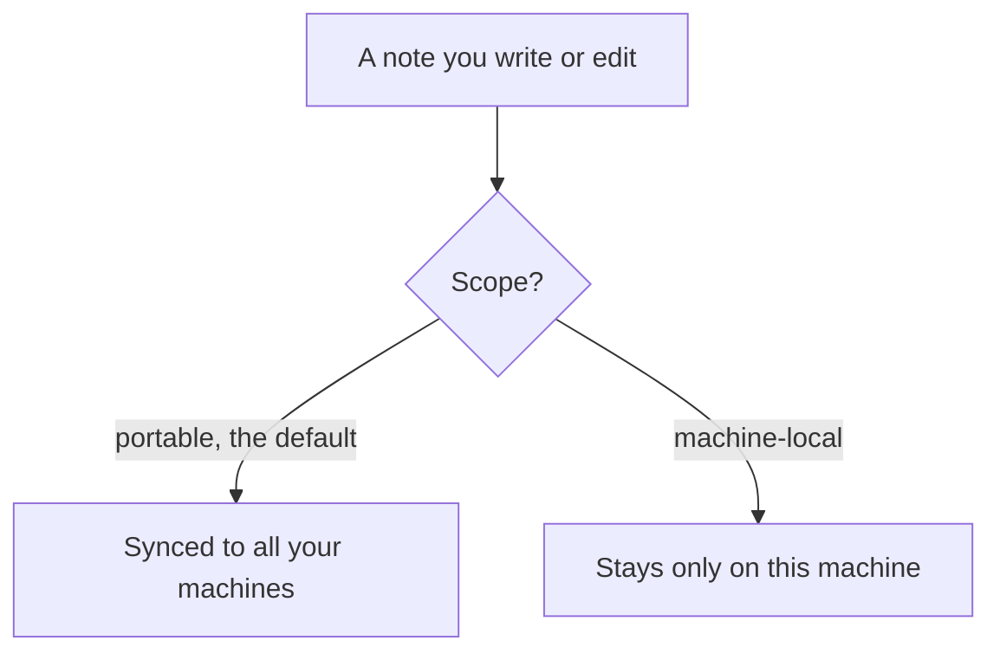
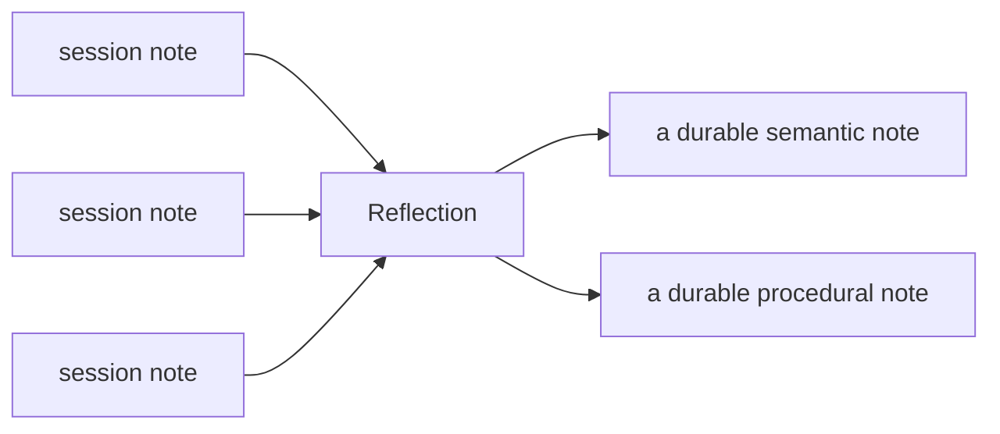

Anamnesis remembers things for you automatically, but it is still your memory. Over time you will want to fix
a note that came out wrong, delete one you no longer need, decide which notes follow you to your other
machines, and let Anamnesis fold a pile of small session notes into a few durable ones. This page covers all
of that in plain terms, with the exact commands and the one safety habit worth learning.

## The two kinds of notes: portable and machine-local

Every note has a **scope**, which is just a setting that decides whether the note travels to your other
machines.

- **Portable** notes are the default. They are synced: they get committed to git and show up on every machine
  you have connected. Use this for anything you would want to remember no matter where you are working:
  decisions, preferences, how-tos, and the distilled notes Anamnesis writes for you.
- **Machine-local** notes stay on the one machine where they were created. They are never pushed and never
  appear anywhere else. Use this for things that only make sense on this computer: a local file path, a quirk
  of this laptop's setup, a scratch note you do not want cluttering your other machines.

Under the hood this is simply where the file lives. Portable notes live in a folder that git syncs;
machine-local notes live in a separate folder that is never synced. You do not have to manage the files
yourself, but it explains the behavior: marking a note machine-local is how you keep it on one machine, and
marking it portable is how you share it everywhere.

<Callout type="info">
  If you are not sure, leave a note **portable**. Portable is the default, and a note you can see everywhere
  is more useful than one stranded on a single machine. Reach for machine-local only when you have a clear
  reason to keep something off your other computers.
</Callout>



You pick the scope in the dashboard's note editor (the **Scope** control, which toggles between `portable`
and `machine-local`). New notes default to `portable`.

## Editing and deleting notes in the dashboard

The dashboard is the friendly way to tidy up. Open a note and you can rewrite its title and body, change its
type, retag it, move it to a different project, and flip its scope. There is a Write/Preview toggle so you can
see how the Markdown will read before you save.

What happens when you save or delete a **portable** note:

- **Editing** rewrites the note's Markdown file, records the change in git history (so you can always look
  back at older versions), and rebuilds the search index so the edit is searchable right away.
- **Deleting** removes the note's Markdown file, records the removal in git history, and rebuilds the search
  index.
- If your edit changes a note's **type** or **scope**, the file moves to its new folder. The dashboard
  removes the old file and records that too, so history stays clean.

For **machine-local** notes, the dashboard makes the change on this machine only and does **not** record it in
git, because machine-local notes are never part of the synced history. It still rebuilds the search index so
the change shows up immediately.

In short: editing and deleting are safe and reversible through the dashboard. Because every portable change is
committed to git, you have a full history to fall back on, and you can browse it from the dashboard's history
view.

<Callout type="info">
  Saving an edit or deleting a portable note commits the change **locally** but does not push it to your other
  machines on its own. The change travels on the next sync. If you want it everywhere immediately, run a sync
  (see [Across machines](./across-machines)).
</Callout>

## Reflection: turning many small notes into a few good ones

Every time a Claude Code session ends, Anamnesis can write a short note about what happened (these are called
**episodic** notes, meaning "one note per session"). After a while you accumulate a lot of them, and the same
facts and preferences show up again and again across sessions.

**Reflection** is the cleanup pass for that. It reads a project's session notes, finds the things that keep
recurring, and writes a small number of durable notes: lasting facts, decisions, and preferences (called
**semantic** notes) and repeatable how-tos (called **procedural** notes). It merges repeated points into one
entry and drops the one-off chatter. The session notes it used are then marked as already reflected, so the
next reflection does not chew on them again.

The distilled notes are written as **portable** notes (so they sync everywhere), tagged `reflection` so you
can see where they came from, and given a lower confidence on purpose so they are easy to spot and review.
Reflection only adds notes; it never edits or deletes your existing ones. You stay in charge: review the new
notes in the dashboard afterward and keep, fix, or delete them.



### Reflection needs an LLM provider

Reflection asks a language model to do the distilling, so it only runs if you have told Anamnesis which model
to use. "LLM" just means a large language model: the same kind of AI that powers Claude. You configure this
with environment variables on the machine where you will run reflection:

- `ANAMNESIS_REFLECTION_PROVIDER` - a label for your provider (for example `deepseek` or `openai`). It is only
  used to tag the notes; if you leave it unset it defaults to `heuristic`.
- `ANAMNESIS_REFLECTION_MODEL` - the model name to call.
- `ANAMNESIS_REFLECTION_BASE_URL` - the base URL of an OpenAI-compatible chat completions endpoint. Anamnesis
  posts to this URL with `/chat/completions` appended.
- `ANAMNESIS_REFLECTION_API_KEY` - your API key. For convenience, `DEEPSEEK_API_KEY` or `OPENAI_API_KEY` are
  also accepted if this dedicated key is not set.

The **model**, **base URL**, and **key** are the three that matter: if any of them is missing, reflection has
no provider to call. When you try to apply it without all three, Anamnesis tells you exactly that and writes
nothing:

```text
reflect: no reflection provider configured (set ANAMNESIS_REFLECTION_PROVIDER + model/base-url/key)
```

<Callout type="info">
  Reflection only looks at a project once it has enough un-reflected session notes to be worth the effort. The
  default threshold is **5** notes per project. You can change it with the `ANAMNESIS_REFLECT_MIN_EPISODICS`
  environment variable. Projects under the threshold are simply skipped.
</Callout>

### Try it first as a dry run

Reflection is a dry run by default: without `--apply` it tells you what it *would* do and writes nothing. This
is the safe way to see whether you have enough to distill, and it does not need a provider configured:

```bash
anamnesis reflect
```

You will see one line per project that has enough notes, for example:

```text
reflect: my-project: 7 episodic(s) would be distilled (dry-run; pass --apply)
```

You can scope the dry run (or any reflect run) to a single project:

```bash
anamnesis reflect --project my-project
```

## The safe way to reflect

This is the one habit worth getting right. It is simple, and following it avoids the only way reflection can
disappoint you.

**Run reflection from your own terminal, and use plain `anamnesis reflect --apply`.**

```bash
anamnesis reflect --apply
```

When it finishes you will see something like:

```text
reflect: my-project: distilled 7 episodic(s) -> 3 note(s)
reflect: wrote 3 note(s); synced (pushed=True pulled=0)
```

Two reasons this is the safe path:

1. **Run it from your own terminal.** The provider settings above (your API key in particular) are set in your
   shell environment. Reflection can only reach the model from a place where those settings are loaded, which
   is your own terminal. That is also the natural place to read the output.

2. **Use `--apply`, not `--apply --no-sync`.** Plain `anamnesis reflect --apply` writes the new notes **and
   then syncs**, and the sync commits them to git in the same step. That commit is what makes the new notes
   permanent and safe. (If you have no remote configured, the sync still commits the notes locally, which is
   what protects them.)

<Callout type="warn">
  Avoid the `--no-sync` flag when you reflect. With `--no-sync`, reflection writes the new notes and rebuilds
  the search index, but it **does not commit them to git**. They sit on disk as uncommitted changes. If a
  routine sync runs before you commit them yourself (for example, the sync that happens automatically when
  your next Claude Code session ends), that sync rebases against your other machines first, and an uncommitted
  note can be discarded in the process. The freshly distilled notes are then gone. This is a real way to lose
  work, and it is entirely avoided by letting `anamnesis reflect --apply` commit for you.
</Callout>

If you have a reason to use `--no-sync` (for example you want to inspect the result before it goes anywhere),
commit it yourself right away so a later sync cannot wipe it. From your memory folder (the synced `memory/`
directory under your Anamnesis home, which defaults to `~/.anamnesis/memory`):

```bash
git add -A && git commit -m "reflect: distilled notes"
```

When you are ready to share the result with your other machines, run a normal sync:

```bash
anamnesis sync
```

### A note about the dashboard's Reflect button

The dashboard also has a Reflect action, and a review screen that lists the distilled notes so you can **Keep**
or **Delete** each one. This is a comfortable way to review reflections in the GUI.

There is one thing to know. Behind the scenes the dashboard's Reflect button runs the distilling step with
`--no-sync`, so the freshly distilled notes are written to disk but are **not committed on their own**. They
become permanent in one of two ordinary ways:

- When you **Keep** or **Delete** a reflected note in the review screen, the dashboard commits that change to
  git for you (Keep commits the note with a `reviewed` tag; Delete commits its removal).
- The next sync also commits whatever is on disk.

So the dashboard is safe as long as you actually go review the results. The risk is the same one as above: if
you run Reflect in the dashboard, leave the new notes unreviewed, and a sync runs in the background first, the
uncommitted notes can be lost. The simplest mental model stays the one in the previous section: when you want
reflected notes that are committed and on their way to your other machines, run `anamnesis reflect --apply`
from your terminal, or review them promptly in the dashboard.

## A quick tidy-up routine

A calm, low-effort habit:

1. Edit or delete any notes that are wrong or no longer useful, in the dashboard.
2. Decide scope as you go: leave it portable unless a note truly belongs to one machine.
3. When a project has built up session notes, run `anamnesis reflect` to preview, then
   `anamnesis reflect --apply` to distill and commit them.
4. Review the new distilled notes in the dashboard. Keep the good ones, fix or delete the rest.
5. Run `anamnesis sync` to make sure everything is on your other machines.

## Related

- [Browse your memory](./dashboard) - searching, the memory map, history, and the note editor.
- [Across machines](./across-machines) - how syncing works and how to run a sync.
- [What happens when you use it](./how-it-works) - session capture and auto-injection.
