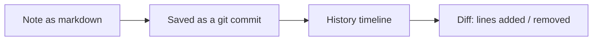
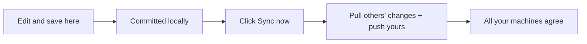

The dashboard is a visual window into everything Anamnesis remembers. Claude Code writes
plain markdown notes as it works, and the dashboard lets you read, search, edit, and
explore them in your browser. Nothing here owns your data: the markdown files on your
machine are the real memory, and the dashboard is just a friendly view over them.

This page walks through launching it and everything you can do once it is open.

## Launch it

The dashboard lives in the `dashboard/` folder of the repo. From a clone, run:

```bash
cd dashboard
npm install
npm run dev
```

Then open the address it prints:

```text
http://localhost:3000
```

That is it. The first `npm install` can take a minute; after that, `npm run dev` starts in
a few seconds. Leave it running in a terminal tab and refresh the browser whenever you want
the latest view.

<Callout type="info">
You need `git`, `uv`, `python`, and Node 20 available on the machine, because the dashboard
reads your local memory store and shells out to the `anamnesis` command line for writes. The
dashboard reads the same store your other tools use (markdown plus a derived search index),
so it does not need its own copy of anything.
</Callout>

### Where it reads from

By default the dashboard reads the store at `~/.anamnesis`. If your memory lives elsewhere,
point it there with an environment variable before starting:

```bash
ANAMNESIS_HOME=/path/to/your/store npm run dev
```

A few other settings exist for advanced setups (for example which command line binary to
call for writes, or which git remote to sync against). You rarely need them; the defaults
work for a standard install. The full list of environment variables lives in the dashboard
README.

### Run it as a real app (optional)

For day-to-day use you can also build it once and serve it, instead of running the dev
server:

```bash
npm run build
npm run start
```

This still opens at `http://localhost:3000`. There is also a packaged desktop app you can
build, and a phone-and-laptop option over your private network, both covered at the end of
this page.

## Get your bearings

The dashboard has one layout: a sidebar on the left and a top bar across the top.

The **sidebar** holds a **New note** button and links to the main views:

- **Overview** (the home screen) - the 3D memory map and your most recent notes.
- **Browse** - the searchable list of every note.
- **Review** - a reflection checkpoint for notes Claude Code has proposed.
- **History** - the timeline of every change to your memory.
- **Machines** - every computer that has synced into your memory.

Below those links the sidebar lists your **projects** with a count next to each. Click a
project to jump straight to Browse filtered to just that project.

The **top bar** holds a **Search memory...** button, a small sync status pill, a sync
button, and a light/dark theme toggle. On a narrow screen the sidebar collapses into a
menu you open from the top bar.

## Find what you need: search and the command palette

Two ways to find a note.

**Full-text search.** Open the **Browse** view from the sidebar. It lists every note and
searches the full text (titles, bodies, and tags), ranking the best matches first. You can
also click a project in the sidebar to filter Browse down to that project.

**The command palette.** Press `Cmd-K` (or `Ctrl-K` on Windows and Linux) from anywhere. A
search box pops up near the top of the screen. Start typing and it searches your memory as
you go, showing up to twelve matches. When the box is empty it instead lists quick jumps
under a "Go to" heading, so you can hop to Overview, Browse memory, History, Machines, or
start a new note without touching the mouse.

```text
Search memory or jump to a view...
```

Press `Esc` to close it. The **Search memory...** button in the top bar (it shows a small
`⌘K` hint) opens the same palette if you would rather click than press a key.

## Explore the memory map

The **Overview** page (the home screen, the `/` route) shows a 3D **memory map**: a gentle,
rotating cloud of your notes that you can drag to spin and scroll to zoom.

- Each small point is a note. Its color tells you its type (semantic, procedural, or
  episodic).
- The larger glowing points are **hubs**, one per project, that the notes cluster around.
  Each hub is labelled with its project name and is sized by how many notes it holds. Notes
  that share tags are linked with faint lines.
- It drifts slowly on its own. You do not have to do anything to watch it move; it pauses
  the idle spin while you are dragging, hovering, or inspecting a note.

**Filter by type.** In the top-left corner are three chips, one each for **semantic**,
**procedural**, and **episodic**, with a count on each. Click a chip to dim and hide that
type, and click again to bring it back.

**Click a point to open a detail card.** Clicking a note brings up a card on the right with
its type, its title, its project, a short excerpt, and up to four of its tags, plus an
**Open note** button to read the full thing. Clicking a hub shows the project, how many
notes are anchored to it, and a **Browse region** button that filters Browse to that
project. Close the card with the X in its corner.

**Move around.** Three controls sit in the bottom-left corner: **zoom out**, **Reset**, and
**zoom in**. Reset returns the view to its default angle and zoom.

<Callout type="info">
The map is a way to wander and rediscover, not a precise diagram. If you want to find one
specific thing, search is faster. If you want to get a feel for what has accumulated and
stumble onto forgotten notes, the map is the place.
</Callout>

<Callout type="warn">
The 3D map needs WebGL. If your browser or machine cannot run WebGL, the map area shows a
short message instead, and your memory is still fully browsable from the lists and search.
</Callout>

## Read a note

Click any note (from Browse, the map, search results, or the recent list on Overview) to
open it. You see the note rendered as clean markdown, along with all of its metadata: its
title, type, project, tags, and timestamps. From a note you can jump to **Edit** it or to
its **History**, using the buttons at the top of the note.

## See the history and diffs

Anamnesis keeps every version of every note, because the memory folder is a git repository
(git is a tool that records the full history of changes to files). The dashboard turns that
history into something readable.

- The **History** view (in the sidebar) shows a single timeline of every change across all
  of your memory, newest first, as a commit graph.
- Each note also has its own **History** page, reachable from the note, showing just that
  note's versions.
- Click any point in the history to see the **diff**: the exact lines that were added and
  removed in that change, in red and green.

This means you can always answer "what did this note used to say, and when did it change?"
without leaving the browser.



## See your machines

If you use Anamnesis on more than one computer, memory syncs between them. The **Machines**
view lists every machine that has contributed to your memory, with the last time each one
synced and a small status badge. It is worked out from who authored each change, so you do
not configure anything: a machine shows up here once it has synced in. This is also where
sync conflicts surface if two machines edited the same note and the most recent write won.

## Create and edit notes

You can write memory by hand, not just let Claude Code do it.

**New note.** Click **New note** at the top of the sidebar (or pick it from the command
palette). Fill in:

- a **title** (a short, recall-friendly line; this is the only required field),
- a **type**: `procedural`, `semantic`, or `episodic` (the default is `semantic`),
- a **project** (the default is `global`; the field suggests projects you already use),
- a **scope**: `portable` or `machine-local` (the default is `portable`),
- **tags** (comma separated),
- and the **body** in markdown.

The body has **Write** and **Preview** tabs, so you can flip to a rendered preview of your
markdown before saving. When you finish, click **Create note**.

**Edit a note.** Open any note and click **Edit**. It is the same form, pre-filled, and the
button reads **Save changes**.

When you save, the dashboard writes the markdown file in the exact store format, records it
as a git commit on your machine, and refreshes the search index so the note shows up
immediately. A small toast confirms the save and shows the commit it created.

<Callout type="warn">
Saving commits your change locally but does not reach your other machines on its own. That
is deliberate: saving never does surprise network activity. To share a note across
machines, use the Sync button below.
</Callout>

## Sync across machines

Syncing is one explicit click. In the top bar there is a small status pill (showing whether
your memory is up to date) and a circular **Sync now** button next to it. Hover the button
and its tooltip reads "Sync now (pull + push)".

Click it and the dashboard pulls in changes from your other machines and pushes your local
changes out, in one step.

- If it works, a toast tells you what happened, for example "pushed local edits" or
  "pulled 3".
- If two machines changed the same note, the most recent change wins, and the leftover
  conflict is surfaced for you to resolve in the memory repo and sync again.
- If it cannot reach the command line tool, it tells you the sync failed ("Could not reach
  the anamnesis CLI.").

The status pill refreshes itself roughly every twenty seconds, so it reflects reality
without you clicking.



<Callout type="info">
Sync only does anything if a git remote is configured for your store. Without one, saving
still works and still keeps full local history; there is just nowhere to push to yet.
Setting up cross-machine sync is covered in the sync guide.
</Callout>

## Use it on your phone (interim self-host)

You can run one always-on copy of the dashboard on a machine you keep on (a "hub") and reach
it from your phone and laptop as an installable app over your private Tailscale network (a
mesh that privately connects your own devices). At a high level:

1. Build the server on the hub: `npm install && npm run build`.
2. Run it as a background service and publish it on your tailnet with
   `tailscale serve --bg 3000` (this needs HTTPS certificates enabled in your Tailscale
   admin console).
3. On iPhone, open the tailnet URL in Safari and use Share, then Add to Home Screen. On a
   laptop, open it in Chrome or Edge and use Install app from the address bar.

The server binds to `127.0.0.1` only, so it is never on your local network or the public
internet; the only off-machine access is through your authenticated tailnet. Do not use
`tailscale funnel`, which would expose it publicly. The full step-by-step, including the
systemd service and how to update it, is in `dashboard/deploy/README.md`.

<Callout type="warn">
This phone-and-laptop setup is an interim, self-hosted convenience, not a polished product.
Treat it as a way to glance at your memory on the go, and expect to tend the service
yourself (updating it with `git pull && npm run build` and restarting it).
</Callout>

## A desktop app (optional)

If you prefer a standalone app over a browser tab, you can build one:

```bash
npm run desktop:build
```

On Linux this produces an `.AppImage` and a `.deb` under `dist/`. It runs its own local
server against this machine's store and works offline for reading. macOS and Windows builds
are produced by a GitHub Actions workflow and ship unsigned and unverified for now, until
that hardware is available to verify them.

## Where to go next

- [Install and connect to Claude Code](./install) - getting Anamnesis set up in the first place.
- [Sync internals](../internals/sync) - how cross-machine sync works under the hood.
