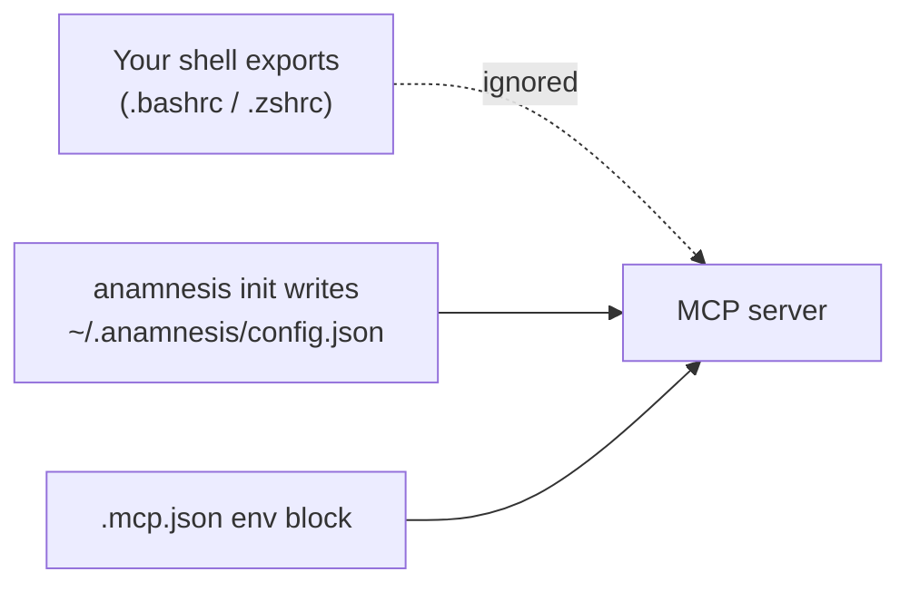
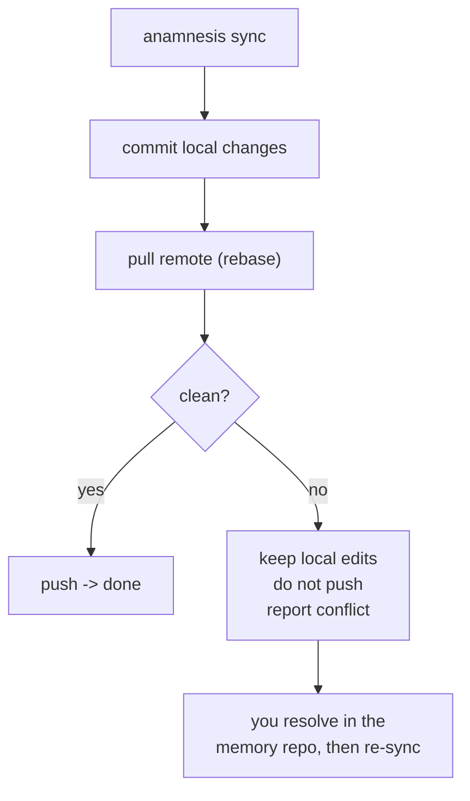

This page collects the questions people hit most in their first hour with Anamnesis, plus the
handful of gotchas that have a clear fix. Each answer tells you what to type and what you should
see. If something here does not match what you are seeing, the [How it works](./how-it-works) and
[Install](./install) pages have the longer story.

A few words you will see below, defined once:

- **MCP server**: the small program Claude Code talks to so it can read and write your memory. You
  do not run it by hand; Claude Code starts it for you.
- **Hooks**: little actions Claude Code runs automatically at the start and end of a session (to
  pull in your relevant memory, and to save a note about what you just did).
- **The store**: the folder your memory lives in, by default `~/.anamnesis`. It holds your notes as
  markdown files plus a search index.

## Setup and first run

### Nothing happens after I install. Does Claude Code see my memory?

Two things have to be true before Claude Code can use Anamnesis:

1. You ran the one-command setup, `anamnesis init`, which connects everything up.
2. You started a **new** Claude Code session afterwards (see the next question).

The fastest way to confirm the setup itself worked is to ask for status from the command line:

```bash
uv run anamnesis status
```

You should see something like:

```
store: /home/you/.anamnesis
notes: 12  by_type={'episodic': 7, 'semantic': 3, 'procedural': 2}  by_scope={'portable': 12}
sync: initialized=True remote=you@host.your-tailnet.ts.net:anamnesis-memory.git head=a1b2c3d dirty=False (ok)
```

If `notes` is `0` and you are brand new, that is fine: memory fills in as you work. If `sync` says
`initialized=False`, re-run `anamnesis init` (it is safe to run again).

### Do I have to restart Claude Code after running `anamnesis init`?

Yes. Claude Code reads its MCP servers and hooks when a session starts, so any session that was
already open will not pick up Anamnesis. Quit Claude Code and start it again (open a new session).

<Callout type="warn">
This is the single most common "it is not working" cause. If you just ran `anamnesis init`, close
your current Claude Code session and open a fresh one before testing.
</Callout>

After restarting, you can confirm the memory tools are loaded by asking Claude something like "what
is in my memory about this project?" or by checking that the `memory_search`, `memory_list`, and
`memory_status` tools appear in Claude Code's tool list.

### Why do my `export ANAMNESIS_...` shell variables get ignored?

Because Claude Code does **not** start the MCP server with your shell's environment. It launches it
with a filtered environment, so anything you `export` in your terminal (or put in `.bashrc` /
`.zshrc`) is invisible to the server. This trips up almost everyone once.

There are two correct places to set Anamnesis configuration:

1. **Let `anamnesis init` do it.** The recommended path. `init` writes your settings to a small
   per-machine file at `~/.anamnesis/config.json`, and both the MCP server and the dashboard read
   it. You do not have to touch any environment variables.

2. **Set them in the MCP config's `"env"` block.** If you are wiring things up by hand, put the
   variables inside the `"env"` block of the server entry in your `.mcp.json`, not in your shell:

   ```json
   {
     "mcpServers": {
       "anamnesis": {
         "command": "uv",
         "args": ["run", "--project", "server", "anamnesis"],
         "env": {
           "ANAMNESIS_HOME": "/home/you/.anamnesis",
           "ANAMNESIS_MACHINE_ID": "desktop-amsterdam",
           "ANAMNESIS_GIT_REMOTE": "you@host.your-tailnet.ts.net:anamnesis-memory.git"
         }
       }
     }
   }
   ```

The only three variables that matter for normal use are:

| Variable | Default | What it does |
| --- | --- | --- |
| `ANAMNESIS_HOME` | `~/.anamnesis` | Where your notes and search index live. |
| `ANAMNESIS_MACHINE_ID` | this computer's hostname | The name stamped on notes you write, so you can tell which machine wrote what. |
| `ANAMNESIS_GIT_REMOTE` | unset | The sync address of your shared repo. Unset means commit locally only, no sync. |



<Callout type="info">
Keep your real `ANAMNESIS_GIT_REMOTE` out of any config you commit to a public repo. Use the
per-machine `~/.anamnesis/config.json` that `init` writes, or a user-scoped MCP config.
</Callout>

### I want to see what `init` will do before it changes anything.

Run it with `--print`. This is a dry run: it shows the full plan (which MCP entry, which hooks,
which store directory, which remote) and writes nothing.

```bash
uv run anamnesis init --print
```

When you are happy, run it for real:

```bash
uv run anamnesis init            # interactive: confirm store dir, machine id, remote
```

`init` is safe to run more than once. It backs up your Claude Code `settings.json` before changing
it and never installs a hook twice, so re-running to fix a setting or add a remote later does no
harm.

### I am only on one machine. Do I still set up sync?

No. Run:

```bash
uv run anamnesis init --local-only
```

Everything works locally and your notes are still version-controlled on disk. When you add a second
machine later, just re-run `init` with a remote and nothing else changes:

```bash
uv run anamnesis init --remote 'you@host.your-tailnet.ts.net:anamnesis-memory.git'
```

## The typing_extensions crash

### `anamnesis init` crashes with an error about `typing_extensions`. What is wrong?

This is a known, fully understood issue with a simple fix. One of Anamnesis's dependencies
(`python-ulid`) imports `typing_extensions` even on modern Python, but does not always declare it,
so a minimal install can be missing it and crash on startup.

It only happens in two situations:

- You are on a **stale checkout** of the repo from before the fix landed.
- You installed the broken **0.0.1** package.

The fix is to use version **0.0.2 or newer**, which declares `typing-extensions>=4` as a dependency,
and to install with **Python 3.12**:

```bash
cd server
uv venv --python 3.12
uv pip install -e ".[mcp,dev]"
```

If you are on a stale checkout, pull the latest first:

```bash
git pull
```

To confirm you are on a fixed version, check the package version:

```bash
uv run anamnesis --help    # should run without a typing_extensions error
```

<Callout type="info">
The published package name is `anamnesis-memory`, but the command it installs is still `anamnesis`.
The one-line install (`uv tool install anamnesis-memory && anamnesis init`) only works once the
package is published to PyPI; until then, install from the repo as shown above.
</Callout>

## Reflection and provider settings

### I ran `anamnesis reflect` and it wrote nothing. Why?

Reflection is the optional pass that reads your past session notes for a project and distills them
into durable, reusable notes. It uses a language model, and **it writes nothing unless you have
configured a provider for it.** Two things to know:

1. **By default `reflect` is a dry run.** Without `--apply`, it only reports what it would do:

   ```bash
   uv run anamnesis reflect --project my-app
   ```
   ```
   reflect: my-app: 7 episodic(s) would be distilled (dry-run; pass --apply)
   ```

2. **`--apply` needs a provider configured.** If you pass `--apply` but no model is set up, it tells
   you and exits without writing:

   ```bash
   uv run anamnesis reflect --project my-app --apply
   ```
   ```
   reflect: no reflection provider configured (set ANAMNESIS_REFLECTION_PROVIDER + model/base-url/key)
   ```

To enable it, set all of: the provider, the model id, the OpenAI-compatible base URL, and an API
key. These go in your environment when you run the command by hand (this is a manual command, not
the MCP server). For example, for an OpenAI-compatible endpoint:

```bash
export ANAMNESIS_REFLECTION_PROVIDER=deepseek
export ANAMNESIS_REFLECTION_MODEL=deepseek-chat
export ANAMNESIS_REFLECTION_BASE_URL=https://api.deepseek.com
export ANAMNESIS_REFLECTION_API_KEY=sk-...
uv run anamnesis reflect --project my-app --apply
```

A project also has to have enough material to be worth distilling: at least 5 un-reflected session
notes by default (set `ANAMNESIS_REFLECT_MIN_EPISODICS` to change it). Projects under that threshold
are quietly skipped.

<Callout type="info">
You never need a provider for everyday memory. The note Anamnesis saves at the end of each session
is built deterministically with no network call and no API key. Reflection is an extra, opt-in
"clean up and summarize" step.
</Callout>

### Does my session-end summary cost money or need an API key?

No. By default the end-of-session note is built deterministically (the heuristic builder), entirely
on your machine, with no API key and no network call. The summarization model is a swappable config
value for people who want to plug a model in later, but it is off until you set one.

## Sync and conflicts

### Two machines edited the same note. Which one wins?

Neither is silently overwritten. Anamnesis syncs your memory as a git repository, and on a genuine
conflict (the same note changed differently on two machines) it does the safe thing: it **keeps your
local edits, does not push, and tells you** to resolve it. It never auto-merges or drops a side.

You will see this in the sync output:

```bash
uv run anamnesis sync
```
```
sync: pushed=False pulled=0 conflicted=True head=a1b2c3d (conflict on rebase; kept local edits, did not push - resolve and re-sync)
```



When this happens, Anamnesis has already aborted the failed rebase for you, so your repo is back in a
clean state with your local edits intact (nothing is half-applied and there is no rebase to finish).
To bring the two sides together, pull the remote in, resolve the conflicting note, commit, and sync
again:

```bash
cd ~/.anamnesis/memory
git status                       # confirm the tree is clean, your edits are present
git pull --no-rebase origin main # merge the remote in; git marks the conflicting note
# open the conflicting note, keep the wording you want, remove the <<<< ==== >>>> markers, then:
git add -A
git commit
uv run anamnesis sync            # pushes the merged result to your other machines
```

In practice conflicts are rare because each machine usually writes its own session notes (each note
has its own file), but when they do happen your work is never thrown away.

### Should I sync the search index or the database file across machines?

No, and Anamnesis will not do it for you. **Only the markdown notes sync.** The search index
(`index.db`) lives outside the synced folder and is rebuilt locally on every machine after each
pull. This is deliberate: syncing a live database file through git or a cloud folder is exactly what
corrupts it. So a note written on your desktop becomes searchable on your laptop within one sync
cycle, and the database never travels.

The layout on disk makes this clear:

```
~/.anamnesis/
├── memory/      # markdown notes - the source of truth (this is the git repo that syncs)
│   └── <type>/<id>.md
└── index.db     # search index - rebuilt locally, never synced
```

If your search results look stale on one machine, you can rebuild the index without touching git:

```bash
uv run anamnesis reindex
```
```
reindex: indexed 12 note(s)
```

## A few more quick answers

### What is the difference between `sync` and `--no-sync`?

`anamnesis sync` does the full cross-machine round trip: commit your local changes, pull the remote
with rebase, push, and rebuild the index. Several commands also accept a `--no-sync` flag (for
example `capture`, `reflect`, `migrate`). With `--no-sync`, the command writes its changes and
rebuilds the local index, but it does **not** commit or push.

<Callout type="warn">
`--no-sync` does not commit, so its output is uncommitted working-tree changes. If a background sync
runs before you commit, those changes can be lost. If you use `--no-sync`, either re-run with a sync
afterward or commit the changes in `~/.anamnesis/memory` yourself.
</Callout>

### How do I check sync status at a glance?

```bash
uv run anamnesis status
```

`initialized=True` means the store is a git repo, `remote=` shows your sync address (or `None` for
local-only), `dirty=True` means there are uncommitted changes, and `head` is the current commit.

### Where do I go next?

- [Install and connect to Claude Code](./install) - the full setup walkthrough.
- [Across machines](./across-machines) - setting up Tailscale and the shared repo.
- [How it works](./how-it-works) - the plain-language tour of the moving parts.
- [Curating your memory](./curating) - reflect, dedup, and keeping notes tidy.
