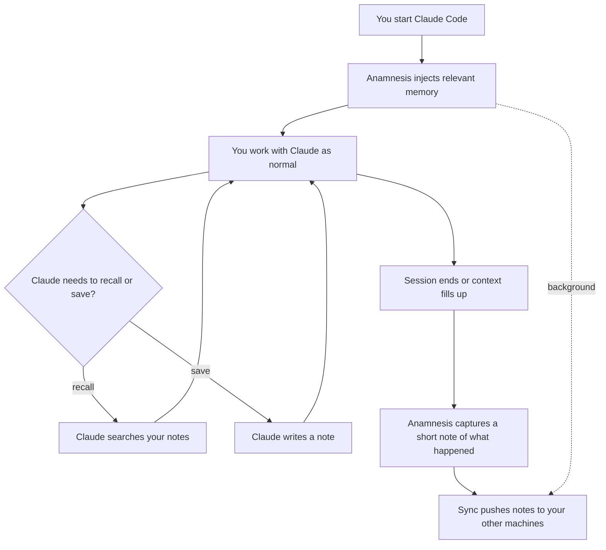

The short version: once Anamnesis is set up, you keep using Claude Code exactly as you
always have. Memory happens around you. At the start of a session Anamnesis hands Claude
the notes that matter for the project you are in; during the session Claude can look
things up and save what it learns; when the session ends, what you did gets written down
as a short note; and all of it quietly syncs to your other machines.

You usually do nothing. This page walks through each moment so you know what to expect
and what the occasional visible bits mean.

<Callout type="info">
A "note" is just a small markdown file: a title, a short body, and a few tags. You can
read every one of them by hand, search them in the [dashboard](./dashboard), or let
Claude pull them up for you. Nothing is hidden in a binary blob.
</Callout>

## The shape of a session



The three things that happen automatically are **inject** (at the start), **capture**
(at the end), and **sync** (quietly, in the background). You can ignore all three. The
rest of this page explains them in case you are curious or something looks unexpected.

## At the start: relevant memory is injected

The moment a session starts, resumes, or you run `/clear`, Anamnesis selects the notes
that are most relevant to the project you are working in and hands them to Claude as
context. You see them as a block at the top of the conversation that begins with this
exact heading:

```
# Anamnesis memory (auto-injected)
```

That is your cue that Claude started this session already knowing the relevant history,
instead of from zero.

### What gets picked

Anamnesis does not dump your whole memory into the session. It chooses up to eight
project notes, plus all of your global notes (preferences that apply everywhere). The
selection favors:

- your **durable** notes for this project (verified how-tos, decisions, facts, and
  conventions), most-recently-updated first, and
- up to **two** recent session summaries, so Claude has a "here is what you last did"
  thread to pick up from.

Notes you have superseded are left out (they are still browsable in the dashboard), and
session summaries that have already been folded into durable notes are dropped so the
same thing is not said twice.

### What the block looks like

A realistic injected block for a project might look like this:

```md
# Anamnesis memory (auto-injected)

## [semantic] Prefer pnpm over npm in this repo
_project: github.com/you/storefront | origin: desktop_

The lockfile is pnpm-lock.yaml. Use `pnpm install` / `pnpm add`, never npm,
or CI fails on a mismatched lockfile.

## [procedural] How to run the integration tests locally
_project: github.com/you/storefront | origin: desktop_

Start the test database with `docker compose up -d db`, then
`pnpm test:integration`. The suite expects DATABASE_URL on localhost:5433.

## [episodic] add a Stripe webhook handler for checkout.session.completed
_project: github.com/you/storefront | origin: laptop_

**Ask:** add a Stripe webhook handler for checkout.session.completed

**Branch:** feat/checkout-webhook
**Files touched (2):**
- src/app/api/webhooks/stripe/route.ts
- src/lib/orders.ts

**Outcome:** Handler verifies the signature and marks the order paid. Still
need to add a test for the duplicate-event case.
```

The `[semantic]`, `[procedural]`, and `[episodic]` tags are the three kinds of note,
explained [below](#the-three-kinds-of-note). The `_project: ... | origin: ..._` line
tells you which project the note belongs to and which of your machines first wrote it.

<Callout type="info">
If a note was not written by you by hand (for example a session summary, or a note from
a reflection model), the metadata line also shows its source and a confidence score, for
example `source: session-end (confidence 0.8)`. Notes you wrote yourself show no such
tag.
</Callout>

If there are no relevant notes yet (a brand-new project, or a fresh install), the block
is simply not shown. That is normal, not an error. It fills in as you work.

## During the session: Claude can recall and save

While you work, Claude can reach into your memory on its own through a small set of
tools. You do not call these; Claude does, when it helps. Read-only lookups are safe to
auto-approve, so they happen without interrupting you:

- **search** your notes by keyword (for example, "how did we set up auth here?"),
- **list** your notes for a project,
- **check status** (how many notes you have, where the store lives, sync state).

When Claude learns something worth keeping, it can also **save a note** and **run a
sync**. Saving and syncing change your store, so by default Claude asks before doing
them, the same way it asks before editing a file.

If you ever see a tool-approval prompt, these are the five tools, named exactly as they
appear: `memory_search`, `memory_list`, and `memory_status` are the read-only lookups
(safe to auto-approve), while `memory_write` (save a note) and `memory_sync` (sync now)
are the two that change your store.

You can also just ask in plain English. Some examples of things that work:

```text
Remember that we deploy this project with `make release`, not from CI.
```

```text
What did I decide about the database migration strategy last week?
```

```text
Save a note: the staging API key lives in 1Password under "storefront-staging".
```

Claude turns the first and third into saved notes and answers the middle one by searching
what you already have.

<Callout type="info">
A note can be **portable** (the default; it syncs to your other machines) or
**machine-local** (it stays only on the machine where it was written and never syncs).
If something is specific to one laptop, you can ask for it to be kept machine-local.
</Callout>

## The three kinds of note

Every note is one of three kinds. You rarely have to think about which is which (Claude
picks), but it helps to recognize them in the injected block and the dashboard:

<Cards>
  <Card title="What happened (episodic)">
    A short record of a session: the ask, the branch, files touched, and how it turned
    out. These are usually written automatically when a session ends.
  </Card>
  <Card title="Facts and preferences (semantic)">
    Stable facts, conventions, and the way you like things done. "Use pnpm here." "The
    staging URL is X." These tend to stay true over time.
  </Card>
  <Card title="How-tos (procedural)">
    Verified steps, decisions, and fixes that worked. "Run the tests like this." "We
    chose Postgres over SQLite because Y."
  </Card>
</Cards>

## At the end: your session is captured

When a session ends, Anamnesis reads the transcript and writes a single short "what
happened" note (an episodic note) so the next session, on any of your machines, can pick
up where you left off. That note records the ask you opened with, the git branch, the
files that were edited, and the last outcome. It is the kind of note you saw in the
injected block above.

It also captures the same kind of note **before the context window fills up and gets
compacted**, so a long session does not lose its history partway through.

Anamnesis skips sessions that are not worth remembering. If you only ran a slash command,
or barely did anything, no note is written, and you will simply not see one. Nothing to
clean up.

<Callout type="info">
By default the summary is written **deterministically** from the transcript, so it needs
no API key and costs nothing: it is the ask, the branch, the files, and the outcome,
quoted from your session. A smarter summarizer (a reflection model) is a swappable
option you can turn on later, but it is **not** on by default.
</Callout>

## In the background: sync keeps your machines in step

When a session starts, Anamnesis also kicks off a sync in the background (it does not
block you), and it syncs again after capturing the end-of-session note. A sync commits
your local notes, pulls anything new from your other machines, and pushes yours up, then
rebuilds the local search index so the new notes are immediately searchable.

The practical effect: a note written on your desktop is on your laptop by the next
session, with no manual step.

<Callout type="warn">
If you edited the *same* note differently on two machines, sync will not silently throw
one away. It surfaces the clash as a normal git conflict for you to resolve, and keeps
your local edits in the meantime. This is rare in day-to-day use. The deep dive is in
[How sync works](../internals/sync).
</Callout>

Only your markdown notes travel between machines. The search index (a SQLite database) is
rebuilt fresh on each machine and is never synced, which is what keeps it from ever
corrupting.

## So what do you actually do?

Most of the time, nothing. You open Claude Code and work. The honest summary:

| Moment | What happens | What you do |
| --- | --- | --- |
| Session start | Relevant memory is injected; background sync starts | Nothing (you may see the auto-injected block) |
| While working | Claude searches and lists notes as needed | Nothing, or ask it to remember / recall something |
| Claude wants to save or sync | It asks first | Approve, the same as approving a file edit |
| Session end / context fill | A short note of what happened is captured and synced | Nothing |

The one habit worth building is occasional curating: glancing at the dashboard now and
then to fix or retire a note that has gone stale. That is covered in
[Curating your memory](./curating).

## Where to go next

- [Install and set up](./install) - get Anamnesis running and wire up the hooks that
  make all of the above automatic.
- [Across machines](./across-machines) - put your machines on one Tailscale network and
  point them at a shared repo.
- [The dashboard](./dashboard) - browse, search, and edit every note by hand.
- [Curating your memory](./curating) - keep notes accurate over time.
- [How injection and capture work](../internals/capture-and-injection) - the internals,
  if you want them.
