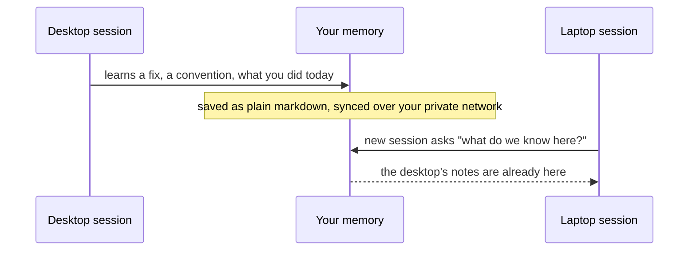
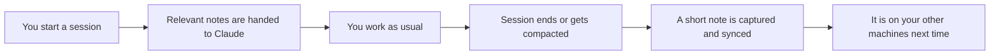

Anamnesis is a memory for [Claude Code](https://claude.com/claude-code). It remembers what you and Claude
worked out together, keeps it after you close the session, and carries it to the other computers you own. The
name is Greek: *anamnesis* means recollection, the act of calling knowledge back to mind.

This page explains the problem it solves, what you actually get, and why you would want it. It stays at the
level of "what you do" and "what you see". If you want to know how the parts fit together under the hood, that
lives in the [internals](../internals/architecture) section.

## The problem

Claude Code is great in the moment, but its memory has two holes.

**It forgets between sessions.** You spend an afternoon teaching it your project: how the code is laid out,
which fix finally worked, the convention you always want followed. You close the terminal. Tomorrow you open a
new session and it is back to zero. You explain the same things again.

**It does not follow you across machines.** Maybe the desktop session learned all of that. But you pick up
your laptop on the train, and that knowledge never made the trip. Each machine starts fresh, and the work you
did on one never reaches the other.

People try to patch the second hole by syncing Claude Code's local database through a cloud folder like
Dropbox or iCloud. That tends to corrupt the database, because two machines writing the same file at once is
exactly what those folders are bad at. So the common workaround quietly makes things worse.

<Callout type="info">
Anamnesis is for syncing across *your own* machines, the desktop and laptop and home server you already own.
It is not a shared team brain or a cloud account. Your memory stays on your hardware.
</Callout>

## The promise

A memory that persists and follows you.

What Claude learns in one session is still there in the next one. What it learns on your desktop is already on
your laptop the next time you sit down there. You stop re-explaining your project, and you stop losing context
just because you switched machines.



## What you actually get

In plain terms, Anamnesis gives you three things.

### 1. Plain notes that you own

Every durable thing Claude learns becomes a plain markdown note: a conventions file for a project, a record of
an architecture decision, a short summary of what a session accomplished. Markdown is just text. You can open
it in any editor, read it, fix a typo, or delete it. Nothing is locked inside a proprietary format or a vendor
cloud. The notes live in a folder on your computer at `~/.anamnesis`.

Because the notes are version-controlled (they live in a git repository), you also get history for free: who
wrote what, on which machine, and when. Nothing is silently overwritten.

### 2. Sync across your own computers, over your own private network

Your notes stay in step across every machine you own. A note written during your desktop session is searchable
in your laptop session within a sync cycle. The sync runs over a private network you set up between your own
devices using [Tailscale](https://tailscale.com) (a tool that links your machines into one private mesh, with
no public servers in the middle). You do not paste API keys into a third party, and your notes are not stored
in someone else's cloud.

If you only have one machine right now, that is fine. You can run it single-machine and add a second computer
later without redoing anything. See [Working across machines](./across-machines) for the setup.

### 3. A dashboard to browse it all

There is a small web dashboard, like a friendly viewer for your memory, where you can:

- read and full-text search every note,
- edit a note's markdown and see the full history of each one,
- see your whole fleet of machines: which machine wrote what, and when it last synced.

Edits you make in the dashboard write straight back to the markdown, so the dashboard and Claude always see the
same notes. See the [Dashboard tour](./dashboard) for what each screen does.

## How it feels day to day

You mostly do nothing, and that is the point. Once it is set up, a normal session looks like this.



- **At the start of a session**, Claude is quietly handed the notes that matter for what you are working on:
  your global preferences, the project's durable notes, and a couple of recent session summaries. You did not
  have to remind it.
- **At the end of a session** (and before Claude compacts a long conversation), a short note is captured from
  what happened: what you asked for, which files were touched, how it turned out. It is synced so it reaches
  your other machines by your next session.

This automatic behavior is driven by Claude Code's lifecycle hooks (small actions Claude Code runs at the
start and end of a session). You can read more in [What happens when you use it](./how-it-works).

You can also ask Claude directly, in plain language, things like "what do we know about this project?" or
"remember that we always use the configs-over-scripts approach here." Anamnesis is exposed to Claude Code as a
set of memory tools, so it can search, list, write, and sync your memory on your behalf. The read-only ones
(searching and listing) are safe to let it run without asking each time.

For example, a question to Claude might look like this in your terminal:

```text
> what do we know about this project so far?

  I'll check the project memory.
  (searching memory... 3 notes found)

  From your notes:
  - Conventions: configs over scripts; no Co-Authored-By trailers in commits.
  - Decision: file-first memory, markdown is the source of truth (not a graph DB).
  - Last session: fixed keyword recall so natural-language queries score above 0%.
```

You did not have to paste any of that in. It came from notes earlier sessions wrote, possibly on a different
machine.

## Why you would want it

- **Stop repeating yourself.** Conventions, decisions, and hard-won fixes survive past the session that
  produced them.
- **Switch machines without losing your place.** What the desktop learned is already on the laptop.
- **Keep ownership.** The memory is plain markdown on your own machines, human-readable and yours, with full
  version history. No cloud account is required.
- **Stay private.** Sync happens over your own private mesh between your own devices, not through a vendor's
  servers.
- **Trust it.** Because notes sync as markdown over git and the search index is rebuilt locally on each
  machine, the database file is never synced and never corrupts. If two machines edit the same note in
  conflicting ways, that surfaces as a normal git conflict for you to resolve, rather than one edit being
  silently dropped.

## What this is not

To set expectations honestly:

- It is not a hosted service or a cloud account. There is nothing to sign up for, and your notes are not stored
  on anyone else's servers.
- It is not a team or multi-user shared memory. It syncs across *your own* machines.
- It is not a magic knowledge graph. The notes are plain files, on purpose, because plain files are what the
  latest models are best at using.

## Project status

Anamnesis is open source under the Apache 2.0 license and is currently pre-alpha, so setup and details may
still change. The local-first core (the note store, the memory tools Claude Code uses, and git-over-Tailscale
sync) is built and tested, including a real desktop-to-laptop round-trip. The dashboard and a one-command
installer are in place.

<Callout type="info">
The fastest way to install Anamnesis is the one-line install from PyPI
(`uv tool install anamnesis-memory && anamnesis init`), which is live today. Cloning the repository and
building from source is the path for contributors and local development. See the [Install guide](./install)
for both.
</Callout>

## Next step

Ready to try it?

<Cards>
  <Card title="Install and connect to Claude Code" href="./install">
    Set up Anamnesis on this machine and wire it into Claude Code with a single command.
  </Card>
  <Card title="What happens when you use it" href="./how-it-works">
    See exactly what gets injected, captured, and synced as you work.
  </Card>
</Cards>
