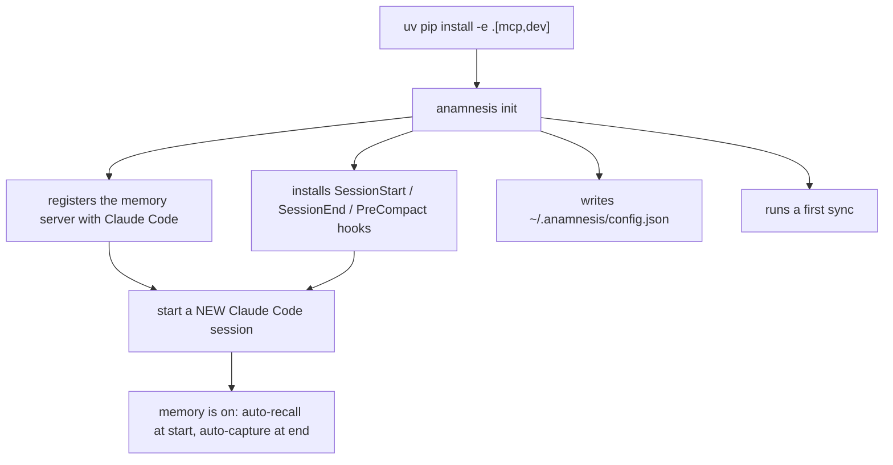

This page takes you from nothing to a working setup: Anamnesis installed, connected to Claude Code, and your memory turning on automatically. Plan for about five minutes.

Anamnesis is a memory layer for Claude Code. It saves what Claude learns about your projects as plain markdown files on your own machine and feeds the relevant pieces back to Claude when you start a new session. You install it once per machine. After that it works in the background.

<Callout type="info">
Anamnesis is pre-alpha and open source (Apache-2.0). The one-line install below works today; the from-source steps are for contributors and air-gapped machines.
</Callout>

## What you need first

- **Claude Code**, installed and working. Anamnesis plugs into it. If you can run `claude` in a terminal, you are set.
- **Python 3.12.** Anamnesis runs on Python 3.11 or newer, and the setup commands here pin 3.12 (the version it is built and tested against).
- **`uv`**, a fast Python package manager. It creates the isolated environment Anamnesis runs in and fetches its dependencies. If you do not have it, install it from [the uv install guide](https://docs.astral.sh/uv/getting-started/installation/) (a single command), then continue.
- **`git`.** It is almost certainly already on your machine. Anamnesis stores your memory as a git repository.

You do not need a cloud account, an API key, or a server. Everything lives on your machine.

## Install from source (works today)

This is the path that works right now. It clones the repository and sets up Anamnesis in its own isolated environment.

First, get the code and move into the server folder:

```bash
git clone https://github.com/oscardvs/anamnesis.git
cd anamnesis/server
```

Then create the environment and install Anamnesis into it:

```bash
uv venv --python 3.12
uv pip install -e ".[mcp,dev]"
```

What each line does, in plain terms:

- `uv venv --python 3.12` creates a clean, isolated Python 3.12 environment just for Anamnesis, so it never collides with anything else on your machine.
- `uv pip install -e ".[mcp,dev]"` installs Anamnesis into that environment. The `mcp` part pulls in the piece that lets Claude Code talk to it; `dev` adds the testing and linting tools. Installing with `-e` (editable) means the code stays in the folder you cloned, which matters because the next step points Claude Code at that folder.

That is the install done. You now have the `anamnesis` command available. Next you connect it to Claude Code.

## Connect it: `anamnesis init`

One command wires this machine up. From the same `anamnesis/server` folder, run:

```bash
uv run anamnesis init
```

`uv run` simply runs the `anamnesis` command inside the environment you just created.

`anamnesis init` is interactive. It asks you a few short questions, each with a sensible default in brackets that you can accept by pressing Enter:

```text
store home [/home/you/.anamnesis]:
machine id [your-hostname]:
sync remote (blank = local-only):
command form [uv run --project /home/you/anamnesis/server anamnesis]:
```

- **store home** is the folder where your memory lives. The default, `~/.anamnesis`, is right for almost everyone.
- **machine id** is a friendly name stamped on every note this machine writes, so later you can tell which machine recorded what. It defaults to your computer's hostname. You can type something clearer, like `desktop-amsterdam`.
- **sync remote** is for sharing memory across several of your own machines. Leave it blank for now to stay on one machine. You can add it later by running `init` again. (The full multi-machine setup is covered in [Memory across machines](./across-machines).)
- **command form** is the exact command Claude Code will use to launch Anamnesis. The default is correct; just press Enter.

When it finishes, you will see a short report and a closing line:

```text
mcp: registered anamnesis (user scope)
hooks: installed SessionStart/SessionEnd/PreCompact -> /home/you/.claude/settings.json
config: wrote /home/you/.anamnesis/config.json
sync: pushed=False pulled=0 (committed locally; no remote configured)
init: done. Start a new Claude Code session for the MCP server and hooks to take effect.
```

The exact wording of the `sync:` line varies a little: on a single machine with no remote yet it reports that there was nothing to push (`pushed=False`) and explains why (`no remote configured`). That is expected and not an error.

### What `anamnesis init` actually set up

In one run it did four things for you, so you do not have to edit any config by hand:

1. **Registered the memory server with Claude Code** at user scope. This is what lets Claude search, list, and write your memory while you work. (The "MCP server" is just the small program Claude talks to; you never run it yourself.)
2. **Installed the lifecycle hooks** into your `~/.claude/settings.json`. These are what make memory automatic: relevant notes are pulled in when a session starts, and a summary of the session is saved when it ends or when the context is about to be compacted. See [What happens when you use it](./how-it-works) for the details.
3. **Wrote a small config file** at `~/.anamnesis/config.json` recording your machine id and (if you set one) your sync remote, so every later launch finds the right settings.
4. **Ran a first sync.** On a single machine with no remote there is nothing to send to other machines, so it just reports that (`pushed=False ... no remote configured`); once you have a sync remote it makes sure this machine is in step with the others.

`init` is safe to run more than once. It backs up your existing `settings.json` before changing it (to `settings.json.bak`) and never adds a hook twice. Re-run it any time you want to change a setting, for example to add a sync remote later.

<Callout type="warn">
You MUST start a NEW Claude Code session for any of this to take effect. The server and the hooks are read when a session starts, so a session that was already open will not see them. Fully quit Claude Code and open it again, then begin a new session.
</Callout>

### Preview before committing: `--print`

If you want to see exactly what `init` will do without it writing or changing anything, add `--print`:

```bash
uv run anamnesis init --print
```

It prints the full plan (the store path, machine id, remote, the command form, and the precise `claude mcp add` and hooks it would write) and exits without touching your system. This is a good way to look before you leap.

### Single machine for now

If you only use one machine and want to skip the sync question entirely, run:

```bash
uv run anamnesis init --local-only
```

You can always add a remote later by running `init` again. Nothing else changes.

## A note on environment variables (read this if sync seems off)

This trips up newcomers, so it is worth one minute.

When Claude Code launches the memory server, it does so with a stripped-down, filtered environment. That means **the server does not see variables you exported in your shell.** If you ran something like `export ANAMNESIS_GIT_REMOTE=...` in your terminal, the server will not pick it up.

You do not need to worry about this if you use `anamnesis init`. It is the whole point of `init`: it bakes your settings into the right places (the server registration, the hooks, and `~/.anamnesis/config.json`) so the server always finds them, no shell exports required.

If you ever do configure things by hand, set these in the server's `"env"` block in `.mcp.json` rather than your shell. The variables Anamnesis reads are:

| Variable | Default | What it does |
| --- | --- | --- |
| `ANAMNESIS_HOME` | `~/.anamnesis` | Where the store and index live. |
| `ANAMNESIS_MACHINE_ID` | your hostname | The machine name stamped on notes you write. |
| `ANAMNESIS_GIT_REMOTE` | unset | The git remote used to sync across machines; unset means local commits only. |

The `.env.example` file in the repo documents these too, but remember: that `.env` file is for running tooling by hand. It is not read by the server Claude Code launches.

## The one-line install

Anamnesis is published to PyPI as `anamnesis-memory`. Install it and wire up this machine in one line:

```bash
uv tool install anamnesis-memory && anamnesis init
```

A couple of details worth knowing:

- The package on PyPI is named **`anamnesis-memory`** (the plain name `anamnesis` was already taken by an unrelated project). The command it installs is still just **`anamnesis`**.
- `uv tool install` puts the `anamnesis` command on your PATH globally, so you no longer need the `uv run` prefix or the cloned `server` folder.

## How the pieces fit together



## Check it worked

After you start a fresh Claude Code session, you can confirm Anamnesis is connected by asking Claude to check its memory status. With the server registered, Claude has a read-only `memory_status` tool that reports note counts, the store paths, and the sync state. If it answers with those, you are wired up.

You can also verify from the terminal at any time:

```bash
uv run anamnesis status
```

## Troubleshooting

<Callout type="warn">
**Nothing seems to happen in Claude Code.** The most common cause is forgetting to start a new session. Quit Claude Code completely and reopen it, then start a fresh session.
</Callout>

- **`mcp: \`claude\` not found on PATH`** in the `init` output. Anamnesis could not find the `claude` command to register itself. Make sure Claude Code is installed and that running `claude` in your terminal works, then re-run `uv run anamnesis init`. (Anamnesis will also print the exact command to run by hand if you prefer.)
- **`init: refusing to run; ... settings.json is not valid JSON`.** Your `~/.claude/settings.json` has a syntax error from a previous manual edit. Fix the JSON, then re-run. Anamnesis deliberately stops before changing anything so it cannot make a broken file worse.
- **`sync: skipped (...)`.** Your sync remote could not be reached. On a single machine you can ignore this. If you set a remote, check it is reachable and then run `uv run anamnesis sync`. Multi-machine setup is covered in [Memory across machines](./across-machines).
- **Python version errors during install.** Make sure the environment was created with `uv venv --python 3.12`. Anamnesis needs Python 3.11 or newer.

## Next steps

- [What happens when you use it](./how-it-works) - how memory is recalled, captured, and synced as you work.
- [Memory across machines](./across-machines) - put your laptop and desktop on the same memory.
- [The dashboard](./dashboard) - browse, search, and edit your memory in a git-like GUI.
