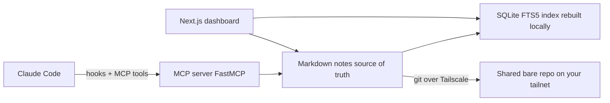
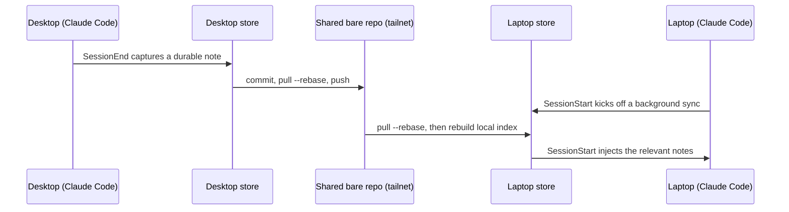

Anamnesis is a local-first, file-based memory layer for [Claude Code](https://claude.com/claude-code) that syncs automatically across all of your own machines. Everything Claude learns about your projects (conventions, architecture decisions, fixes that worked, what you did yesterday) is captured as plain markdown, indexed locally for fast retrieval, and kept in sync across your fleet over your private network. There is no cloud account to create and no service to sign up for. Your memory stays on your machines: version-controlled, human-readable, and yours. The local-first core is open source under the Apache License 2.0 (repo: [github.com/oscardvs/anamnesis](https://github.com/oscardvs/anamnesis)).

<Callout type="warn">
  Anamnesis is pre-alpha. The local-first core, hooks, and the one-command installer are built and tested, but setup and APIs may still change. See [Status](#status) below for what works today.
</Callout>

## The shape of it

The word *anamnesis* (ἀνάμνησις) is Greek for *recollection*: the act of calling knowledge back to mind. The system has five parts, each doing one job:



- **Markdown is the source of truth.** Notes live as plain `.md` files under `~/.anamnesis/memory/`, so they are readable, `git diff`-able, and exactly the shape current models are good at using.
- **A SQLite FTS5 index gives fast keyword recall.** It is derived from the markdown and can always be rebuilt locally. It is never synced.
- **Sync is git over a [Tailscale](https://tailscale.com) mesh.** Only markdown travels; the database file never leaves the machine, so it never corrupts.
- **Claude Code talks to it through an MCP server** (built on [FastMCP](https://gofastmcp.com)) plus lifecycle hooks (SessionStart, SessionEnd, PreCompact).
- **A Next.js dashboard** is a git-like GUI to browse, search, edit, and inspect the history of your memory across every machine.

## What is in the docs

<Cards>
  <Card title="Guide" href="./guide/index">
    Start here if you are new. What Anamnesis is, how to install it, how it works day to day, how to set up cross-machine sync, the dashboard, curating your notes, and an FAQ.
  </Card>
  <Card title="Internals" href="./internals/architecture">
    How it works under the hood: the architecture, data model, recall and ranking, capture and injection via hooks, the sync protocol, the swappable reflection model, the MCP server, the dashboard, and the design decisions behind them.
  </Card>
  <Card title="Reference" href="./reference/cli">
    The exact surface: every CLI subcommand, the MCP tools and their signatures, configuration via environment variables, and the security model.
  </Card>
</Cards>

If you just want to get running, jump to:

- [Install](./guide/install) - set up the server and run `anamnesis init`.
- [How it works](./guide/how-it-works) - the day-to-day loop of capture, recall, and sync.
- [Across machines](./guide/across-machines) - put your fleet on one tailnet and share a repo.
- [The dashboard](./guide/dashboard) - browse and edit your memory in a GUI.

For the precise surface area:

- [CLI reference](./reference/cli) - `init`, `inject`, `capture`, `sync`, `reindex`, `status`, `serve`.
- [MCP tools](./reference/mcp-tools) - `memory_search`, `memory_list`, `memory_status`, `memory_write`, `memory_sync`.
- [Configuration](./reference/configuration) - the `ANAMNESIS_*` environment variables.
- [Security](./reference/security) - the trust boundary and what is auto-approvable.

For the reasoning, see the internals:

- [Architecture](./internals/architecture) - the five layers and how Claude Code drives them.
- [Data model](./internals/data-model) - note types and the on-disk layout.
- [Recall](./internals/recall) - FTS5, BM25, and ranking.
- [Sync](./internals/sync) - the `commit -> pull --rebase -> push` cycle and conflict handling.
- [Reflection](./internals/reflection) - the deterministic default and the swappable summarization model.
- [Design decisions](./internals/design-decisions) - why files and not a knowledge graph.

## Quickstart

Anamnesis runs as a local MCP server over a store at `~/.anamnesis` (markdown notes plus a SQLite index that is rebuilt locally). Install the server from the repo:

```bash
cd server
uv venv --python 3.12
uv pip install -e ".[mcp,dev]"
```

Then wire this machine up in one command. `anamnesis init` registers the MCP server at user scope, installs the SessionStart / SessionEnd / PreCompact hooks, configures the store and your sync remote, and runs a first sync. It is idempotent (it backs up `settings.json` and never duplicates a hook):

```bash
uv run anamnesis init            # interactive: confirm store dir, machine id, remote
uv run anamnesis init --print    # dry-run: show exactly what it would do
```

Working on a single machine for now? Run `anamnesis init --local-only` and add a remote later by re-running `init`.

<Callout type="info">
  The repo ships a project-scoped `.mcp.json` that registers the server with Claude Code (just a `command` and `args`, no `env` block) and exposes five tools: `memory_search`, `memory_list`, `memory_status` (read-only and auto-approvable), `memory_write`, and `memory_sync`. Claude Code launches MCP servers with a filtered environment, so shell exports are not inherited. `anamnesis init` handles this for you by registering the server at user scope with `ANAMNESIS_MACHINE_ID` (and `ANAMNESIS_GIT_REMOTE` when a remote is set) baked in, and by writing the same values to `~/.anamnesis/config.json`, which the server also reads as a fallback. To configure it by hand, add an `"env"` block with `ANAMNESIS_HOME`, `ANAMNESIS_MACHINE_ID`, and `ANAMNESIS_GIT_REMOTE`. See [Configuration](./reference/configuration).
</Callout>

A full walkthrough lives in [Install](./guide/install) and [Across machines](./guide/across-machines).

<Callout type="warn">
  A one-line install (`uv tool install anamnesis-memory && anamnesis init`) is planned for once the package is published to PyPI. It is not available yet. The PyPI package name will be `anamnesis-memory`, but the command it installs is still `anamnesis`. Until then, install from the repo as shown above.
</Callout>

## How a memory travels

A note written on one machine becomes searchable on the others within a sync cycle. The hooks make this hands-off:



- **SessionStart** injects the most relevant notes for the current project (your global preferences, plus the project's durable notes and a couple of recent session summaries) and kicks off a background sync.
- **SessionEnd** captures a durable episodic note from the session transcript (the ask, the files touched, the outcome) and syncs it.
- **PreCompact** captures the same kind of note before the context is compacted, so nothing is lost.

The session-end summary is deterministic by default and needs no API key. The summarization model is a swappable config value (`ANAMNESIS_REFLECTION_PROVIDER`) for when a reflection model is plugged in later. See [Capture and injection](./internals/capture-and-injection) and [Reflection](./internals/reflection).

## On-disk layout

Memory lives in `~/.anamnesis/` (never inside the repo):

```text
~/.anamnesis/
├── memory/            # markdown notes - the source of truth (a git repo, synced)
│   └── <type>/<id>.md
└── index.db           # SQLite FTS5 index - rebuilt locally, never synced
```

Notes carry one of three types: `procedural`, `semantic`, or `episodic`. See [Data model](./internals/data-model).

<Callout type="error">
  Never sync `index.db` (the SQLite file) through a cloud folder like Dropbox or iCloud. That is the exact pattern that corrupts the database. Sync the markdown via git and let each machine rebuild its own index. This is a load-bearing design rule, not a preference.
</Callout>

## Status

Phase 0 works: the local-first core. The file-first store, the FastMCP server (`memory_search`, `memory_list`, `memory_status`, `memory_write`, `memory_sync`), and git-over-Tailscale sync are built, tested, and validated on real hardware. A note written on the desktop is searchable on the laptop, and a full personal corpus round-trips across machines. The auto-capture and auto-sync session hooks (SessionStart inject plus background sync, SessionEnd and PreCompact capture) are built and tested, and the one-command installer (`anamnesis init`) wires up the MCP server, hooks, store, and first sync.

Phase 1 adds the git-like dashboard (Next.js): browse plus full-text search, a history view driven by the real git log, a per-machine fleet view with sync status, and inline edit that writes back to markdown and reindexes. The next step is publishing to PyPI for a one-line install.

## License and contributing

Anamnesis is open source under the [Apache License 2.0](https://github.com/oscardvs/anamnesis/blob/main/LICENSE). Issues and discussion are welcome on the [GitHub repository](https://github.com/oscardvs/anamnesis); contribution guidelines will land alongside the first release.
