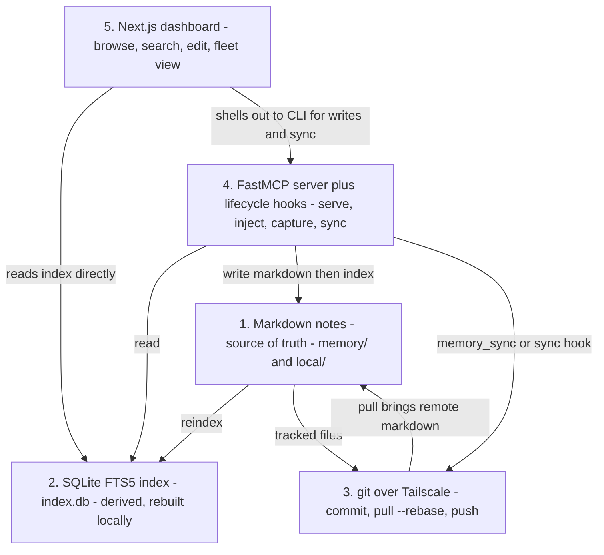
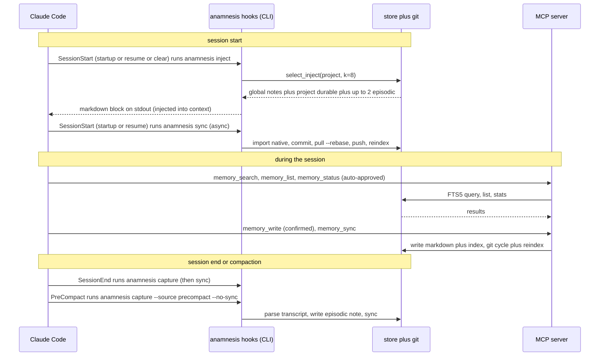

Anamnesis is a cross-machine, file-first memory layer for Claude Code. This page is the canonical
description of how it fits together: the five layers, the data that flows between them, and how Claude
Code itself drives the whole loop through the MCP server and lifecycle hooks. Every field name, default,
and path below is taken straight from the source in `server/src/anamnesis/`.

The one sentence that explains the whole design: **markdown is the source of truth, everything else is
either derived from it or moves it between your machines.**

## The five layers



The layers depend on each other in exactly one direction, so the core stays usable when an upper layer is
absent. The store (`store.py`) never imports FastMCP; the server (`server.py`) imports the store but
nothing above it; the dashboard is a thin client over both. The module docstring in `server.py` states
this explicitly: "The store layer never imports FastMCP; the dependency points one way (server -> store)
so the engine stays usable without the MCP extra."

### 1. Markdown notes (source of truth)

Every note is one markdown file with a YAML front-matter block followed by the body. Files live under the
store root, which resolves from `ANAMNESIS_HOME` (default `~/.anamnesis`):

```
~/.anamnesis/
  memory/                 # SOURCE OF TRUTH - portable (synced) notes
    <type>/<id>.md
  local/                  # machine-local notes, never synced
    <type>/<id>.md
  index.db                # DERIVED - SQLite (WAL + FTS5), rebuilt locally
  config.json             # per-machine config (machine_id, remote), never synced
```

`<type>` is one of `procedural`, `semantic`, or `episodic`. `<id>` is a ULID (lexicographically sortable
by creation time), generated in `MemoryStore.write` via `str(ULID())`. The relative filename is
`<type>/<id>.md` inside the tree the note's scope maps to.

A note's scope decides which tree it lives in, and the tree is authoritative for the scope on reindex
(`MemoryStore.reindex` walks `memory/` as `portable` and `local/` as `machine-local`). The split matters:
`local/` is deliberately outside the git-synced `memory/` tree, so `machine-local` notes are never pushed
to your other machines.

The front-matter mirrors the `Memory` dataclass (`store.py`). Fields and their defaults:

| Field | Default | Notes |
| --- | --- | --- |
| `id` | (generated ULID) | primary key, also the filename |
| `type` | (required) | `procedural` / `semantic` / `episodic` |
| `title` | (required) | |
| `project` | `global` | project key; `global` notes inject everywhere |
| `machine_id` | `unknown` | machine of origin for the write |
| `scope` | `portable` | `portable` (synced) or `machine-local` |
| `tags` | `[]` | |
| `created_at` / `updated_at` | (UTC, second precision) | `datetime.now(UTC).isoformat(timespec="seconds")` |
| `prov_source` | `human` | `human` / `session-end` / `reflection` / `import` |
| `prov_model` | `""` | model id, omitted from front-matter when empty |
| `prov_session` | `""` | session id, omitted when empty |
| `confidence` | `1.0` | |
| `supersedes` | `""` | id of a note this one replaces |

Because the file is the source of truth, you can edit it by hand, `git diff` it, and review it in a pull
request. The full record and markdown format are covered in [the data model](./data-model).

### 2. SQLite FTS5 index (derived, rebuilt locally)

The index at `~/.anamnesis/index.db` is a pure cache of the markdown. It exists for fast recall and stats,
and it can always be thrown away and rebuilt with `MemoryStore.reindex` (or `anamnesis reindex`). The
connection is opened with `PRAGMA journal_mode=WAL` and `PRAGMA busy_timeout=5000`, and with
`check_same_thread=False` because FastMCP runs sync tool calls in a worker threadpool that shares one
connection. WAL plus the busy timeout is what lets concurrent Claude Code sessions touch the store without
file-locking conflicts.

The schema (`_SCHEMA` in `store.py`) is three tables:

- `memories`: one row per note with the structured columns (`id`, `type`, `title`, `body_path`,
  `project`, `machine_id`, `scope`, `created_at`, `updated_at`, the three `prov_*` columns, `confidence`,
  `supersedes`). `type` and `scope` are `CHECK`-constrained to their allowed values. Note that the body
  text is **not** stored here: the column is `body_path`, the file path relative to the scope's tree.
- `memory_tags`: `(memory_id, tag)` with an `ON DELETE CASCADE` to `memories`.
- `memories_fts`: an FTS5 virtual table over `title`, `body`, and `tags` (id is `UNINDEXED`), tokenized
  with `porter unicode61`.

The schema is versioned (`_SCHEMA_VERSION = 1`, tracked in `PRAGMA user_version`). Because the index is
fully derived, a schema upgrade is just: drop the derived tables, recreate them, and reindex from the
markdown. There is never a risky in-place migration of user data in the database.

`MemoryStore.get` reads a note back from its markdown file, not from the database, reinforcing that the
file is canonical: it looks up `body_path` and `scope` in the index, then reads and deserializes the file.

<Callout type="warn">
The database file is **never synced**. This is the claude-brain corruption lesson: syncing a live SQLite
file over a cloud folder corrupts it. Only markdown travels (layer 3); each machine rebuilds its own
`index.db` locally after every pull. See [Design decisions](./design-decisions).
</Callout>

How keyword recall actually works (BM25, the deliberate OR-of-tokens query, superseded-note filtering) is
covered in depth in [Recall](./recall).

### 3. git over Tailscale (sync)

`~/.anamnesis/memory/` is an ordinary git repository. Syncing is a git cycle against a remote that lives on
your private Tailscale mesh (a bare repo on an always-on node, or another machine directly). The backend is
`GitSyncBackend` in `sync.py`, behind a `SyncBackend` Protocol so a peer-to-peer or libSQL backend can slot
in later without touching the server.

One sync cycle (`GitSyncBackend.sync`) is:

1. `git add -A`, then commit if anything is staged. The commit message is
   `anamnesis: sync from <machine_id> at <timestamp>`, authored as `anamnesis <anamnesis@<machine_id>>`.
2. If no remote is configured, stop here (commit locally only).
3. `git fetch origin`, then if the remote has the `main` branch, `git rebase origin/main`. A brand-new
   local repo with no commits does a `git reset --hard origin/main` instead.
4. `git push -u origin main`.

The CLI wraps this in `_run_sync`, which also runs the native-memory import first and a `store.reindex`
afterwards, so the local FTS5 index is rebuilt to match the freshly-pulled markdown. The MCP `memory_sync`
tool does the same reindex step (it calls `backend.sync()` then `store.reindex()`).

<Callout type="warn">
Conflict policy is "surface, never silently drop." If the rebase hits a conflict, `GitSyncBackend.sync`
runs `git rebase --abort` (your local edits stay in place) and returns a `SyncResult` with
`conflicted=True` and the message "conflict on rebase; kept local edits, did not push - resolve and
re-sync." Nothing is lost; you resolve it and sync again.
</Callout>

The branch is always `main` (`_BRANCH = "main"` in `sync.py`). The full sync mechanics, the bare-repo
setup, and the Tailscale wiring are in [Sync](./sync) and the
[Across machines](../guide/across-machines) guide.

### 4. FastMCP server and lifecycle hooks

This is the layer Claude Code talks to. It has two faces:

- **The MCP server** (`anamnesis serve`, built by `build_server` in `server.py` using `FastMCP`), which
  exposes five tools over stdio.
- **The lifecycle hooks** (`anamnesis inject` / `capture` / `sync`), thin CLI subcommands Claude Code runs
  at session boundaries. They live in `cli.py` and deliberately avoid importing FastMCP so the hot path
  works without the optional `mcp` extra.

Both read the same `ANAMNESIS_*` configuration (`config.py`): `ANAMNESIS_HOME`, `ANAMNESIS_MACHINE_ID`
(falls back to the store config, then the hostname), and `ANAMNESIS_GIT_REMOTE` (falls back to the store
config). The store-config fallback is what lets the MCP server, launched via `.mcp.json` without inline
env, still find the remote and actually push on `memory_sync`.

The five MCP tools (from `build_server`):

| Tool | Annotation | What it does |
| --- | --- | --- |
| `memory_search(query, project?, type?, scope?, k=8)` | read-only | FTS5 BM25 keyword search; returns up to `k` ranked notes with body and metadata |
| `memory_list(project?, type?, scope?)` | read-only | list notes newest-first (titles and metadata, no bodies) |
| `memory_status()` | read-only | counts by type/project/scope, store paths, git sync state |
| `memory_write(type, title, body, project="global", tags?, scope="portable")` | write (confirm) | create a note: write markdown, then index it |
| `memory_sync(force=False)` | write (open-world) | one git cycle (commit, pull --rebase, push), then reindex |

The three read-only tools carry `ToolAnnotations(readOnlyHint=True, openWorldHint=False)`, so a client can
safely auto-approve them. `memory_write` is flagged for confirmation (`readOnlyHint=False,
destructiveHint=False`) and `memory_sync` is open-world (`openWorldHint=True`, it touches the network).
The `force` flag on `memory_sync` is reserved for future use. A `memory_write` note is always stamped with
this machine as its origin and defaults to `prov_source="human"`. Full tool signatures and return shapes
are in [the MCP tools reference](../reference/mcp-tools) and [MCP server internals](./mcp-server).

### 5. Next.js dashboard

The dashboard is a git-like GUI over the exact same local store: browse and full-text search every note,
read and edit markdown with per-note history from the real git log, and a fleet view of which machine wrote
what. It reads the SQLite index directly for fast queries and shells out to the `anamnesis` CLI for writes
and sync, so it never becomes a second source of truth. Run it with:

```bash
cd dashboard
npm install
npm run dev      # http://localhost:3000
```

When the dashboard saves an edit it writes markdown and then re-indexes the FTS5 index without touching
git (sync stays a separate, explicit step). See [Dashboard internals](./dashboard-internals) and the
[Dashboard guide](../guide/dashboard).

## How Claude Code drives the loop

Claude Code drives Anamnesis at two points: lifecycle hooks (automatic, at session boundaries) and the MCP
tools (on demand, mid-session). `anamnesis init` installs both; the canonical hook definitions are in
`examples/hooks.settings.json`.



### SessionStart: inject relevant memory

The `SessionStart` event fires two hooks. The first matches `startup|resume|clear` and runs `anamnesis
inject` (timeout 15s); the second matches `startup|resume` and runs `anamnesis sync` asynchronously
(`"async": true`) so the network round-trip never blocks the session opening.

`anamnesis inject` (`cmd_inject` -> `select_inject` in `inject.py`) prints a markdown block to stdout, which
Claude Code injects into the session context. The selection for the current project (resolved by
`resolve_project_key` from the working directory) is:

- **All `global` notes**, always, in full.
- Up to **`k=8`** project notes: recent durable (`procedural` + `semantic`) notes fill the budget, but up
  to **`_MAX_EPISODIC = 2`** of the most recent episodic notes are reserved for the "what I last did"
  continuity thread.
- Superseded notes are hidden (a note is hidden when another note's `supersedes` points at it).
- Already-reflected episodics (tagged `reflected`) are dropped, because their content now lives in durable
  notes.
- Ties on `updated_at` are broken by `confidence`.

`resolve_project_key` derives a stable project identity, in order: an explicit `.anamnesis/project` marker
file (searched up-tree, stopping below `$HOME`), else the normalized `origin` git remote, else the repo
root directory name, else the cwd basename.

### SessionEnd and PreCompact: capture durable notes

Both events run `anamnesis capture` (`cmd_capture` -> `parse_transcript` + `write_episodic`), which reads
the session transcript JSONL and writes one `episodic` note (the ask, the branch, the files touched, the
outcome). Trivial sessions are skipped (no note written), via the `is_trivial_session` gate that runs
before any summarizer.

- **SessionEnd** runs `anamnesis capture` (timeout 120s) and then syncs, so the note is on your other
  machines by the next session.
- **PreCompact** runs `anamnesis capture --source precompact --no-sync` (timeout 60s). `--no-sync` is used
  here because compaction can happen repeatedly mid-session; the note is committed and synced on the next
  sync hook or at session end. The `--source` value is recorded as a tag (`session` plus `session-end` or
  `precompact`); both map to the `session-end` `prov_source` stamped on the note.

The session-end summary is deterministic by default (`HeuristicSummarizer`) and needs no API key. The
summarization model is a swappable config value (`ANAMNESIS_REFLECTION_PROVIDER`, default `heuristic`);
see [Capture and injection](./capture-and-injection) for the transcript parser and
[Reflection](./reflection) for how distilling episodic notes into durable ones works.

<Callout type="info">
The MCP server (`.mcp.json`) and the hooks (`~/.claude/settings.json`) are configured separately.
`settings.json` is per-machine and not synced, so each machine points its hooks at its own checkout.
Claude Code launches MCP servers with a filtered environment, so shell exports are not inherited; set
`ANAMNESIS_*` in the `.mcp.json` `"env"` block (or rely on the per-store `config.json` fallback).
</Callout>

## Setup in one command

`anamnesis init` wires up a machine: it registers the MCP server at user scope, installs the
`SessionStart` / `SessionEnd` / `PreCompact` hooks, writes the store config, and runs a first sync. It is
idempotent (it backs up `settings.json` and never duplicates a hook), and `--print` shows the full plan
without writing anything.

```bash
cd server
uv venv --python 3.12
uv pip install -e ".[mcp,dev]"

uv run anamnesis init            # interactive: confirm store dir, machine id, remote
uv run anamnesis init --print    # dry-run: show exactly what it would do
```

To point a machine at your shared bare repo:

```bash
uv run anamnesis init --remote 'you@host.your-tailnet.ts.net:anamnesis-memory.git'
```

Working on a single machine for now? Use `uv run anamnesis init --local-only` and add a remote later by
re-running `init`.

<Callout type="info">
The PyPI package `anamnesis-memory` is **not published yet**. The README documents a future one-liner
(`uv tool install anamnesis-memory && anamnesis init`) labeled "once the package is published"; until then,
install from the repo as shown above. The installed command is `anamnesis` regardless.
</Callout>

The hook subcommands, every flag, and the `ANAMNESIS_*` variables are documented in the
[CLI reference](../reference/cli) and [configuration reference](../reference/configuration).

## Where to go next

<Cards>
  <Card title="Data model" href="./data-model" description="The Memory record, the markdown format, note types, scope, the store layout, and the SQLite schema." />
  <Card title="Recall" href="./recall" description="FTS5 BM25 keyword search, the OR-of-tokens query, scope filters, and superseded-note hiding." />
  <Card title="Capture and injection" href="./capture-and-injection" description="How SessionStart selects notes and how SessionEnd and PreCompact turn a transcript into an episodic note." />
  <Card title="Sync" href="./sync" description="The git backend, the conflict policy, what is tracked, and why the database is never synced." />
  <Card title="Reflection" href="./reflection" description="Distilling episodic notes into durable notes with a swappable model." />
  <Card title="MCP server" href="./mcp-server" description="The FastMCP wiring, tool annotations, and how the server binds to the store." />
  <Card title="Dashboard internals" href="./dashboard-internals" description="How the Next.js dashboard reads the index directly and shells out to the CLI." />
  <Card title="Design decisions" href="./design-decisions" description="File-first over graphs, never syncing the DB, and the architecture constraints." />
</Cards>
