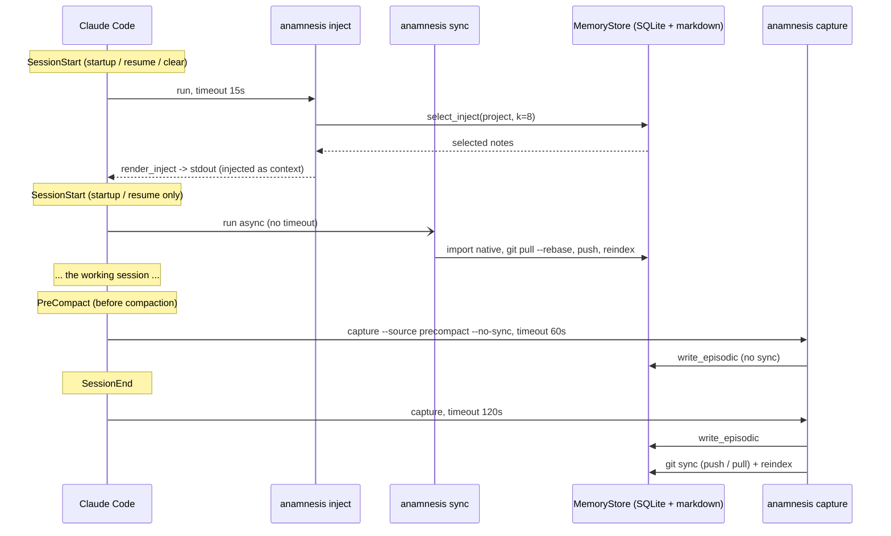
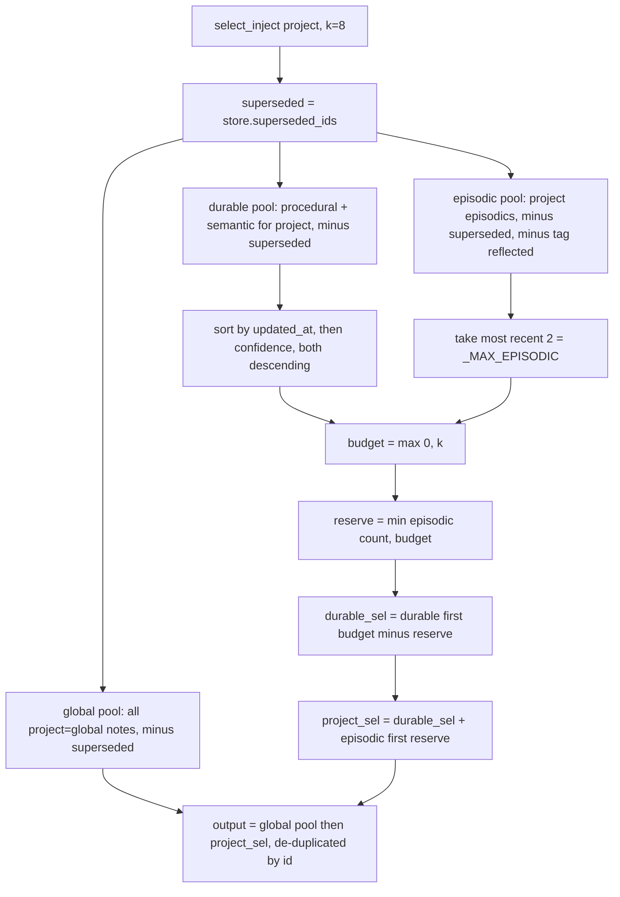
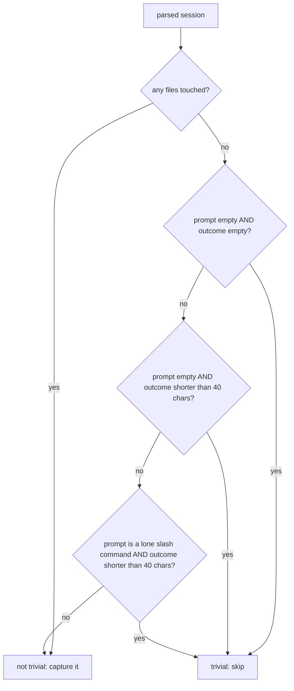

Anamnesis has no daemon. It rides Claude Code's lifecycle hooks instead. Three things happen for you,
automatically, around every session:

1. At **SessionStart** a small set of notes is selected and printed as context, and a sync runs in the background.
2. At **SessionEnd** the transcript is turned into one episodic note, then synced.
3. At **PreCompact** (just before Claude Code compacts the conversation) the same capture runs, without syncing.

This page is the precise reference for that wiring: which hooks `anamnesis init` installs, with what
timeouts; exactly how the injection working set is chosen; and exactly how a transcript becomes a note.
Every field name, default, and threshold below is taken from `server/src/anamnesis/inject.py`,
`server/src/anamnesis/capture.py`, `server/src/anamnesis/cli.py`, `server/src/anamnesis/onboard.py`, and
`examples/hooks.settings.json`.

## The hooks `init` installs

`anamnesis init` writes four matcher-groups into Claude Code's `settings.json` (resolved from
`CLAUDE_CONFIG_DIR`, else `~/.claude/settings.json`). The shape is built by `build_hooks` in
`server/src/anamnesis/onboard.py` and mirrors the checked-in example at `examples/hooks.settings.json`.

| Event | Matcher | Command (subcommand) | `timeout` | `async` |
| --- | --- | --- | --- | --- |
| SessionStart | `startup\|resume\|clear` | `anamnesis inject` | `15` | no |
| SessionStart | `startup\|resume` | `anamnesis sync` | (none) | `true` |
| SessionEnd | (any) | `anamnesis capture` | `120` | no |
| PreCompact | (any) | `anamnesis capture --source precompact --no-sync` | `60` | no |

Timeouts are in seconds. They are the real values from `build_hooks`: `inject` gets `15`, `capture` at
SessionEnd gets `120` (it may run an LLM summary plus a full git sync), and the PreCompact `capture` gets
`60` (no sync, so it is faster). The background `sync` group carries `async: true` and no timeout, so the
session never blocks on the network.

Here is the literal block from `examples/hooks.settings.json`. `init` writes the same structure, except it
substitutes your resolved command form for the placeholder path and prepends an inline
`ANAMNESIS_MACHINE_ID=...` env prefix to each command:

```json
{
  "hooks": {
    "SessionStart": [
      {
        "matcher": "startup|resume|clear",
        "hooks": [
          {
            "type": "command",
            "command": "uv run --project /ABSOLUTE/PATH/TO/anamnesis/server anamnesis inject",
            "timeout": 15
          }
        ]
      },
      {
        "matcher": "startup|resume",
        "hooks": [
          {
            "type": "command",
            "command": "uv run --project /ABSOLUTE/PATH/TO/anamnesis/server anamnesis sync",
            "async": true
          }
        ]
      }
    ],
    "SessionEnd": [
      {
        "hooks": [
          {
            "type": "command",
            "command": "uv run --project /ABSOLUTE/PATH/TO/anamnesis/server anamnesis capture",
            "timeout": 120
          }
        ]
      }
    ],
    "PreCompact": [
      {
        "hooks": [
          {
            "type": "command",
            "command": "uv run --project /ABSOLUTE/PATH/TO/anamnesis/server anamnesis capture --source precompact --no-sync",
            "timeout": 60
          }
        ]
      }
    ]
  }
}
```

<Callout type="info">
The `inject` matcher includes `clear`, so re-injection happens on `/clear` too. The background `sync`
matcher is only `startup|resume`: a `/clear` re-injects from the local index but does not kick off another
network sync.
</Callout>

### How the command is resolved

The literal `uv run --project ...` form above is one of several. `detect_command` (in `onboard.py`)
resolves the base argv in this order:

1. explicit `--command "..."` override (split with `shlex`),
2. `--uv-project <dir>`, which produces `uv run --project <dir> anamnesis`,
3. an installed `anamnesis` found on `PATH` (used directly, by resolved absolute path),
4. else the fallback `uv run --project <server-dir> anamnesis`, where `<server-dir>` is the editable
   checkout's `server/` directory.

`init` is idempotent. `merge_hooks` strips any prior Anamnesis matcher-groups (identified by the command
markers `ANAMNESIS_`, `anamnesis inject`, `anamnesis sync`, `anamnesis capture`), keeps every other
top-level key and any non-Anamnesis hooks, then inserts the fresh set. `write_settings` backs up the
existing file to `settings.json.bak` before writing it atomically, so re-running `init` is safe. The MCP
server is registered separately via `claude mcp add` at user scope (see
[MCP server](../internals/mcp-server)).

### Inline environment

Each installed hook command is prefixed with the `ANAMNESIS_*` values from `build_env`:
`ANAMNESIS_MACHINE_ID` is always set; `ANAMNESIS_GIT_REMOTE` is added when you configured a remote; and
`ANAMNESIS_HOME` is added only when the store home differs from the `~/.anamnesis` default. The
machine-local config at `<home>/config.json` (written by `write_store_config`) carries the same machine id
and remote as a fallback, so a server or CLI launched without inline env still finds them. Because the
remote URL differs per machine, that config file lives outside the synced `memory/` repo and never syncs.

### A session at a glance



## Injection: choosing the working set

At SessionStart, `cmd_inject` (in `server/src/anamnesis/cli.py`) reads the hook payload from stdin,
derives the project key from `payload["cwd"]` via `resolve_project_key`, then calls
`select_inject(store, project=project, k=args.k)` and prints `render_inject(...)` to stdout. The default
`k` is `8` (from the `inject` subparser). Claude Code injects that stdout as session context.

The whole path is pure reads over `MemoryStore` (no FastMCP, no network), which is why it fits comfortably
inside the 15-second timeout.

### Project identity

`resolve_project_key` (in `inject.py`) derives a stable project key from the working directory, in this
order:

1. the first non-empty line of the nearest `.anamnesis/project` marker, searched from the cwd upward and
   stopping below `$HOME` and the filesystem root (so a stray marker at `$HOME` cannot hijack every
   project);
2. else the normalized `origin` git remote (scheme, `user@`, and trailing `.git` stripped, lowercased; an
   `scp`-form `host:path` is rewritten to `host/path`);
3. else the git repo-root directory name, lowercased;
4. else the cwd basename, lowercased, or `global` if empty.

The marker is the explicit, cross-machine-stable override, which matters for non-git workspaces where a
subdirectory would otherwise resolve to its bare basename.

### The selection algorithm

`select_inject` builds the working set from two project pools plus the global pool, against a fixed budget.
The relevant constants in `inject.py` are `_DURABLE = ("procedural", "semantic")` and `_MAX_EPISODIC = 2`.



In words, with the default `k = 8`:

- **All global notes, always, in full.** Every note whose `project` is `global` is included (minus any
  superseded), and the budget `k` does not constrain them. Global notes are the "always-on" memory.
- **Then up to `k` project notes fill a budget.** The durable pool (types `procedural` and `semantic` for
  this project) is sorted by `updated_at` descending, then `confidence` descending, so recency wins and
  confidence breaks ties.
- **Reserve up to 2 most-recent episodics.** Up to `_MAX_EPISODIC = 2` recent episodic notes are reserved
  inside the budget as the "what I last did" continuity thread. `reserve = min(len(episodic), budget)`,
  durable notes take `budget - reserve` slots, and the final `project_sel` is
  `durable_sel + episodic[:reserve]`.
- **Exclude superseded notes.** Any note id returned by `store.superseded_ids()` (that is, any note named
  by another note's `supersedes` field) is dropped from all three pools. Superseded notes are hidden from
  recall but remain browsable via `anamnesis` listing and the dashboard.
- **Drop already-reflected episodics.** Episodics carrying the `reflected` tag are excluded, because their
  content has already been distilled into durable notes (see [Reflection](../internals/reflection)).
  Including them would double-count.

The final list is the global pool followed by `project_sel`, de-duplicated by note id (so a note that is
both global and otherwise selected appears once).

<Callout type="info">
The budget bounds the *project* notes, not the total. If you have many global notes they all inject. Keep
global notes lean. The continuity reserve means at most two recent episodics ever push durable notes out of
the budget.
</Callout>

### The rendered block

`render_inject` turns the selected notes into one markdown block written to stdout. The exact header is:

```markdown
# Anamnesis memory (auto-injected)
```

Each note renders as a section:

```markdown
## [<type>] <title>
_project: <project> | origin: <machine_id>_

<body>
```

The metadata line appends a provenance clause only when the note is not plain human-authored
(`prov_source != "human"`) or its confidence is below `1.0`: `| source: <prov_source> (confidence <value>)`,
where the value is formatted with `%g` (so `0.8`, not `0.80`). `prov_source` is one of `human`,
`session-end`, `reflection`, or `import` (the values the store schema enforces with a `CHECK` constraint).
If the selection is empty, `render_inject` returns an empty string and `cmd_inject` writes nothing.

## Capture: a transcript becomes one episodic note

`anamnesis capture` runs at SessionEnd and (with `--source precompact --no-sync`) at PreCompact.
`cmd_capture` in `cli.py` reads the transcript path from `--transcript` or the hook payload's
`transcript_path`, parses it, resolves the project, writes at most one episodic note, and then syncs unless
`--no-sync` was passed.

### Parsing the transcript

`parse_transcript` (in `server/src/anamnesis/capture.py`) reads the transcript JSONL line by line into a
`ParsedSession` with these fields:

- `first_prompt`: the first non-meta `user` message text (the **ask**). Lines with `isMeta` set are
  skipped.
- `last_outcome`: the last non-empty `assistant` message text (the **outcome**).
- `files_touched`: the `file_path` inputs from `tool_use` blocks whose tool name is in
  `_EDIT_TOOLS = {"Edit", "Write", "MultiEdit", "NotebookEdit"}`, de-duplicated, in first-seen order.
- `git_branch`: the first `gitBranch` field seen.
- `cwd`: the first `cwd` field seen.
- `session_id`: the first `sessionId` field seen.
- `raw`: the full transcript text.

Message text is extracted by `_text_of`, which accepts a plain string `content` or a list of blocks and
joins only the `text` blocks. Parsing is deliberately tolerant: an unreadable file or a malformed JSON line
degrades to an empty or partial `ParsedSession` rather than raising, so capture never breaks session
teardown.

### Skipping trivial sessions (the free gate)

Before any summarizer runs, `is_trivial_session` decides whether the session is even worth a note. It is
provider-agnostic and free (no model call). The thresholds in `capture.py` are
`_TRIVIAL_OUTCOME_FLOOR = 40` characters and `_MAX_LEN = 600` (the clip limit applied later by the
summarizer).



So a session is kept whenever it touched a file, and otherwise kept whenever there is a real user prompt
with enough outcome text. It is skipped when both prompt and outcome are empty, when there is no prompt and
a tiny outcome (shorter than 40 characters), or when the prompt is just a lone slash command (matched by
`^/\S+$`, for example `/clear` or `/effort`) with a tiny outcome. When skipped, `cmd_capture` prints
`capture: skipped trivial session (...)` and writes nothing.

### Summarizing

If the session is not trivial, `write_episodic` calls the resolved `Summarizer`. The default is the
deterministic `HeuristicSummarizer`, selected by `resolve_summarizer` from the
`ANAMNESIS_REFLECTION_PROVIDER` environment variable (default `heuristic`). The heuristic produces:

- **title**: the first line of the first prompt, truncated to 80 characters, or `"Session summary"` if
  there is no prompt.
- **body**: an `**Ask:**` block (the first prompt, clipped to 600 chars), a `**Branch:**` line if a branch
  was seen, a `**Files touched (N):**` list if any, and an `**Outcome:**` block (the last assistant text,
  clipped to 600 chars). Empty fields fall back to `(no user prompt captured)` and
  `(no assistant output captured)`.

The heuristic always returns a result. A summarizer may also return `None` to self-skip a session it judges
not worth keeping; that path is reserved for the swappable LLM summarizer.

<Callout type="info">
The summarizer is swappable, not hardcoded. `resolve_summarizer` maps the `ANAMNESIS_REFLECTION_PROVIDER`
values `deepseek`, `openai`, and `local` to an LLM-backed summarizer (loaded with a lazy import so the hook
hot path never imports the LLM code unless a provider is configured), and any other value falls back to the
heuristic. v0 ships only the deterministic summarizer; the LLM path is the seam, not a default.
</Callout>

### Writing and provenance

When there is a result, `write_episodic` persists one note via `store.write(...)` with:

- `type="episodic"`,
- `title` and `body` from the summary,
- `project` resolved from the session `cwd` (falling back to the payload `cwd`, then `.`),
- `machine_id` from `resolve_machine_id()`,
- `tags=["session", source]`, where `source` is `session-end` or `precompact` (so you can tell which hook
  wrote it),
- `prov_source="session-end"` (both hooks map to this single provenance value),
- `prov_session` set to the transcript's `sessionId`,
- `prov_model` from the summary (empty for the heuristic, the model label for an LLM summary).

On success `cmd_capture` prints `capture: wrote episodic note <id> (...)`. See [Data model](../internals/data-model)
for the full note schema and front-matter layout.

### Then sync (or not)

At SessionEnd, `capture` runs without `--no-sync`, so after writing it calls `_run_sync`: mirror Claude
Code's native memory into the store (unless `ANAMNESIS_IMPORT_NATIVE=0`), then `git` commit,
`pull --rebase`, `push`, then `reindex`. At PreCompact the hook passes `--no-sync`, so the note is written
and indexed but the network sync is deferred to the next SessionEnd or the SessionStart background sync.
This keeps compaction fast and avoids hammering the remote mid-session.

<Callout type="warn">
A PreCompact note is committed locally but not pushed until a later sync. If a concurrent sync on another
machine rebases first, that is normal; sync resolves it on the next cycle. The architectural rule still
holds: never sync the raw SQLite file. Only markdown moves over git, and the index is rebuilt locally by
`reindex`. See [Sync over git](../internals/sync) for the full cycle.
</Callout>

## Running and inspecting the hooks by hand

Every hook is a plain subcommand you can run yourself. From a checkout:

```bash
# Print what would be injected for the current directory's project (k defaults to 8)
uv run --project server anamnesis inject

# Inject for an explicit project key, with a different budget
uv run --project server anamnesis inject --project my-project --k 12

# Capture from a transcript file without syncing (safe to experiment)
uv run --project server anamnesis capture --transcript /path/to/transcript.jsonl --no-sync

# See what init would install, without writing anything
uv run --project server anamnesis init --print
```

`inject` reads its `cwd` from the hook payload on stdin when run as a hook. Run by hand without a payload it
falls back to `.`, so pass `--project` if you want a specific project's working set.

## Related

- [Data model](../internals/data-model)
- [Recall](../internals/recall)
- [Reflection](../internals/reflection)
- [Sync over git](../internals/sync)
- [MCP server](../internals/mcp-server)
- [Install and init](../guide/install)
