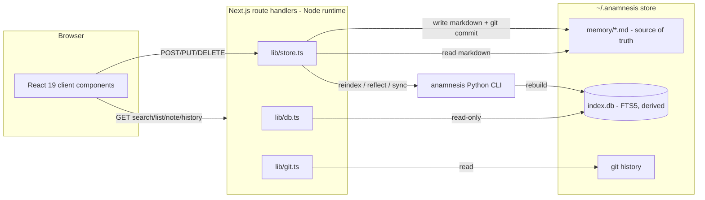
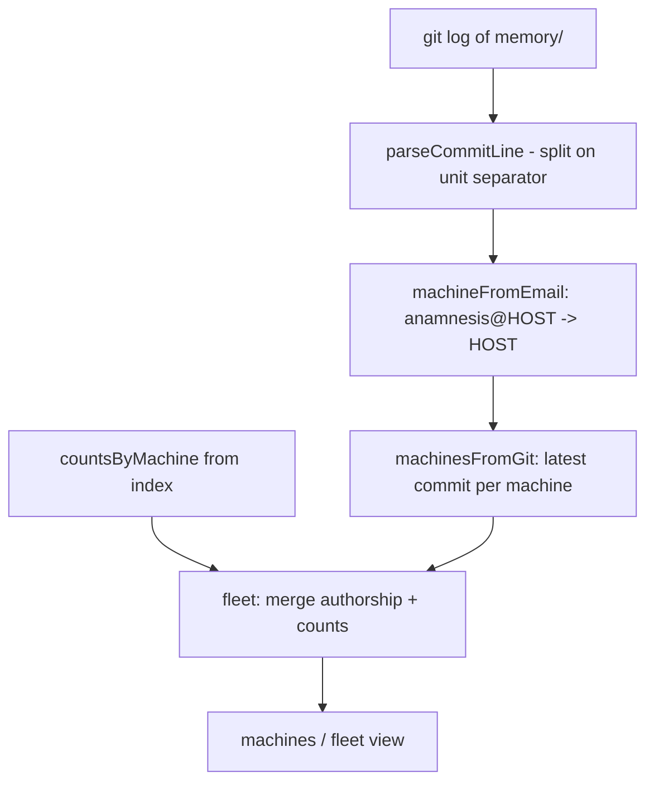
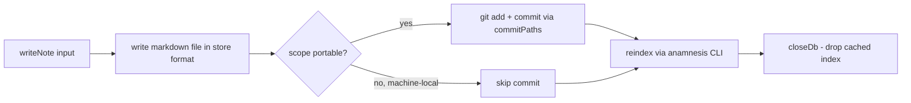
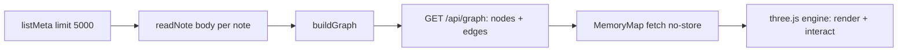

The dashboard is the memory GUI: a git-like visual interface over your cross-machine memory, built with
Next.js (App Router). It is a thin read/write client. It does not own any data. Markdown files under
`~/.anamnesis/memory` are the source of truth, the SQLite FTS5 index is derived, and the git history of
that folder is the memory history. No business logic lives here that the Python server does not also
enforce.

This page documents how the dashboard actually works: where reads go, where writes go, the full HTTP
route surface, how the 3D memory map is built, and what each machine needs installed to run it.

## The core idea: reads are local, writes go through the CLI

The single most important design decision is the split between read paths and write paths.

- **Reads** go straight to the machine-local store from Node. Search and list read the SQLite FTS5
  index directly through a read-only `better-sqlite3` connection. Note content, history, and diffs read
  the markdown files and the git log/show output directly.
- **Writes** (create, edit, delete, reindex, reflect, backfill-provenance, sync) shell out to the
  `anamnesis` Python CLI. Keeping the Python store as the single indexer means the dashboard never
  duplicates indexing logic.



<Callout type="info">
Why the split exists: reading the index directly avoids spawning a Python process per request and keeps
search and list latency low. Writes route through the CLI so there is exactly one indexer and edits show
up in git history immediately.
</Callout>

## Read path 1: the SQLite index (`lib/db.ts`)

Search and list read the derived FTS5 index directly with `better-sqlite3`. The connection is opened
strictly read-only and is never allowed to mutate the writer's settings:

```ts
const db = new Database(path, { readonly: true, fileMustExist: true });
db.pragma("busy_timeout = 5000");
```

Key invariants in `src/lib/db.ts`:

- **Read-only, never owns the file.** The index is owned and written by the Python store. The dashboard
  opens it `readonly: true`, sets `busy_timeout = 5000` (5 seconds) to tolerate the writer's WAL
  checkpoints, and never changes `journal_mode`.
- **The connection is cached** on a global across hot-module-reload in dev, and dropped with `closeDb()`
  after any mutation so the next read reopens the freshly rebuilt index.
- **If the index file does not exist yet,** `getDb()` returns `null` and every read returns an empty
  result rather than throwing. `indexExists()` is the public check.

### How free text becomes a safe FTS5 query

`buildMatch(query)` turns arbitrary input into a safe FTS5 `MATCH` expression. Each word token becomes a
quoted phrase, and the tokens are ANDed together:

```ts
export function buildMatch(query: string): string {
  const tokens = query.match(/[\p{L}\p{N}_]+/gu) ?? [];
  return tokens.map((t) => `"${t}"`).join(" AND ");
}
```

This mirrors the Python store's `_fts_query` and neutralizes every FTS5 operator (`AND`, `OR`, `NOT`,
`NEAR`, `*`, `:`, `"`), so user input can never break the query parser. When there are no word tokens it
returns `""`, and `searchMeta` then returns an empty result.

### The queries `lib/db.ts` runs

| Function | Purpose | Notable detail |
| --- | --- | --- |
| `listMeta(opts)` | List note metadata, newest first | `ORDER BY m.updated_at DESC, m.id DESC`, default `LIMIT 200 OFFSET 0` |
| `searchMeta(query, opts)` | Keyword (BM25) search | `WHERE memories_fts MATCH ?`, `ORDER BY bm25(memories_fts), m.updated_at DESC`, default `LIMIT 50` |
| `getMeta(id)` | Metadata for one note | returns `null` if not indexed |
| `countPendingReflections()` | Reflection notes awaiting review | `prov_source = 'reflection'` and not tagged `reviewed` |
| `stats()` | Totals by type and by project | mirrors the Python `StoreStats` |
| `countsByMachine()` | Note counts grouped by `machine_id` | feeds the fleet view |

Both `listMeta` and `searchMeta` accept the same optional filters: `project`, `type`, `provSource`,
`excludeTag`, `limit`, and `offset`. Tags are stored in a separate `memory_tags` table and are pulled in
per row with `group_concat(tag, char(31))`, then split on the unit separator (`\x1f`) into a string
array.

## Read path 2: markdown and git (`lib/store.ts`, `lib/git.ts`)

Note bodies, history, and diffs never come from SQLite. They come from the source of truth.

- **Bodies** are read by `readNoteText` / `readNote` in `src/lib/store.ts`, which resolve a note's
  absolute path (by `bodyPath` from the index, falling back to a disk search across both trees) and read
  the markdown file, parsing the front-matter with `parseMemory`.
- **History and diffs** are read by `src/lib/git.ts`, which runs `git` in the memory repo. Every read is
  via `runGit` / `runGitSafe`, which invoke `git -C <memoryDir> ...` with `GIT_OPTIONAL_LOCKS=0` so
  reads never take a lock that could fight a concurrent writer.

`lib/git.ts` is read-only except for one function, `commitPaths`, used by the write path. The history
helpers parse a fixed pretty-format using a unit-separator (`\x1f`) between fields:

```
%H %h %an %ae %aI %s
```

- `globalHistory(limit = 200)`: the global commit log, newest first.
- `noteHistory(relPath)`: per-note history that follows renames (`git log --follow --name-status`),
  tagging each commit with a change type (`A`, `M`, `D`, `R`, `T`).
- `noteContentAtCommit(hash, relPath)` and `commitDiff` / `commitFiles`: content and diffs at a revision.
- `repoState()`: working-tree and sync state (`dirty`, `ahead`, `behind`, `conflicted`,
  `conflictedPaths`). Ahead/behind come from `git rev-list --left-right --count origin/main...HEAD`.
  Conflict states are detected from porcelain v1 status codes (`UU`, `AA`, `DD`, `AU`, `UA`, `DU`, `UD`).
- `machinesFromGit()` and `fleet(noteCounts)`: the per-machine fleet view, derived from commit
  authorship.

Diffs are not taken from raw `git diff`. `src/lib/history.ts` computes line diffs from file contents with
`jsdiff` (the `diff` package) so rendering is uniform whether the two sides are two git revisions or a
working-tree edit. `noteDiff(id, from, to)` treats `from === "empty"` as a new file and `to ===
"working"` as the current working-tree file.

### How the fleet view is derived

Sync commits are stamped by the Python backend (`sync.py`) with author `anamnesis` and email
`anamnesis@<machine_id>`. The dashboard parses the machine id back out of that email, so the machines
view is derived straight from git authorship. The same identity is used when the dashboard authors a
commit, so dashboard edits and sync commits look consistent in history.



## Write path: markdown, then git, then reindex (`lib/store.ts`)

Every write follows the same order. The order matters: the markdown file is the source of truth, the
commit records the change in history, and the reindex rebuilds the derived index.



Details from `writeNote`:

- A new note gets a `ulid()` id; an edit preserves the existing id, machine of origin, `createdAt`,
  provenance fields, and `confidence`. New notes default to `project: "global"`, `scope: "portable"`,
  `provSource: "human"`, and `confidence: 1.0`.
- The markdown is written byte-compatible with the Python serializer via `serializeMemory`
  (`src/lib/markdown.ts`). It uses YAML 1.1, single quotes, unindented block sequences, and renders
  `confidence` as a float (`1.0`, not `1`). This keeps ISO timestamps quoted so Python's `yaml.safe_load`
  reads them back as strings rather than coercing them to `datetime`.
- **Only portable notes are committed.** Machine-local notes (`scope: "machine-local"`) live under
  `local/`, a sibling tree that is never committed, so they never leave the machine. Portable notes live
  under `memory/`.
- If the type or scope changed on edit, the file moved on disk; the old file is removed, and the removal
  is committed when the old file was portable.
- The commit message is `anamnesis: <create|edit|delete> <type> note via dashboard`.
- After the file write and commit, `reindex()` runs the CLI and then calls `closeDb()` so the next read
  reopens the rebuilt index. If git fails (for example the store is not a git repo), the commit is
  skipped but the markdown write still stands.

### How the CLI is invoked

All mutations funnel through `runCli` in `src/lib/store.ts`, which resolves how to invoke the CLI:

```ts
// default invocation, run from the dashboard directory
uv run --project ../server anamnesis <subcommand> ...
```

The invocation is configurable by environment variable:

- `ANAMNESIS_CLI` (unset by default): a full command prefix that overrides everything below, for example
  `anamnesis` if the CLI is on `PATH`.
- `ANAMNESIS_UV` (default `uv`): the uv binary.
- `ANAMNESIS_SERVER` (default `../server`): the server project directory passed to `uv run --project`.

`runCli` always sets `ANAMNESIS_HOME` and `ANAMNESIS_MACHINE_ID` in the child environment so the CLI
operates on the same store the dashboard reads, with a 64 MiB `maxBuffer`.

The mutation helpers map directly to CLI subcommands:

| Helper | CLI command | Notes |
| --- | --- | --- |
| `reindex()` | `anamnesis reindex` | rebuilds the index; drops the cached connection on success |
| `reflect({ project, apply })` | `anamnesis reflect [--project P] [--apply --no-sync]` | dry-run unless `apply`; `--apply` implies `--no-sync` and reindexes |
| `backfillProvenance({ apply })` | `anamnesis backfill-provenance [--apply --no-sync]` | dry-run unless `apply` |
| `sync()` | `anamnesis sync` | one pull/push cycle; parses `pushed=`, `pulled=`, `conflicted=`, `head=` from output |

<Callout type="warn">
`reflect --apply` and `backfill-provenance --apply` both pass `--no-sync`, so they do not push your
changes to the remote. Run a separate **Sync** afterward (or commit) so a concurrent sync on another
machine cannot wipe the local-only output. Sync is always a separate, explicit action, so saving a note
never does surprise network I/O.
</Callout>

## The API route surface

All route handlers are App Router route handlers under `src/app/api/`. Every one sets `runtime =
"nodejs"` and `dynamic = "force-dynamic"`: they read local SQLite, git, and the filesystem, so they must
run on the Node runtime and must not be cached or statically rendered. None of them run on the edge.

| Method + path | Reads / writes | Backed by |
| --- | --- | --- |
| `GET /api/overview` | read | `stats()`, `repoState()`, `indexExists()`, `countPendingReflections()` |
| `GET /api/notes?q=&project=&type=&limit=` | read | `searchMeta` when `q` present, else `listMeta` |
| `POST /api/notes` | write | `writeNote` (create), returns `201` |
| `GET /api/notes/:id` | read | `readNote` body + `getMeta` |
| `PUT /api/notes/:id` | write | `writeNote` (edit) |
| `DELETE /api/notes/:id` | write | `deleteNote` |
| `GET /api/notes/:id/diff?from=&to=` | read | `noteDiff` (`from` default `empty`, `to` default `working`) |
| `POST /api/notes/:id/keep` | write | `markReviewed` (adds the `reviewed` tag) |
| `GET /api/notes/:id/history` | read | `noteHistory` (follows renames) |
| `GET /api/history?limit=` | read | `globalHistory` (default limit `200`) |
| `GET /api/commits/:hash` | read | `commitDetail` (per-file diffs) |
| `GET /api/fleet` | read | `fleet(countsByMachine())` + `repoState()` |
| `GET /api/graph` | read | `buildGraph` over `listMeta` + note bodies (the memory map) |
| `POST /api/reindex` | write | `reindex()`; `200` on success, `500` on failure |
| `POST /api/reflect?project=&apply=1` | write | `reflect`; dry-run unless `apply=1` |
| `POST /api/backfill-provenance?apply=1` | write | `backfillProvenance`; dry-run unless `apply=1` |
| `POST /api/sync` | write | `sync()`; `409` when conflicted, else `200` |

Validation notes:

- `POST /api/notes` and `PUT /api/notes/:id` reject a missing or unknown `type` and a blank `title` with
  `400`. Valid types are `procedural`, `semantic`, `episodic`.
- `POST /api/sync` returns HTTP `409` when the sync left a conflict (last-writer-wins surfaces unresolved
  paths in the machines view).

## The memory-map data model

The 3D memory map (`/api/graph` plus the `MemoryMap` client component) renders your whole store as a node
cloud. The graph is built by a pure, deterministic function, `buildGraph`, in `src/lib/graph.ts`, so it
is unit-tested independently of rendering. The route handler feeds it real notes:



### Nodes

There are two node kinds:

- **Hub nodes** (`kind: "hub"`), one per distinct `project`, with id `hub:<project>`. Hubs are the
  cluster backbone.
- **Memory nodes** (`kind: "mem"`), one per note, carrying `type`, `title`, `tags`, and a short plain-text
  `excerpt` derived from the body (markdown stripped, capped at 200 characters with an ellipsis).

### Edges

Edges are undirected and de-duplicated. `buildGraph` adds them from four sources:

1. **Membership:** every memory node links to its project hub. This is the backbone that holds each
   cluster together.
2. **Inter-cluster:** each project hub links to the up to **2** other projects it shares the most tags
   with (real tag overlap, not an arbitrary chain). Projects with no shared tags get no inter-cluster
   edge.
3. **Wikilinks:** best-effort note-to-note edges from `[[wikilink]]` references in bodies, resolved by
   exact note id or by title slug.
4. **Shared tags:** notes that share a tag are chained within each tag group. Groups smaller than **2** or
   larger than **8** are skipped, so a ubiquitous tag does not collapse the map into a hairball.

<Callout type="info">
The map is a visualization derived from the same notes, projects, and tags. It is not a separate graph
database. Architecture stays file-first: markdown is the source of truth, and the graph is recomputed on
each request.
</Callout>

### Rendering

`src/components/memory-map.tsx` is a client component that fetches `/api/graph` and renders it with
**three.js** (dynamically imported, so it only loads in the browser). The notable rendering choices:

- Project hubs are laid out on a Fibonacci sphere; member notes are scattered around their hub.
- Hubs are sized by member count; node color is by memory type (`semantic`, `procedural`, `episodic`)
  with a distinct color for hubs, themed for light and dark.
- Distance fog gives the cloud depth; the scene idles with a gentle spin that pauses while you drag,
  hover, or inspect a node.
- Type-filter chips toggle node kinds; clicking a node opens a detail card (excerpt, tags) and navigates
  from the card (a memory opens `/notes/:id`; a hub opens `/browse?project=...`).
- If WebGL is unavailable the component shows a fallback message; your memory is still browsable from the
  lists.

## Runtime requirements

The dashboard is one Next.js server (`output: "standalone"` in `next.config.ts`). It reads the
machine-local `~/.anamnesis` store, so any machine that runs a server instance needs these present
(the runtimes are not bundled):

- **git** (the memory directory is a git repo; history, diffs, and commits all shell out to it)
- **uv**, **python** (writes, reindex, reflect, backfill, and sync shell out to the `anamnesis` Python
  CLI via `uv run --project ../server`)
- **Node 20** (`better-sqlite3` is pinned to `12.9.0`, the last release that ships Node 20 prebuilt
  binaries; `better-sqlite3` is also listed in `serverExternalPackages` so the native module stays out of
  the server bundle)

Configuration is entirely by environment variable. From the dashboard README:

| Variable | Default | Purpose |
| --- | --- | --- |
| `ANAMNESIS_HOME` | `~/.anamnesis` | Store root (markdown + `index.db`) |
| `ANAMNESIS_MACHINE_ID` | hostname | Machine id stamped on dashboard-authored commits |
| `ANAMNESIS_GIT_REMOTE` | unset | Passed through to `anamnesis sync`; unset means commit locally only |
| `ANAMNESIS_CLI` | (derived) | Full CLI command prefix; overrides the default uv invocation |
| `ANAMNESIS_UV` | `uv` | uv binary for the default `uv run --project ../server anamnesis` |
| `ANAMNESIS_SERVER` | `../server` | Server project dir for the default uv invocation |

`src/lib/config.ts` resolves `ANAMNESIS_HOME` (expanding a leading `~`), then derives `memory/` (the
synced git repo), `local/` (machine-local, not synced), and `index.db` (the derived index) under it.

## The tech stack

Verified against `package.json`. The dashboard pulls in focused libraries rather than a heavy component
framework:

- **Next.js `16.2.9` (App Router), React `19.2.4`, Node.js runtime.** React Compiler is enabled
  (`reactCompiler: true`).
- **Tailwind v4 (CSS-first)** with hand-built shadcn-idiom primitives (`class-variance-authority` +
  `tailwind-merge` + Radix `Slot`), the dark "Console" aesthetic.
- **`better-sqlite3` `12.9.0`** for the read-only index connection.
- **three.js (`three` `^0.169.0`)** for the 3D memory map.
- **Focused UI libraries:** `cmdk` (the Cmd-K command palette), `react-markdown` + `remark-gfm` (note
  bodies), `lucide-react`, `next-themes`, `sonner` (toasts), `ulid` (ids), `yaml` (the front-matter
  codec).
- **Hand-rolled git visuals:** an SVG commit-lane renderer plus a `diff` (jsdiff) based line-diff
  renderer, lighter and fully themeable since the sync history is mostly linear.

Tests run with `vitest` (`npm test`). The codec tests pin byte-compatibility with the Python store's
serializer (key order, single-quoted timestamps, unindented tag sequences), so notes written here
round-trip through `yaml.safe_load` without timestamps being coerced to `datetime`.

## The app shells: web, PWA, Electron

The same standalone server is delivered three ways. All three read the machine-local `~/.anamnesis` store
and need `git`, `uv`, `python`, and Node 20 on any machine that runs a server instance.

### 1. Web (dev or local)

```bash
npm install
npm run dev      # http://localhost:3000
# production:
npm run build && npm run start
```

### 2. PWA over the tailnet

Run one always-on instance on a hub machine and publish it tailnet-only. From `deploy/README.md`, the
shape is: build the standalone server, copy the example env to
`~/.config/anamnesis/dashboard.env`, install and enable the `anamnesis-dashboard` systemd user service,
then expose it on the tailnet:

```bash
systemctl --user enable --now anamnesis-dashboard
loginctl enable-linger "$USER"   # run without an active login
tailscale serve --bg 3000        # publish tailnet-only over HTTPS
```

Then install it to a home screen: on iPhone open the tailnet URL in Safari and use Share, Add to Home
Screen; on a laptop open it in Chrome or Edge and use Install app. The service worker is registered in
production only (`src/components/sw-register.tsx`, best-effort).

<Callout type="warn">
The standalone entry (`scripts/serve.cjs`) forces `HOSTNAME=127.0.0.1`, so the server binds loopback
only and is never on your LAN or the public internet. The only off-machine access is `tailscale serve`,
which is tailnet-only and authenticated by your tailnet. Do not use `tailscale funnel`, which would
expose it publicly.
</Callout>

### 3. Desktop app (Electron)

```bash
npm run desktop:build   # Linux: dist/*.AppImage and dist/*.deb
```

The Electron app runs its own local standalone server against this machine's store, so it works offline
for reads. The build pins **Electron 34** (Node 20, V8 13.2) so the Node-20 `better-sqlite3` native
module compiles for Electron's ABI, then restores the Node-ABI build so the web flow keeps working.
`electron-builder.yml` ships plain files (no asar) because the standalone server is spawned as a child
Node process that loads a native `.node` from `.next/standalone/node_modules`, and asar packing makes
that path fragile.

Cross-platform: Linux is built and verified locally. macOS (dmg) and Windows (nsis) are produced by the
`desktop build` GitHub Actions workflow (`.github/workflows/desktop.yml`) and are shipped unsigned and
unverified until that hardware is available.

## Related pages

- [Architecture overview](./architecture)
- [Data model](./data-model)
- [Recall and search](./recall)
- [Sync over git](./sync)
- [Reflection](./reflection)
