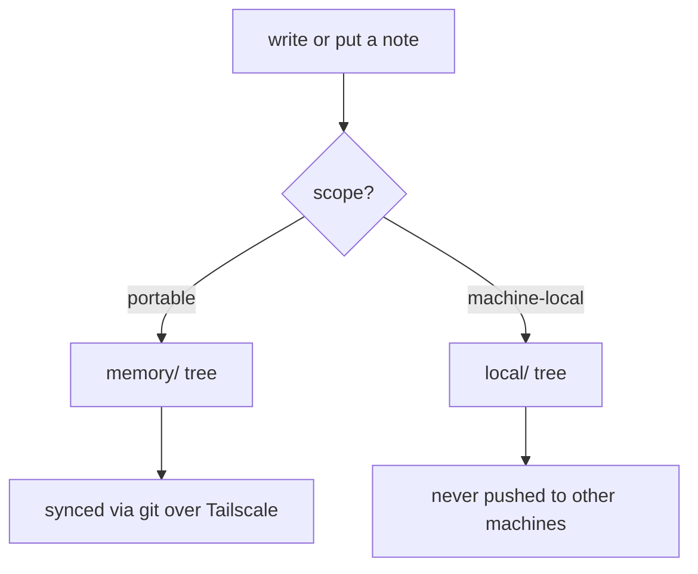
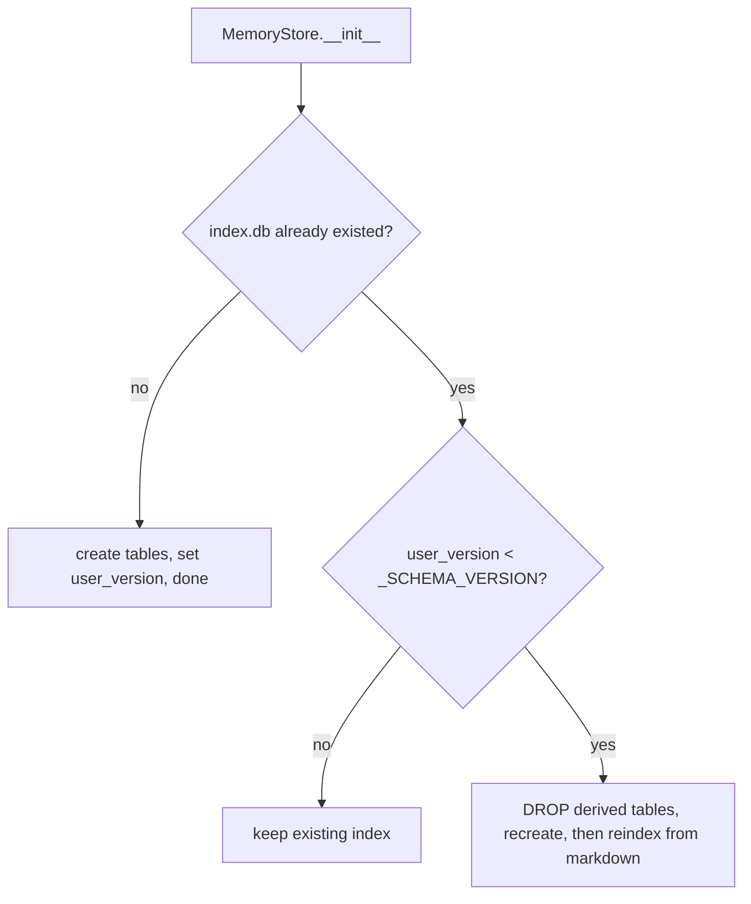
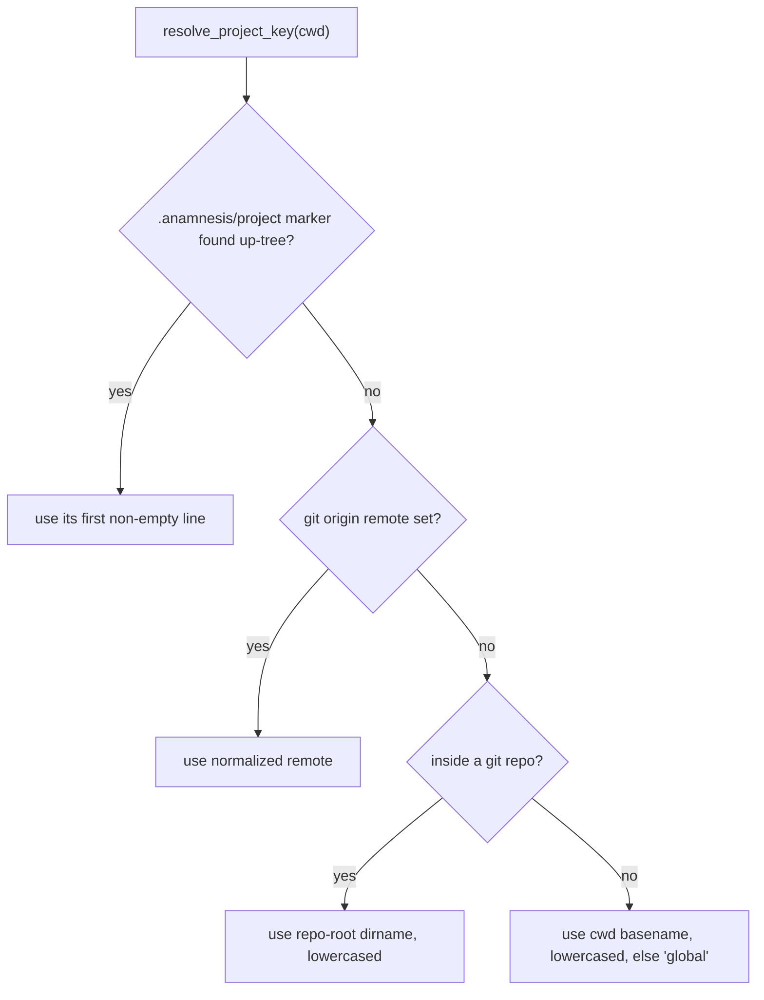

This is the canonical reference for how a single memory note is represented in Anamnesis: the in-memory `Memory` record, the markdown file it serializes to, the directory it lives in, and the SQLite index derived from it. Everything here is grounded in `server/src/anamnesis/store.py`, `server/src/anamnesis/inject.py`, and `server/src/anamnesis/config.py`.

The governing rule, repeated throughout: **markdown files are the source of truth, and the SQLite index is fully derived.** The index can always be deleted and rebuilt from the markdown with no loss.

## The `Memory` record

A note is modeled in code as the `Memory` dataclass (`store.py`). Every field, with its default:

| Field | Type | Default | Notes |
| --- | --- | --- | --- |
| `id` | `str` | (required) | A ULID string, generated on `write` via `str(ULID())`. |
| `type` | `str` | (required) | One of `procedural`, `semantic`, `episodic`. |
| `title` | `str` | (required) | Short human-readable label. |
| `body` | `str` | (required) | The markdown body (everything after the frontmatter). |
| `project` | `str` | `"global"` | Project key (see [project resolution](#project-resolution)). |
| `machine_id` | `str` | `"unknown"` | The machine that authored the note. |
| `scope` | `str` | `"portable"` | `portable` or `machine-local` (see [scope](#scope-portable-vs-machine-local)). |
| `tags` | `list[str]` | `[]` | Free-form tags. |
| `created_at` | `str` | `""` | UTC ISO-8601, seconds precision. |
| `updated_at` | `str` | `""` | UTC ISO-8601, seconds precision. |
| `prov_source` | `str` | `"human"` | One of `human`, `session-end`, `reflection`, `import`. |
| `prov_model` | `str` | `""` | Model id, when a model produced the note. |
| `prov_session` | `str` | `""` | Originating session id, when known. |
| `confidence` | `float` | `1.0` | Used to break recency ties during injection. |
| `supersedes` | `str` | `""` | Id of a note this one replaces. |

Two type aliases document the constrained string fields: `MemoryType = str` (`"procedural" | "semantic" | "episodic"`) and `Scope = str` (`"portable" | "machine-local"`).

Timestamps come from `_utcnow()`, which returns `datetime.now(UTC).isoformat(timespec="seconds")`, so the format is for example `2026-06-24T18:33:07+00:00`.

## The markdown format

Each note is one markdown file: a YAML frontmatter block delimited by `---\n` (the `_FM_DELIM` constant), followed by the body. `_serialize(mem)` writes the frontmatter with `yaml.safe_dump(meta, sort_keys=False, allow_unicode=True)`, so the **key order is fixed by insertion order**, not alphabetical.

### Frontmatter fields, in write order

`_serialize` builds the metadata dict in exactly this order:

1. `id`
2. `type`
3. `title`
4. `project`
5. `machine_id`
6. `scope`
7. `prov_source`
8. `confidence`
9. `prov_model` (only if non-empty)
10. `prov_session` (only if non-empty)
11. `supersedes` (only if non-empty)
12. `created_at`
13. `updated_at`
14. `tags`

`prov_model`, `prov_session`, and `supersedes` are **omitted entirely when empty**, so a hand-written or human-sourced note typically has none of them. `created_at`, `updated_at`, and `tags` are always written, and always come after the optional provenance keys.

A representative file (`~/.anamnesis/memory/semantic/<ULID>.md`) looks like:

```markdown
---
id: 01J9Z8YPM7Q3X2V4WT6B5N0KGD
type: semantic
title: Dashboard grid minmax convention
project: github.com/oscardvs/anamnesis
machine_id: thinkpad
scope: portable
prov_source: human
confidence: 1.0
created_at: '2026-06-24T18:33:07+00:00'
updated_at: '2026-06-24T18:33:07+00:00'
tags:
- dashboard
- css
---
Wrap every Tailwind grid-cols track in minmax(0, ...) so wide content does not blow out the layout.
```

A reflection-derived note that replaces an earlier one adds the optional keys between `confidence` and `created_at`:

```markdown
---
id: 01J9ZB0C4F8H2K6M3P9R7S5T1W
type: procedural
title: Run reflect safely
project: github.com/oscardvs/anamnesis
machine_id: thinkpad
scope: portable
prov_source: reflection
confidence: 0.8
prov_model: claude-opus-4-8
prov_session: 3bf75f14-4c3f
supersedes: 01J9Z8YPM7Q3X2V4WT6B5N0KGD
created_at: '2026-06-24T19:01:55+00:00'
updated_at: '2026-06-24T19:01:55+00:00'
tags:
- reflection
---
Commit immediately after reflect, or a concurrent sync can wipe the output.
```

### Round-tripping (serialize and deserialize)

`_serialize` appends one trailing newline to the body (`f"{_FM_DELIM}{front}{_FM_DELIM}{mem.body}\n"`). `_deserialize` reverses this exactly:

- It requires the text to start with `---\n`, otherwise it raises `ValueError("memory file missing YAML front-matter")`.
- It splits on the closing `\n---\n` delimiter (`text[len(_FM_DELIM):].partition("\n" + _FM_DELIM)`).
- It strips the single trailing newline that `_serialize` added (`if body.endswith("\n"): body = body[:-1]`).
- Missing optional keys fall back to the same defaults as the dataclass: `project="global"`, `machine_id="unknown"`, `scope="portable"`, `tags=[]`, `prov_source="human"`, `confidence=1.0`, and empty strings for `prov_model`, `prov_session`, `supersedes`. `confidence` is coerced with `float(...)`.

<Callout type="info">
Because deserialization tolerates missing optional keys and supplies defaults, you can hand-author a minimal note with just `id`, `type`, and `title` in the frontmatter and it will index correctly. The full set of keys is what the writer produces, not what the reader requires.
</Callout>

## Note types

There are exactly three note types, enforced at the SQLite layer by a `CHECK (type IN ('procedural','semantic','episodic'))` constraint on the `memories` table:

- **`procedural`** - how to do something (steps, commands, conventions). Durable.
- **`semantic`** - facts and stable knowledge about the world or the project. Durable.
- **`episodic`** - what happened in a session ("what I last did"). Treated as transient continuity.

The distinction matters at injection time. In `inject.py`, `_DURABLE = ("procedural", "semantic")` are the note types that fill the main injection budget, while episodic notes are capped by `_MAX_EPISODIC = 2` and serve only as a short "what I last did" continuity thread. Once an episodic note has been folded into durable notes by reflection, it is tagged `reflected` and dropped from injection (`"reflected" not in m.tags`), since its content now lives in the durable notes.

## Scope: portable vs machine-local

`scope` answers one question: does this note travel to your other machines? There are two values:

- **`portable`** (the default) - the note belongs to the synced corpus.
- **`machine-local`** - the note stays on the machine that created it.



### The tree is authoritative for scope

Scope is not trusted from the frontmatter when rebuilding the index. It is determined by **which directory tree the file is in**. `MemoryStore._dir_for_scope(scope)` returns `self.local_dir` for `machine-local` and `self.memory_dir` for everything else:

```python
def _dir_for_scope(self, scope: Scope) -> Path:
    return self.local_dir if scope == "machine-local" else self.memory_dir
```

On `reindex`, the store walks both trees and **overwrites the in-memory `scope` from the tree it found the file in**, regardless of what the frontmatter said:

```python
for base, scope in ((self.memory_dir, "portable"), (self.local_dir, "machine-local")):
    for path in sorted(base.rglob("*.md")):
        mem = _deserialize(path.read_text(encoding="utf-8"))
        mem.scope = scope   # tree wins
        self._index(mem, str(path.relative_to(base)))
```

<Callout type="warn">
Moving a file between `memory/` and `local/` changes its scope on the next reindex, even if the frontmatter still says otherwise. The directory is the authority. The frontmatter `scope` value is a convenience for readers and for the freshly-written file; the reindex path reconciles it to the tree.
</Callout>

`get` mirrors this: it reads the stored `scope` from the index, picks the base directory with `_dir_for_scope`, and reads the body from `base / body_path`. The `body_path` stored in the index is relative to the scope's base directory, not to the store root.

## Store layout under `~/.anamnesis`

The store root defaults to `~/.anamnesis`. `config.resolve_home()` resolves it from `ANAMNESIS_HOME` if set, otherwise `Path.home() / ".anamnesis"`.

```
~/.anamnesis/
  memory/                 # SOURCE OF TRUTH, portable, git-synced
    procedural/<ULID>.md
    semantic/<ULID>.md
    episodic/<ULID>.md
  local/                  # SOURCE OF TRUTH, machine-local, NEVER synced
    procedural/<ULID>.md
    semantic/<ULID>.md
    episodic/<ULID>.md
  index.db                # DERIVED, SQLite (WAL + FTS5), rebuildable
  config.json             # machine-local config, never synced
```

`MemoryStore.__init__` wires these paths and creates both note trees if missing:

```python
self.memory_dir = self.root / "memory"
self.local_dir = self.root / "local"
self.db_path = self.root / "index.db"
self.memory_dir.mkdir(parents=True, exist_ok=True)
self.local_dir.mkdir(parents=True, exist_ok=True)
```

Within each tree, the relative path of a note is `<type>/<id>.md` (set on write as `rel_path = f"{mem.type}/{mem.id}.md"`). So a portable procedural note lives at `~/.anamnesis/memory/procedural/<ULID>.md` and a machine-local one at `~/.anamnesis/local/procedural/<ULID>.md`.

### `config.json`

`config.json` is **machine-local and never synced**. It lives at `<home>/config.json`, deliberately outside the synced `memory/` tree, because the git remote URL differs per machine. It is written by `anamnesis init` (`onboard.write_store_config`) and holds two keys:

```json
{
  "machine_id": "thinkpad",
  "remote": "git@example.com:you/anamnesis-memory.git"
}
```

`remote` is omitted when you run local-only. `config.py` reads these via `_store_config()` (a best-effort JSON read that returns `{}` on any `OSError`/`ValueError` so resolution never crashes on a bad file), and exposes:

- `resolve_machine_id()` - `ANAMNESIS_MACHINE_ID`, else `config.json`'s `machine_id`, else `socket.gethostname()`, else `"unknown"`.
- `resolve_remote()` - `ANAMNESIS_GIT_REMOTE`, else `config.json`'s `remote`, else `None`. The `config.json` fallback is what lets the MCP server (launched from `.mcp.json` without inline env) and the dashboard find the remote so an in-session `memory_sync` can push rather than only commit locally.

<Callout type="warn">
Never sync the raw `index.db` over a cloud folder. Sync the markdown under `memory/` via git and rebuild the index locally on each machine. `config.json` and the entire `local/` tree are intentionally outside the synced corpus.
</Callout>

## The SQLite index

`index.db` is a derived cache. It is opened with `sqlite3.connect(self.db_path, check_same_thread=False)` because the FastMCP server runs sync tools in a worker threadpool and shares the connection across threads. Two PRAGMAs make that safe:

```python
self._db.execute("PRAGMA journal_mode=WAL")
self._db.execute("PRAGMA busy_timeout=5000")
```

- **WAL mode** lets concurrent Claude Code sessions read while one writes, avoiding the file-locking conflicts a rollback journal would cause.
- **`busy_timeout=5000`** (5 seconds) makes a blocked writer wait and retry rather than fail immediately under contention.

### Schema

The schema (`_SCHEMA` in `store.py`) is three objects: a structured `memories` table, a `memory_tags` join table, and a `memories_fts` FTS5 virtual table.

```sql
CREATE TABLE IF NOT EXISTS memories (
  id           TEXT PRIMARY KEY,
  type         TEXT NOT NULL CHECK (type IN ('procedural','semantic','episodic')),
  title        TEXT NOT NULL,
  body_path    TEXT NOT NULL,
  project      TEXT NOT NULL DEFAULT 'global',
  machine_id   TEXT NOT NULL,
  scope        TEXT NOT NULL DEFAULT 'portable' CHECK (scope IN ('portable','machine-local')),
  created_at   TEXT NOT NULL,
  updated_at   TEXT NOT NULL,
  prov_source  TEXT NOT NULL DEFAULT 'human'
               CHECK (prov_source IN ('human','session-end','reflection','import')),
  prov_model   TEXT,
  prov_session TEXT,
  confidence   REAL NOT NULL DEFAULT 1.0,
  supersedes   TEXT
);
CREATE INDEX IF NOT EXISTS idx_mem_scope   ON memories(project, type, scope);
CREATE INDEX IF NOT EXISTS idx_mem_recency ON memories(updated_at DESC);
CREATE INDEX IF NOT EXISTS idx_mem_prov    ON memories(prov_source);

CREATE TABLE IF NOT EXISTS memory_tags (
  memory_id TEXT NOT NULL REFERENCES memories(id) ON DELETE CASCADE,
  tag       TEXT NOT NULL,
  PRIMARY KEY (memory_id, tag)
);

CREATE VIRTUAL TABLE IF NOT EXISTS memories_fts USING fts5(
  id UNINDEXED, title, body, tags, tokenize='porter unicode61'
);
```

Note what the `memories` table does and does not store. It holds all the structured metadata plus `body_path` (the relative path to the markdown file), but **not the body itself**. The body lives only in the markdown file and, for search, in the FTS5 table.

The `memories_fts` virtual table indexes `title`, `body`, and `tags` (with `id` carried `UNINDEXED` so it can be selected back). The tokenizer is `porter unicode61`: `unicode61` provides Unicode-aware tokenization and diacritic folding, and `porter` adds English stemming so "running" matches "run". Tags are stored in FTS as a single space-joined string (`" ".join(mem.tags)`).

### How a row is written

`_index(mem, rel_path)` does an idempotent upsert for one note:

1. `INSERT OR REPLACE INTO memories (...)` with all structured columns. Empty `prov_model`, `prov_session`, and `supersedes` are stored as SQL `NULL` (`mem.prov_model or None`, etc.).
2. `DELETE FROM memory_tags WHERE memory_id = ?` then re-insert the current tags.
3. `DELETE FROM memories_fts WHERE id = ?` then re-insert the FTS row.

This delete-then-insert pattern keeps `memory_tags` and `memories_fts` consistent on rewrites. `write` and `put` both call `_index` and then `self._db.commit()`. On any indexing failure they unlink the just-written markdown file before re-raising, so a half-written note never lingers on disk:

```python
abs_path.write_text(_serialize(mem), encoding="utf-8")
try:
    self._index(mem, rel_path)
except Exception:
    abs_path.unlink(missing_ok=True)
    raise
self._db.commit()
```

`write` generates the id and timestamps for you; `put` takes a fully-formed `Memory` (caller-supplied id and timestamps) and upserts by id, which the native-memory importer uses to make re-imports overwrite in place rather than duplicate.

### Supersession

A note with a non-empty `supersedes` pointing at another note's id hides that older note from recall. `superseded_ids()` collects every non-empty `supersedes` value, and both `search` and the injection selector exclude those ids:

```sql
AND m.id NOT IN
  (SELECT supersedes FROM memories WHERE supersedes IS NOT NULL AND supersedes <> '')
```

Superseded notes are hidden from recall and injection but remain on disk and browsable via `list`.

### Schema version and rebuild from markdown

`_SCHEMA_VERSION = 1` is stored in SQLite's `PRAGMA user_version`. On open, the store compares the DB's recorded version against the constant:



Because the index is fully derived, a version bump needs no hand-written migration: the store drops `memories`, `memory_tags`, and `memories_fts`, recreates them from `_SCHEMA`, sets `user_version`, and calls `reindex()`.

`reindex()` is the canonical "rebuild from source of truth" path and can be run any time (it returns the number of notes indexed):

1. `DELETE FROM memories`, `DELETE FROM memory_tags`, `DELETE FROM memories_fts`.
2. Walk `memory/` as `portable` and `local/` as `machine-local`, in that order, over `sorted(base.rglob("*.md"))`.
3. Deserialize each file, force `scope` from the tree, and `_index` it under its path relative to that tree's base.
4. Commit.

If `index.db` is ever lost or corrupted, deleting it and re-opening the store (or running a reindex) reconstructs it entirely from the markdown. No memory is lost, because the markdown is the source of truth.

## Project resolution

Notes are scoped to a `project` key. The default is `"global"`, and global notes are always injected in full. For a working directory, the project key is resolved by `inject.resolve_project_key(cwd)` in a fixed precedence order:



1. **`.anamnesis/project` marker.** `_read_marker(cwd)` searches from `cwd` upward through its parents and returns the first non-empty line of the nearest `.anamnesis/project` file. The search **stops below the home directory and the filesystem root**, so a stray marker at `$HOME` cannot hijack every project. This is the explicit, cross-machine-stable override, useful for non-git workspaces where a subdirectory would otherwise resolve to a bare basename.
2. **Normalized git `origin` remote.** Runs `git -C <cwd> remote get-url origin`; on success the URL is normalized by `_normalize_remote`: strip the scheme (`https://`, `ssh://`, `git://`), strip a leading `user@`, convert the scp form `host:path` to `host/path`, strip a trailing `.git`, then strip trailing slashes and lowercase. So `git@github.com:oscardvs/anamnesis.git` and `https://github.com/oscardvs/anamnesis` both normalize to `github.com/oscardvs/anamnesis`.
3. **Repo-root directory name.** If there is no `origin`, `git -C <cwd> rev-parse --show-toplevel` gives the repo root, and its directory name is used, lowercased.
4. **cwd basename.** Outside any git repo, the basename of `cwd` lowercased, or `"global"` if that is empty.

<Callout type="info">
Normalizing the remote is what makes a project key stable across machines: the same repo cloned over SSH on one machine and HTTPS on another resolves to the same key, so its notes group together. The `inject.py` docstring flags the fuller cross-machine identity work as a deliberate follow-up isolated to this one function.
</Callout>

## Related pages

- [Recall and search](./recall) - how the FTS5 BM25 query is built and ranked.
- [Capture and injection](./capture-and-injection) - how notes are selected and rendered at SessionStart.
- [Sync](./sync) - how the `memory/` tree travels over git on a Tailscale mesh.
- [Architecture overview](./architecture) - the file-first design in one place.
