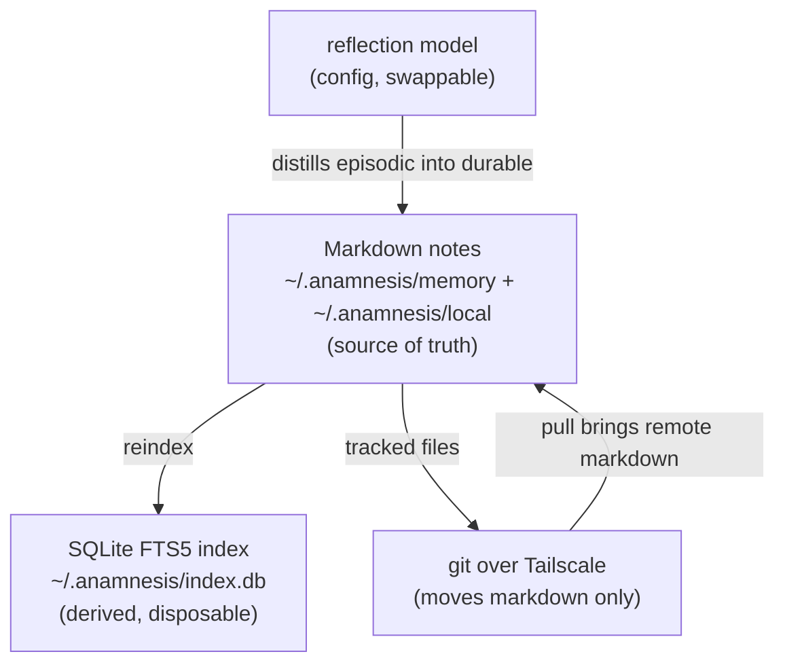
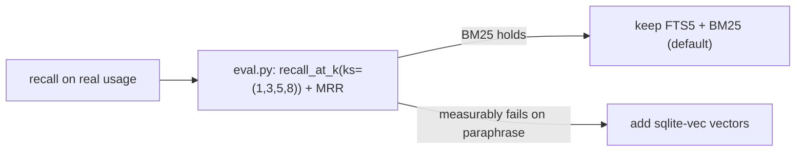
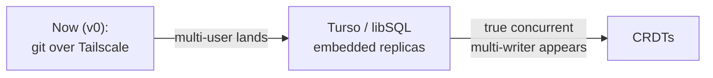
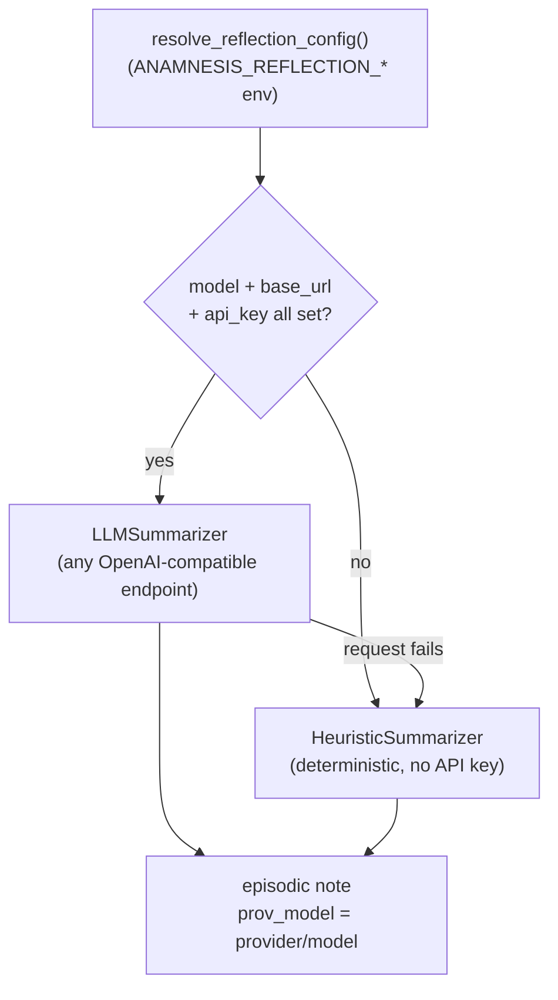

This page is the canonical record of the architecture decisions Anamnesis is built on, written in an ADR
(Architecture Decision Record) style: for each decision, what we decided, why, and the specific condition
under which we would revisit it. These are the choices stated in `CLAUDE.md` under "Architecture decisions
(do not relitigate without evidence)," reconciled with how they actually show up in `server/src/anamnesis/`.

The through-line behind every decision is one sentence: **markdown is the source of truth, and everything
else is either derived from it or moves it between your machines.** Each decision below is a consequence of
holding that line and refusing to add machinery that does not earn its keep.

<Callout type="info">
The bar for changing any of these is evidence, not preference. `CLAUDE.md` frames them as decisions not to
relitigate "without evidence," and each one below names the concrete signal that would constitute that
evidence. Where the project plans to grow, it grows by adding behind an existing seam (for example the
`SyncBackend` protocol), not by rewriting the core.
</Callout>

## The decisions at a glance

| Decision | Status | Revisit when |
| --- | --- | --- |
| File-first, not a knowledge graph | Adopted (v1) | Recall quality on real usage demonstrably suffers |
| SQLite is first-class, with WAL | Adopted | (WAL stays; vectors are the conditional part) |
| Add `sqlite-vec` vectors | Deferred | Keyword search measurably fails on paraphrase queries |
| Never sync the raw DB; sync markdown via git | Adopted | (Load-bearing; not expected to change) |
| Git-as-sync now | Adopted (v0) | Multi-user lands (then Turso/libSQL), or true multi-writer (then CRDTs) |
| Reflection/compression model is swappable | Adopted | (Never hardcode it; the frontier moves weekly) |



## Decision 1: File-first, not a knowledge graph

**Decision.** Memory is plain markdown files, one note per file, and they are the single source of truth.
Anamnesis does **not** build a knowledge-graph memory or a custom context compressor for v1.

**Why.** The publicly stated rationale in `CLAUDE.md`: "the research shows files + keyword search are
competitive and graphs add cost without proportional benefit." A graph layer is real, permanent complexity
(a schema, an ingestion pipeline, a query language, its own corruption and migration story) added on top of
something users already understand. Plain files keep the whole system inspectable and recoverable: you can
read a note in any editor, `git diff` it, review it in a pull request, and hand-edit it without going through
Anamnesis at all.

This shows up concretely in the store. A note is a YAML front-matter block followed by a markdown body,
serialized by `_serialize` and parsed back by `_deserialize` in `server/src/anamnesis/store.py`. Reads go to
the file, not the database: `MemoryStore.get` looks up the file path in the index and then reads and
deserializes the markdown, so the file stays canonical.

```python
# server/src/anamnesis/store.py  (MemoryStore.get)
def get(self, memory_id: str) -> Memory:
    """Read a memory back from its markdown file (the source of truth)."""
    row = self._db.execute(
        "SELECT body_path, scope FROM memories WHERE id = ?", (memory_id,)
    ).fetchone()
    if row is None:
        raise KeyError(memory_id)
    base = self._dir_for_scope(row["scope"])
    text = (base / row["body_path"]).read_text(encoding="utf-8")
    return _deserialize(text)
```

Note the column the database stores: `body_path`, not the body itself. The schema (`_SCHEMA` in `store.py`)
indexes structured metadata and a derived FTS copy of the text, but the authoritative body lives only on
disk. The `memories` table even encodes `body_path TEXT NOT NULL`, making "the file is where the body lives"
a structural fact, not a convention.

The `General` conventions in `CLAUDE.md` restate the same posture as a rule: "Don't introduce a database
server, a graph DB, or a vector DB 'just in case' - stay local-first and simple."

**When we would revisit.** `CLAUDE.md` is explicit: "Revisit only if recall quality on real usage demonstrably
suffers." That is a measurable bar, not a vibe. The instrument that would measure it already exists:
`server/src/anamnesis/eval.py` runs `recall_at_k(store, cases, ks=(1, 3, 5, 8))` and reports Recall@k plus MRR
over a set of paraphrase queries. Files-plus-keyword-search stays until that number, on real usage, drops far
enough to justify the cost of a graph.

<Callout type="warn">
"Files + keyword search are competitive" is a claim about the current generation of techniques, recorded in
the local-only `docs/research/model-landscape.md` and kept fresh. The decision is held against evidence, so
the right response to "should we add a graph" is to run the eval, not to argue from intuition.
</Callout>

## Decision 2: SQLite is first-class, with WAL

**Decision.** SQLite is a deliberate, first-class part of the design, not an afterthought. It provides
FTS5-backed keyword and BM25 recall, and the connection runs in WAL mode so multiple concurrent Claude Code
sessions do not hit file-locking conflicts.

**Why.** `CLAUDE.md`: "FTS5 for keyword/BM25 recall; use WAL mode so multiple concurrent Claude Code sessions
don't hit file-locking conflicts." In practice, several Claude Code sessions on one machine can all touch the
same store at once (mid-session MCP queries, a background sync hook, the dashboard). The classic SQLite default
(rollback journal) serializes readers against a writer hard enough to produce lock errors under that pattern.
WAL lets readers proceed concurrently with a writer, and a busy timeout absorbs the brief windows where a lock
genuinely must be waited for.

The store opens its connection with exactly these pragmas, and the comment in `store.py` spells out why the
connection is even shared across threads:

```python
# server/src/anamnesis/store.py  (MemoryStore.__init__)
# check_same_thread=False: the FastMCP server runs sync tools in a worker
# threadpool, so the connection is shared across threads. SQLite's
# serialized threadsafety + WAL + busy_timeout (below) keep that safe.
self._db = sqlite3.connect(self.db_path, check_same_thread=False)
self._db.row_factory = sqlite3.Row
self._db.execute("PRAGMA journal_mode=WAL")
self._db.execute("PRAGMA busy_timeout=5000")
```

So the three concrete settings are: `journal_mode=WAL`, `busy_timeout=5000` (5 seconds), and
`check_same_thread=False`. The full-text side is an FTS5 virtual table over the searchable fields:

```sql
-- _SCHEMA in server/src/anamnesis/store.py
CREATE VIRTUAL TABLE IF NOT EXISTS memories_fts USING fts5(
  id UNINDEXED, title, body, tags, tokenize='porter unicode61'
);
```

Search ranks with BM25 (`ORDER BY bm25(memories_fts), m.updated_at DESC`) and the default result budget is
`k=8`. The recall mechanics, including the deliberate OR-of-tokens query that recovered recall from about 0%
to about 94% on the eval set, are covered in depth in [Recall](./recall).

A corollary decision is what is **deferred**: vectors. `CLAUDE.md` says "Add `sqlite-vec` vectors only when
keyword search measurably fails on paraphrase queries." Today nothing in the package imports `sqlite-vec`; it
exists only as an optional `vectors` packaging extra and is not wired into `store.py`.

**When we would revisit.** Add `sqlite-vec` embeddings only when the eval harness shows keyword search
measurably failing on paraphrase queries. The threshold is empirical: `recall_at_k` with `ks=(1, 3, 5, 8)`
over LLM-generated paraphrase cases (`build_eval_candidates`) is the gate. Until BM25 demonstrably falls short
there, the simpler FTS5 path stands and the vector dependency stays out of the default install.



## Decision 3: Never sync the raw database; sync markdown via git

**Decision.** The raw SQLite database file is never synced over cloud folders or any other file-mirroring
mechanism. Only markdown travels (via git); each machine rebuilds its own index locally.

**Why.** `CLAUDE.md`: "Never sync the raw DB file over cloud folders (the claude-brain corruption lesson).
Sync markdown via git; rebuild the index locally on each machine." A SQLite database is binary pages plus a
write-ahead log, not a single value that merges cleanly. Mirroring that live file between machines through a
folder-sync tool interleaves partial writes and corrupts it. The project refers to this repeatedly as the
"claude-brain corruption lesson," and it is the reason the rule is absolute rather than a preference.

The guarantee is enforced by **topology**, not by a `.gitignore` entry, which is stronger. The git repository
is `memory/`, while the database lives one level up at the store root, physically outside the git working
tree, so git literally never sees it:

```text
~/.anamnesis/                 # store root  (MemoryStore.root)
  memory/                     # the git repo  (MemoryStore.memory_dir)  -- SYNCED
    <type>/<id>.md            #   one markdown file per note, source of truth
  local/                      # machine-local notes  (MemoryStore.local_dir)  -- NEVER SYNCED
    <type>/<id>.md
  index.db                    # derived SQLite index (WAL + FTS5)  -- NEVER SYNCED
```

Because the index is fully derived, it is disposable: `MemoryStore.reindex` walks both trees (`memory/` as
`portable`, `local/` as `machine-local`), reads every `*.md`, and rebuilds the FTS5 tables from scratch. The
sync callers run that rebuild right after every pull, so search reflects the markdown that just arrived. Even
schema upgrades exploit this: the migration path in `MemoryStore.__init__` drops the derived tables, recreates
them at the current `_SCHEMA_VERSION` (currently `1`, tracked in `PRAGMA user_version`), and reindexes, so
there is never a risky in-place migration of user data in the database.

<Callout type="error">
Do not put `index.db` inside `memory/`, and do not configure any folder-sync tool (Dropbox, iCloud, a naive
git of the binary) to mirror it between machines. The index is derived state. Syncing it is the exact failure
mode this design exists to avoid. If an index is ever damaged or stale, delete it and reindex; the files are
authoritative and recovery is total.
</Callout>

**When we would revisit.** This one is load-bearing and not expected to change. Even the planned sync evolution
(Decision 5) keeps it intact: a Turso/libSQL embedded-replica path replicates a managed database under its own
consistency protocol; it does not mean mirroring `~/.anamnesis/index.db` over a cloud folder. The markdown stays
the source of truth regardless of what carries it. See [Sync](./sync) for the full mechanics and the durability
tests that guard this.

## Decision 4: Git-as-sync now (and the planned evolution)

**Decision.** The v0 sync layer is plain git over a private Tailscale mesh: commit local changes, integrate
the remote with `pull --rebase`, push. The deliberate plan for the future is staged: Turso/libSQL embedded
replicas when multi-user lands, and CRDTs only if true concurrent multi-writer editing ever appears.

**Why.** `CLAUDE.md`: "Sync evolution: git-as-sync for the MVP -> Turso/libSQL embedded replicas when
multi-user lands -> CRDTs only if true concurrent multi-writer editing appears." Git is simple, already
battle-tested, version-controlled, human-readable, and good enough for a single user's own fleet of machines.
For one person syncing one machine at a time, there is no concurrent-multi-writer problem to solve, so the
heavier machinery would be cost without benefit, the same logic as Decision 1.

The implementation is `GitSyncBackend` in `server/src/anamnesis/sync.py`, and crucially it sits behind a
`Protocol` so the mechanism can evolve without touching the server, the CLI, or the dashboard:

```python
# server/src/anamnesis/sync.py
class SyncBackend(Protocol):
    """Pluggable sync mechanism (git-over-Tailscale today; P2P/libSQL later)."""
    def init(self) -> None: ...
    def sync(self) -> SyncResult: ...
    def state(self) -> SyncState: ...
```

That seam is the decision made concrete. Every consumer depends only on `SyncBackend` and the `SyncResult` /
`SyncState` shapes, so a future Turso/libSQL backend or a direct peer-to-peer backend can slot in as another
implementation without a rewrite. The branch is always `main` (the module constant `_BRANCH = "main"`), and
integration is rebase-only, so the shared history stays linear.

The v0 conflict policy is "surface, never silently drop": if a rebase cannot apply cleanly, the backend runs
`git rebase --abort` (your local edits stay exactly as they are on disk) and returns a `SyncResult` with
`conflicted=True`, pushing nothing. That is a normal return value, not an exception; a human or the dashboard
reconciles the two versions, then syncs again.



**When we would revisit.** Each arrow above is gated on a real condition, not a calendar:

- Move past pure git **when multi-user lands** (the trigger for a Turso/libSQL embedded-replica backend).
- Reach for **CRDTs only if true concurrent multi-writer editing appears**, which the current single-user,
  one-machine-at-a-time pattern does not demand.

The guiding rule from `CLAUDE.md`'s conventions still applies: stay local-first and simple, and do not add a
database server "just in case." The current design earns its keep; anything heavier waits for evidence it is
needed. Full sync behavior, the bare-repo Tailscale topology, and the durability tests are in
[Sync](./sync) and the [Across machines](../guide/across-machines) guide.

## Decision 5: The reflection/compression model is swappable

**Decision.** The model used for session-end summarization and for reflecting episodic notes into durable ones
is a swappable configuration value. It is never hardcoded; provider, model, and endpoint all come from
configuration, and the default path needs no API key.

**Why.** `CLAUDE.md`: "The reflection/compression model is swappable. Never hardcode it - the price/quality
frontier moves weekly (see `docs/research/model-landscape.md`, local-only)." Pinning a specific model into the
code would mean shipping a new release every time the frontier moves. Instead the choice is a runtime config
knob, and the project keeps a living record of current model/technique tradeoffs locally.

The module docstring of `server/src/anamnesis/llm_summarizer.py` states the contract directly: it "Sends a
redacted, size-bounded transcript to any OpenAI-compatible endpoint and parses a strict-JSON summary.
Provider, model, and URL come entirely from config; nothing about any provider is hardcoded. Any failure falls
back to the deterministic heuristic so capture never breaks session teardown."

Configuration is read from the environment by `resolve_reflection_config`, which is machine-local and never
synced (it is reflection config, not memory):

| Variable | Default | Purpose |
| --- | --- | --- |
| `ANAMNESIS_REFLECTION_PROVIDER` | `heuristic` | provider label; anything other than a complete config falls back to the deterministic heuristic |
| `ANAMNESIS_REFLECTION_MODEL` | `""` | model id sent in the request payload |
| `ANAMNESIS_REFLECTION_BASE_URL` | `""` | OpenAI-compatible base URL (`/chat/completions` is appended) |
| `ANAMNESIS_REFLECTION_API_KEY` | (falls back to `DEEPSEEK_API_KEY`, then `OPENAI_API_KEY`) | bearer token |
| `ANAMNESIS_REFLECTION_TIMEOUT` | `30` (seconds) | HTTP timeout |
| `ANAMNESIS_REFLECTION_MAX_TOKENS` | `120000` | drives the transcript char window (`max_tokens * 4`) |

`make_llm_summarizer` builds an `LLMSummarizer` only when `model`, `base_url`, and `api_key` are all present;
otherwise it returns the deterministic `HeuristicSummarizer`. So the model is not just swappable, it is
optional, and its absence degrades gracefully rather than breaking teardown.



The HTTP client is a thin stdlib `urllib` POST to `<base_url>/chat/completions` with `temperature=0.2` and
`stream=False`, so the base hook install needs no extra dependency. Provenance is recorded on the resulting
note: a model-summarized note carries `prov_model = "<provider>/<model>"`, so you can always tell which model
produced a given memory. How distilling episodic notes into durable ones works end to end is in
[Reflection](./reflection).

**When we would revisit.** There is no fixed model to revisit; the design's entire point is that the choice is
a config value that moves with the frontier. The living evaluation lives in `docs/research/model-landscape.md`
(local-only), and the `CLAUDE.md` "Staying current" section makes keeping it fresh part of the workflow. Pin a
model only at the edges (your own env), never in the code.

<Callout type="warn">
Because the reflection config is machine-local environment configuration, it is read fresh on each invocation
and is never written into the synced `memory/` tree. Set it per machine. The provenance on each note records
which model actually produced it, so you can audit and re-reflect later if you change models.
</Callout>

## How these decisions reinforce each other

The five decisions are not independent; they compose into one coherent stance.

- File-first (1) is what makes "never sync the DB" (3) safe: there is exactly one authoritative copy of memory
  (the files), so the index can be thrown away and rebuilt freely.
- SQLite-with-WAL (2) is the fast, derived read path over those files, and keeping it derived is what lets it
  be local and disposable rather than something that has to be synced.
- Git-as-sync (4) moves only the markdown, which is only tractable because the source of truth is plain text
  with clean diffs and a clear conflict story.
- The swappable model (5) keeps the one genuinely fast-moving dependency (the LLM) out of the code and behind
  config, so the stable core does not churn when the model frontier does.

Each decision also names its own escape hatch: the recall eval for files-vs-graph and for keyword-vs-vectors,
the `SyncBackend` protocol for sync evolution, and the reflection config plus `model-landscape.md` for the
model. Nothing here is permanent by assertion; it is permanent until the named evidence shows up.

## Related pages

- [Architecture overview](./architecture)
- [Data model and note format](./data-model)
- [Recall: FTS5 and BM25](./recall)
- [Cross-machine sync over git and Tailscale](./sync)
- [Reflection](./reflection)
- [The MCP server](./mcp-server)
