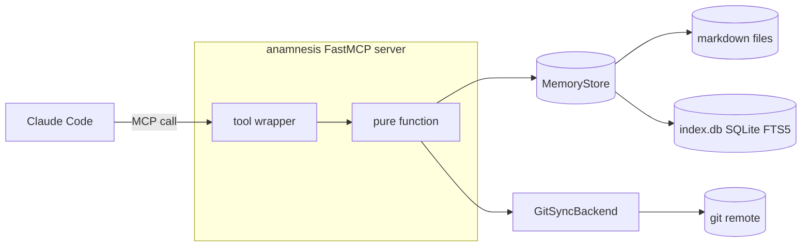
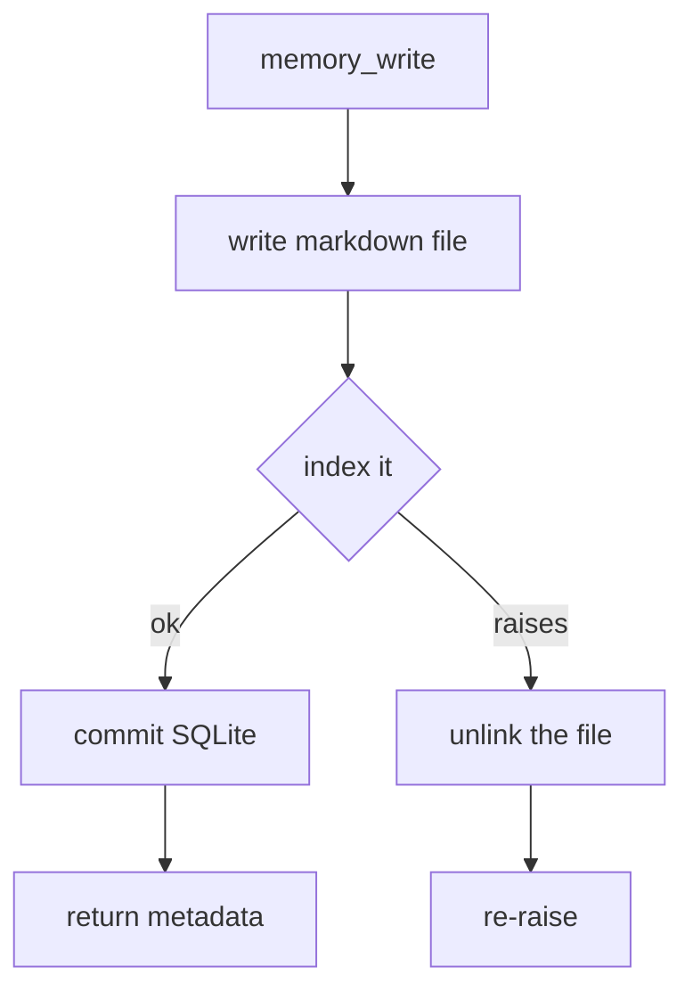
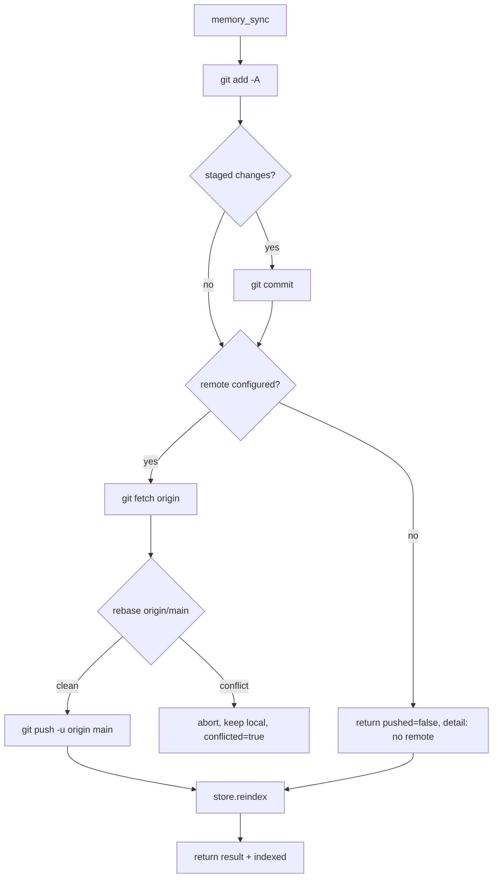
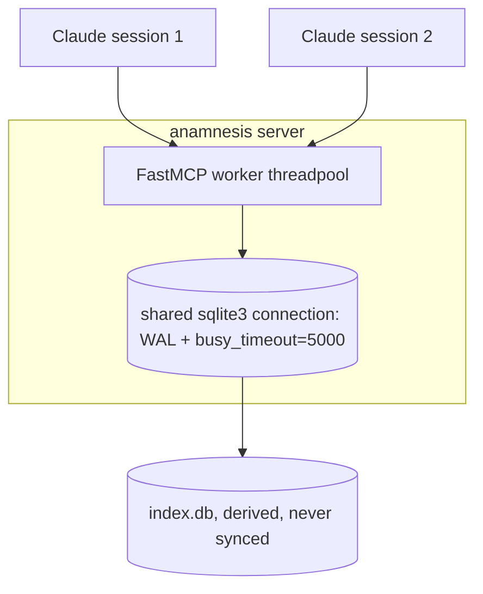

Anamnesis exposes the memory store to Claude Code through a [Model Context Protocol](https://modelcontextprotocol.io) server built with [FastMCP](https://github.com/jlowin/fastmcp). The server is deliberately thin: it maps MCP tool calls onto the store and the git sync backend, and nothing more. Markdown stays the source of truth, the SQLite index stays derived, and the server holds no state of its own beyond the bound store, sync backend, and machine id.

This page is the reference for the server. Every field name, default, and threshold below is taken from `server/src/anamnesis/server.py`, its tests in `server/tests/test_server.py`, and the supporting modules `store.py`, `sync.py`, and `config.py`.

## What the server is

The server module defines one FastMCP instance named `anamnesis` with five tools. The dependency points one way only: `server.py` imports the store and sync layers, but neither of those imports FastMCP. That keeps the engine (and the hook-driven CLI hot path) usable without the optional `mcp` extra installed.

```python
mcp: FastMCP = FastMCP(name="anamnesis")
```

The five tools split into two groups:

| Tool | Mutates store | Annotation | Auto-approvable |
| --- | --- | --- | --- |
| `memory_search` | no | `readOnlyHint=True, openWorldHint=False` | yes |
| `memory_list` | no | `readOnlyHint=True, openWorldHint=False` | yes |
| `memory_status` | no | `readOnlyHint=True, openWorldHint=False` | yes |
| `memory_write` | yes | `readOnlyHint=False, destructiveHint=False` | no (confirm) |
| `memory_sync` | yes | `readOnlyHint=False, openWorldHint=True` | no (confirm) |

The three read-only query tools carry the shared `_READ_ONLY` annotation:

```python
_READ_ONLY = ToolAnnotations(readOnlyHint=True, openWorldHint=False)
```

A client that honors annotations (Claude Code does) can auto-approve the read-only tools and prompt for confirmation on the two writers. The test `test_read_only_query_tools_are_annotated_read_only` asserts `readOnlyHint is True` for `memory_search`, `memory_list`, and `memory_status`, and `readOnlyHint is False` for `memory_write` and `memory_sync`. The test `test_build_server_registers_the_five_tools` asserts the registered set is exactly those five names.

<Callout type="info">
`openWorldHint=False` on the read-only tools says they operate over a closed, local world (your store). `memory_sync` sets `openWorldHint=True` because it talks to a remote over the network. `memory_write` sets `destructiveHint=False` because it only ever creates new notes (each write gets a fresh ULID id); it never overwrites or deletes an existing note.
</Callout>

## Architecture: tool wrappers over pure functions

Each MCP tool is a small closure registered inside `build_server`. Every one of them delegates to a separately testable, module-level function that takes the store (and, where needed, the sync backend) as an explicit argument. The wrapper does the MCP-facing work (signature, docstring shown to the model, annotations); the pure function does the logic.



The mapping is one wrapper to one function:

| Tool wrapper | Pure function | Signature |
| --- | --- | --- |
| `memory_search` | `search_memories` | `search_memories(store, *, query, project=None, type=None, scope=None, k=8)` |
| `memory_list` | `list_memories` | `list_memories(store, *, project=None, type=None, scope=None)` |
| `memory_status` | `status_report` | `status_report(store, backend)` |
| `memory_write` | `write_memory` | `write_memory(store, *, type, title, body, project="global", tags=None, machine_id="unknown", scope="portable")` |
| `memory_sync` | `sync_memory` | `sync_memory(store, backend)` |

This split is why the test file can exercise behavior two ways: it calls the pure functions directly against a temp-directory store (fast, no transport), and it drives the registered tools through an in-memory FastMCP `Client` to prove the wiring, schemas, and annotations Claude Code actually sees.

<Callout type="info">
The shared serializer `_memory_dict(mem, *, include_body)` is what turns a `Memory` dataclass into the JSON-friendly dict every tool returns. `include_body=True` adds the `body` field; `include_body=False` omits it. That single flag is the entire difference between what `memory_search` returns (bodies included) and what `memory_list` returns (bodies omitted).
</Callout>

## How the server is built and launched

`build_server` binds the tools to a concrete store and resolves the machine id once, at build time:

```python
def build_server(store: MemoryStore, *, machine_id: str | None = None) -> FastMCP:
    mid = machine_id or resolve_machine_id()
    backend: SyncBackend = GitSyncBackend(
        store.memory_dir, remote=resolve_remote(), machine_id=mid
    )
    mcp: FastMCP = FastMCP(name="anamnesis")
    # ... register the five tools, all closing over `store`, `backend`, `mid` ...
    return mcp
```

`server.py` also defines a `main()` that serves the store over stdio, but it is not the wired console script:

```python
def main() -> None:
    build_server(MemoryStore(resolve_home())).run()
```

The actual entry point declared in `server/pyproject.toml` is `anamnesis = "anamnesis.cli:main"`, and `anamnesis serve` (the default subcommand when none is given) is what Claude Code runs. Its handler `cmd_serve` does the same thing, but it imports `build_server` lazily so the non-serve hot path (inject, capture, sync) never needs the MCP extra installed:

```python
def cmd_serve() -> int:
    from anamnesis.server import build_server  # local import keeps the hot path MCP-free
    build_server(MemoryStore(resolve_home())).run()
    return 0
```

The repo ships a project-scoped `.mcp.json` that registers the server with Claude Code:

```json
{
  "mcpServers": {
    "anamnesis": {
      "command": "uv",
      "args": ["run", "--project", "server", "anamnesis", "serve"]
    }
  }
}
```

You can run the same command yourself to sanity-check that the server starts:

```bash
uv run --project server anamnesis serve
```

<Callout type="warn">
Claude Code launches MCP servers with a filtered environment, so your shell exports (`ANAMNESIS_HOME`, `ANAMNESIS_MACHINE_ID`, `ANAMNESIS_GIT_REMOTE`) are not inherited. Set them in the server's `.mcp.json` `"env"` block, or rely on the store-config fallback described under [Resolution at build time](#resolution-at-build-time).
</Callout>

### Resolution at build time

Three values are resolved from the environment (with fallbacks) and then frozen into the server:

- **Store root** comes from `resolve_home()`: `ANAMNESIS_HOME` if set (with `~` expanded), otherwise `~/.anamnesis`.
- **Machine id** comes from `resolve_machine_id()`: `ANAMNESIS_MACHINE_ID`, else the `machine_id` in the per-store `config.json`, else `socket.gethostname()`, else the literal string `"unknown"`. It is never empty.
- **Sync remote** comes from `resolve_remote()`: `ANAMNESIS_GIT_REMOTE`, else the `remote` in the per-store `config.json`, else `None`.

The store config lives at `<home>/config.json`, outside the synced `memory/` repo (the remote URL differs per machine). It is written by `anamnesis init`. A missing or malformed config yields `{}` so resolution never fails on a bad file.

<Callout type="warn">
`machine_id` is **not** a tool parameter. It is bound at build time as `mid` and threaded into `memory_write` from inside the closure, so the model cannot spoof the machine of origin. The end-to-end test builds the server with `machine_id="m-test"`, writes a note through the client, and asserts the returned `machine_id == "m-test"`, proving the bound id wins regardless of tool arguments.
</Callout>

## The read-only tools

### memory_search

```python
@mcp.tool(annotations=_READ_ONLY)
def memory_search(
    query: str,
    project: str | None = None,
    type: str | None = None,
    scope: str | None = None,
    k: int = 8,
) -> list[dict[str, object]]:
    ...
```

Keyword search over the FTS5 index, ranked by BM25. Returns up to `k` notes (default `8`), each a dict with `body` and full metadata. The optional filters narrow the result:

- `project` restricts to one project bucket.
- `type` restricts to `procedural`, `semantic`, or `episodic`.
- `scope` restricts to `portable` (synced) or `machine-local` (this machine only).

Returned shape, one dict per hit:

```jsonc
{
  "id": "01J...",          // ULID
  "type": "procedural",
  "title": "WAL mode",
  "project": "anamnesis",
  "machine_id": "desktop", // machine of origin
  "scope": "portable",
  "tags": ["sqlite"],
  "created_at": "2026-06-24T12:00:00+00:00",
  "updated_at": "2026-06-24T12:00:00+00:00",
  "body": "set busy_timeout"
}
```

Two recall details worth knowing, both implemented in the store, not the server:

- The query text is tokenized into words, each word becomes a quoted FTS5 phrase, and the phrases are joined with **`OR`** (not `AND`) and ranked by BM25. ANDing every token scored 0 percent recall on natural-language paraphrase queries; the OR-plus-BM25 form recovered recall to about 94 percent on the same eval set. If the query has no word tokens, search returns an empty list.
- Notes that another note marks as `supersedes` are excluded from results, so superseded memories do not resurface in recall.

### memory_list

```python
@mcp.tool(annotations=_READ_ONLY)
def memory_list(
    project: str | None = None,
    type: str | None = None,
    scope: str | None = None,
) -> list[dict[str, object]]:
    ...
```

Lists notes newest-first (ordered by `updated_at DESC, id DESC`), returning titles and metadata but **no bodies**. The shape is identical to `memory_search` minus the `body` key. The test `test_list_memories_returns_metadata_without_body` asserts `"body" not in items[0]`. Same three optional filters as search; there is no `k` cap on `memory_list`.

### memory_status

```python
@mcp.tool(annotations=_READ_ONLY)
def memory_status() -> dict[str, object]:
    ...
```

Reports index health and git sync state. No parameters. Returned shape:

```jsonc
{
  "root": "/home/you/.anamnesis",
  "db_path": "/home/you/.anamnesis/index.db",
  "total": 42,
  "by_type":    { "procedural": 20, "semantic": 18, "episodic": 4 },
  "by_project": { "anamnesis": 30, "global": 12 },
  "by_scope":   { "portable": 40, "machine-local": 2 },
  "sync": {
    "initialized": true,
    "remote": "ssh://node.tailnet/srv/anamnesis.git",
    "head": "3237e8f",
    "dirty": false,
    "detail": "ok"
  }
}
```

The counts come from `store.stats()`; the `sync` block comes from `backend.state()`. `sync.initialized` is `false` until the `memory/` git repo exists (no sync has run yet); `sync.remote` echoes the configured remote, so it is `null` when no remote is set. The test `test_status_report_reports_index_health_and_sync_state` builds a backend with `remote=None` and asserts `initialized is False` and `remote is None`.

## The write tools

### memory_write

```python
@mcp.tool(annotations=ToolAnnotations(readOnlyHint=False, destructiveHint=False))
def memory_write(
    type: str,
    title: str,
    body: str,
    project: str = "global",
    tags: list[str] | None = None,
    scope: str = "portable",
) -> dict[str, object]:
    ...
```

Creates one durable note: it writes the markdown file first, then indexes it. Note the wrapper has **no** `machine_id` parameter; the bound `mid` is injected inside the closure. The model controls everything else:

- `type` is one of `procedural` (verified how-tos, decisions, fixes), `semantic` (facts, preferences, conventions), or `episodic` (what happened). The store schema enforces this set with a `CHECK` constraint.
- `project` defaults to `"global"`.
- `tags` defaults to an empty list.
- `scope` defaults to `"portable"` (syncs to your other machines). `"machine-local"` keeps the note on this machine only and never syncs it.

The note's id is a freshly generated ULID, and `created_at`/`updated_at` are stamped at write time. The return value is the created note's full metadata including its `body`. Because the write modifies the store, the tool is not auto-approved; the client should confirm it.



<Callout type="info">
The portable vs machine-local split is enforced by *where the file lives*, not just by a field. A portable note is written under `<home>/memory/<type>/<id>.md` (inside the git-synced tree); a machine-local note is written under `<home>/local/<type>/<id>.md` (outside it). The test `test_write_memory_accepts_machine_local_scope` asserts a `machine-local` write lands in `local/` and leaves `memory/` empty, so it can never be pushed.
</Callout>

### memory_sync

```python
@mcp.tool(annotations=ToolAnnotations(readOnlyHint=False, openWorldHint=True))
def memory_sync(force: bool = False) -> dict[str, object]:
    ...
```

Runs one git sync cycle and then rebuilds the index. Concretely, `sync_memory` calls `backend.sync()` and then `store.reindex()`:

```python
def sync_memory(store: MemoryStore, backend: SyncBackend) -> dict[str, object]:
    r = backend.sync()
    indexed = store.reindex()
    return {
        "pushed": r.pushed,
        "pulled": r.pulled,
        "conflicted": r.conflicted,
        "head": r.head,
        "indexed": indexed,
        "detail": r.detail,
    }
```

The git cycle (in `GitSyncBackend.sync`) is: `git add -A`, commit if anything is staged, then `git fetch origin`, integrate `origin/main` with `git rebase`, and `git push -u origin main`. The branch is always `main`. The reindex afterward matters because pulling brings in markdown from other machines and the SQLite index is derived; rebuilding keeps search in step with the freshly synced files. The test `test_sync_memory_reindexes_so_pulled_notes_are_searchable` proves a pulled note is searchable on the receiving machine with no manual reindex.

Returned shape:

```jsonc
{
  "pushed": true,      // did we push new commits?
  "pulled": 2,         // commit count pulled from the remote
  "conflicted": false, // true if a rebase conflict was surfaced
  "head": "3237e8f",   // short HEAD after the cycle
  "indexed": 42,       // notes reindexed from markdown
  "detail": "synced"
}
```

Two behaviors to know:

- **No remote configured.** If `resolve_remote()` returned `None`, sync just commits locally and returns `pushed=false`, `conflicted=false`, with `detail` explaining there is no remote (it contains the substring `remote`). Asserted by `test_memory_sync_without_remote_commits_locally`.
- **Conflict policy.** On a rebase conflict the backend aborts the rebase, keeps your local edits in place, does not push, and returns `conflicted=true` with `detail` telling you to resolve and re-sync. It never silently drops either side.

<Callout type="warn">
The `force` flag is accepted in the signature but **reserved for future use**: `memory_sync` ignores it entirely and always calls `sync_memory(store, backend)`. Passing `force=true` changes nothing today. Do not rely on it.
</Callout>



## Concurrency model

Multiple Claude Code sessions can target the same store at once, and FastMCP runs synchronous tool functions in a worker threadpool. So the store's single SQLite connection is shared across threads. Three things make that safe, all set up in `MemoryStore.__init__`:

```python
self._db = sqlite3.connect(self.db_path, check_same_thread=False)
self._db.row_factory = sqlite3.Row
self._db.execute("PRAGMA journal_mode=WAL")
self._db.execute("PRAGMA busy_timeout=5000")
```

- `check_same_thread=False` lets the threadpool reuse the one connection across threads. This relies on SQLite's serialized threadsafety.
- **WAL mode** (`journal_mode=WAL`) lets readers and a writer proceed concurrently without the readers blocking on the writer.
- **`busy_timeout=5000`** (5000 milliseconds) makes a contended write wait and retry for up to five seconds instead of failing immediately with "database is locked".

The index database is never synced. It lives at `<home>/index.db`, outside the git-managed `memory/` tree, and is always rebuildable from markdown via `store.reindex()`. This is the deliberate lesson from the claude-brain DB-corruption incident: sync markdown over git, rebuild the index locally on each machine, never copy the live DB file between machines.



<Callout type="warn">
The index schema is versioned (`_SCHEMA_VERSION = 1`, tracked in `PRAGMA user_version`). On startup, if an existing DB is at a lower version, the store drops the derived tables, recreates them with the current schema, and reindexes from markdown. Because the index is fully derived, this migration is lossless: the markdown files are untouched.
</Callout>

## Testing the wiring yourself

Run the server test suite from the `server/` package:

```bash
cd server
uv run pytest tests/test_server.py -v
```

The suite covers home and machine-id resolution, each pure tool function against a temp store, the exact set of five registered tools, the read-only annotations, an end-to-end write-then-search through an in-memory `Client`, the bound machine id, the sync-and-reindex round trip across two stores sharing a bare git remote, and the no-remote local-commit path.

## Honest status

- The server, the five tools, the annotations, and the concurrency model described here are all shipped and tested.
- A one-line install via PyPI is **not** shipped yet. The README labels `uv tool install anamnesis-memory && anamnesis init` as available "once the package is published"; for now, install from source with `uv pip install -e ".[mcp,dev]"` in `server/`. The PyPI distribution name is `anamnesis-memory`, but the import package and the installed CLI command stay `anamnesis`.

## Related pages

- [The memory store](./store) for FTS5, BM25, the schema, and scope.
- [Cross-machine sync](./sync) for the git-over-Tailscale backend in detail.
- [Configuration](../reference/configuration) for `ANAMNESIS_HOME`, `ANAMNESIS_MACHINE_ID`, and `ANAMNESIS_GIT_REMOTE`.
