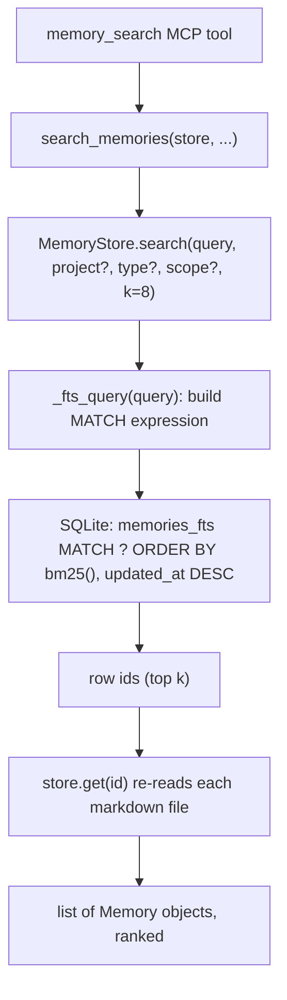
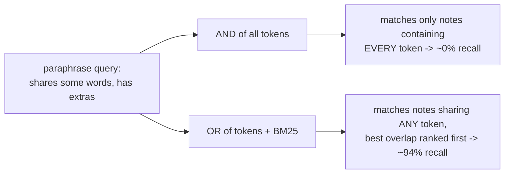
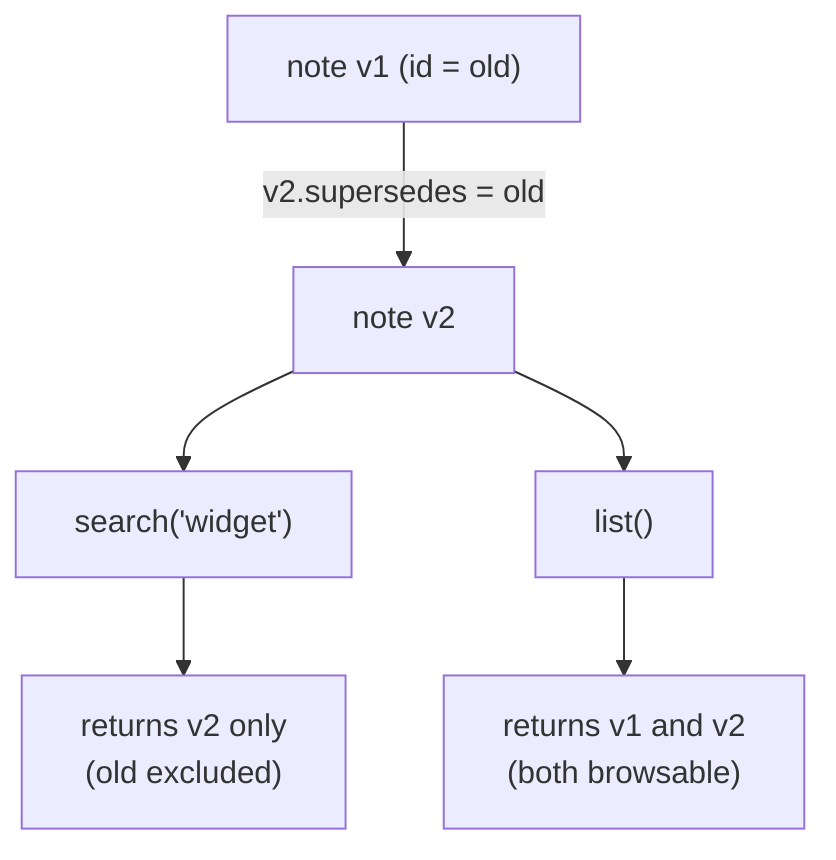

Anamnesis recall is keyword search, not a vector database. The source of truth is markdown, and a SQLite FTS5 index derived from those files answers queries with BM25 ranking. This page documents exactly how `MemoryStore.search` turns a free-text query into ranked notes, why query tokens are joined with `OR` and not `AND`, and how superseded notes are kept out of recall while staying browsable.

All of the behavior below lives in `server/src/anamnesis/store.py`, with the contract pinned by tests in `server/tests/test_store.py`.

## Where recall fits

A query enters through the MCP tool `memory_search` (defined in `server/src/anamnesis/server.py`), which calls the pure helper `search_memories`, which calls `MemoryStore.search`. The store runs one FTS5 query, then re-reads each hit from its markdown file before returning.



The index is never the source of truth. Every hit returned by `search` is re-read from disk via `get`, which loads and parses the note's markdown file. If the index and the files ever disagree, `reindex` rebuilds the entire index from the markdown tree.

## The FTS5 table

The index defines one virtual table for full-text search (`_SCHEMA` in `store.py`):

```sql
CREATE VIRTUAL TABLE IF NOT EXISTS memories_fts USING fts5(
  id UNINDEXED, title, body, tags, tokenize='porter unicode61'
);
```

Notes on each column and option:

- `id UNINDEXED` stores the note id alongside the searchable text but does not tokenize it, so ids never pollute keyword matches. It is used to join back to the structured `memories` table.
- `title`, `body`, and `tags` are the three searchable fields. On indexing (`_index`), `tags` is stored as the tag list joined with single spaces: `" ".join(mem.tags)`.
- `tokenize='porter unicode61'` applies Unicode-aware tokenization plus the Porter stemmer, so `connection` and `connections` collapse to the same stem and match each other.

The structured `memories` table holds everything else (type, project, machine_id, scope, timestamps, provenance, `supersedes`) and a `body_path` pointing at the markdown file on disk. `search` joins `memories_fts` to `memories` on `id`.

## How search() works

`MemoryStore.search` has this signature:

```python
def search(
    self,
    query: str,
    *,
    project: str | None = None,
    type: MemoryType | None = None,
    scope: Scope | None = None,
    k: int = 8,
) -> list[Memory]:
```

The default `k` is `8`. The steps are:

1. **Build the MATCH expression.** `match = _fts_query(query)`. If it comes back empty (the query had no word characters), `search` returns `[]` immediately and never touches the database.
2. **Assemble the SQL.** A base `SELECT m.id FROM memories_fts f JOIN memories m ON m.id = f.id WHERE memories_fts MATCH ?`, with optional `AND m.project = ?`, `AND m.type = ?`, and `AND m.scope = ?` clauses appended only when those filters are passed. All values are bound parameters, never string-interpolated.
3. **Exclude superseded notes.** A fixed clause is always appended (see [Superseded notes](#superseded-notes-are-hidden-from-recall) below).
4. **Rank and limit.** `ORDER BY bm25(memories_fts), m.updated_at DESC LIMIT ?` with `k` as the final parameter.
5. **Re-read from markdown.** The query returns ids only. `search` then calls `self.get(r["id"])` for each row, which reads the note back from its markdown file. The returned list is `Memory` objects, in rank order.

The full assembled query (with all three optional filters present) is:

```sql
SELECT m.id FROM memories_fts f
JOIN memories m ON m.id = f.id
WHERE memories_fts MATCH ?
AND m.project = ?
AND m.type = ?
AND m.scope = ?
AND m.id NOT IN
  (SELECT supersedes FROM memories WHERE supersedes IS NOT NULL AND supersedes <> '')
ORDER BY bm25(memories_fts), m.updated_at DESC LIMIT ?
```

### Ranking: BM25 with a recency tie-break

`bm25(memories_fts)` is SQLite FTS5's built-in relevance function. It returns a score where lower (more negative) is better, so a plain `ORDER BY bm25(memories_fts)` already puts the most relevant note first. Anamnesis adds a secondary sort key, `m.updated_at DESC`, so that when two notes score equally on BM25 the more recently updated one wins. The result: relevance first, freshness as the tie-break.

<Callout type="info">
`updated_at` is an ISO-8601 string (for example `2026-06-24T10:30:00+00:00`, produced by `_utcnow()` with `timespec="seconds"`). Because ISO-8601 sorts lexicographically in time order, `ORDER BY ... DESC` on the text column is correct without any date parsing. The `memories` table also carries `idx_mem_recency ON memories(updated_at DESC)` to back this ordering.
</Callout>

## The query builder: _fts_query

`_fts_query` is the small function that turns arbitrary user or imported text into a safe FTS5 MATCH expression. The entire implementation:

```python
def _fts_query(query: str) -> str:
    tokens = re.findall(r"\w+", query, flags=re.UNICODE)
    return " OR ".join(f'"{t}"' for t in tokens)
```

Three things happen here:

1. **Tokenize on `\w+`.** `re.findall(r"\w+", query, flags=re.UNICODE)` pulls out runs of word characters (letters, digits, underscore, Unicode-aware). Everything else (spaces, punctuation, FTS5 operators) is discarded at this stage.
2. **Double-quote every token.** Each token becomes a quoted phrase, for example `"sqlite"`. Quoting neutralizes FTS5-special characters so a token can never be interpreted as a query operator. This is what lets a query like `state-of-the-art` or `16:9` run without raising: the `-` and `:` are not part of any `\w+` run, so they are dropped, and the surviving word tokens are quoted.
3. **Join with `OR`.** The quoted tokens are joined with ` OR `.

So the query:

```
how to configure a SQLite connection to avoid lock errors on concurrent writes
```

becomes the MATCH expression:

```
"how" OR "to" OR "configure" OR "a" OR "SQLite" OR "connection" OR "to" OR "avoid" OR "lock" OR "errors" OR "on" OR "concurrent" OR "writes"
```

If the query has no word characters at all (for example `"-"`), `re.findall` returns an empty list, the join produces `""`, and `search` short-circuits to `[]`.

<Callout type="info">
There is no stop-word removal. Common words like `to`, `a`, and `on` stay in the OR expression. They contribute little to BM25 (they appear in many notes, so their inverse-document-frequency weight is low) but they do not hurt ranking, and keeping the function this simple is deliberate.
</Callout>

## Why OR and not AND

This is the load-bearing design decision in recall, and it is the subject of a dedicated fix (commit `e727005`).

The intuitive choice is to `AND` the tokens: require a matching note to contain every word of the query. That is wrong for natural-language recall. A real query is a paraphrase, not a copy of the note. It almost always contains at least one word the relevant note does not. Under `AND`, a single missing word drops the note from the results entirely.

Measured on the eval set, ANDing every token scored about **0% recall** on natural-language paraphrase queries. Switching to `OR` plus BM25 ranking surfaces the best-overlapping notes first (a note that shares more, and rarer, query words ranks higher) and recovered recall to about **94%** on the same eval set.



The pure intent is captured by `test_search_recalls_on_partial_overlap_not_only_full_match` in `test_store.py`. It writes a note titled `Use WAL mode for SQLite` with body `Set busy_timeout on every connection to avoid lock errors.`, then searches:

```
how to configure a SQLite connection to avoid lock errors on concurrent writes
```

The query shares `SQLite`, `connection`, `avoid`, `lock`, and `errors` with the note, but also carries `configure`, `concurrent`, and `writes`, which the note lacks. An AND-of-all-tokens match would return nothing; the test asserts the note is still found. That is the OR + BM25 behavior working as designed.

<Callout type="warn">
OR recall means `search` returns the best-overlapping notes, not only exact matches. Treat the result as a ranked candidate set, and rely on BM25 order plus `k` (default `8`) to keep it tight. This is the right trade for feeding Claude a working set, where a near-miss is far cheaper than a missed memory.
</Callout>

## Superseded notes are hidden from recall

When a newer note replaces an older one, the new note's `supersedes` field carries the old note's id. `search` always appends this exclusion clause, regardless of any project, type, or scope filters:

```sql
AND m.id NOT IN
  (SELECT supersedes FROM memories WHERE supersedes IS NOT NULL AND supersedes <> '')
```

So any id that appears as some other note's `supersedes` value is excluded from search results. The helper `superseded_ids()` returns the same set (every non-empty `supersedes` value in the store) for callers that need it directly.

The key asymmetry, pinned by `test_search_excludes_superseded_but_list_includes`:

- `search` excludes superseded notes. They are stale, so they must not be recalled into a working set.
- `list` includes them. The full history stays browsable (for example in the dashboard), so nothing is silently lost.



## Scope, project, and type filters

The three optional filters narrow recall before ranking:

- `project` restricts to notes whose `project` equals the value. `test_search_is_scoped_by_project` confirms a query only returns notes from the requested project.
- `type` restricts to one of `procedural`, `semantic`, or `episodic` (enforced by a `CHECK` constraint on the `memories` table).
- `scope` restricts to `portable` or `machine-local`.

When no `scope` is passed, search spans both portable and machine-local notes. `test_list_and_search_filter_by_scope_but_span_both_by_default` verifies that a default `search("findme", project="p")` returns notes from both trees, while `scope="machine-local"` narrows to the local-only note. (Machine-local notes live under `local/` outside the git-synced `memory/` tree; see [Sync](./sync).)

## Concurrency and the rebuildable index

The SQLite connection is opened with `check_same_thread=False` because the FastMCP server runs synchronous tools in a worker threadpool, so one connection is shared across threads. Safety comes from `PRAGMA journal_mode=WAL` plus `PRAGMA busy_timeout=5000` (5 seconds), set at open time in `MemoryStore.__init__`. `test_store_is_usable_from_another_thread` writes and searches from a separate thread to pin this.

Because the index is fully derived, a fresh machine that synced only the markdown can rebuild a working index from the files alone. `reindex` clears `memories`, `memory_tags`, and `memories_fts`, then walks both trees (`memory/` as `portable`, `local/` as `machine-local`) and re-indexes every `*.md` file, returning the count. `test_reindex_rebuilds_index_from_markdown_only` deletes `index.db` (and its `-wal` and `-shm` sidecars), reopens the store, confirms search is empty, then reindexes and confirms recall returns. Schema upgrades use the same mechanism: on open, a `user_version` below `_SCHEMA_VERSION` (currently `1`) drops the derived tables, recreates them, and reindexes from markdown.

<Callout type="warn">
Never sync `index.db` itself. It is derived state and syncing a live SQLite database over a file-sync tool risks corruption. Sync the markdown via git and rebuild the index locally. See [Sync](./sync) for the git-over-Tailscale flow.
</Callout>

## Vectors are an optional, currently-unused extra

Recall is keyword-only today. Semantic vector search exists only as an optional dependency, not a code path: `server/pyproject.toml` declares

```toml
# Optional semantic recall - added only when keyword search proves insufficient.
vectors = [
  "sqlite-vec>=0.1",
]
```

This `vectors` extra is not installed by default and is not wired into `store.py` (nothing imports `sqlite-vec` anywhere in the package). The architecture position is explicit: add `sqlite-vec` embeddings only if keyword search measurably fails on paraphrase queries. The eval harness in `server/src/anamnesis/eval.py` is the instrument that would detect such a failure: `recall_at_k(store, cases, ks=(1, 3, 5, 8))` runs `store.search` over each case and returns a `RecallReport` with Recall@k for k in `(1, 3, 5, 8)` plus MRR (mean reciprocal rank of the first relevant hit). The cases themselves are LLM-generated paraphrase queries (`build_eval_candidates`, one paraphrase query per sampled note). Until that bar is crossed, the simpler FTS5 + BM25 path stands.

## Trying it

The store is plain Python. To exercise recall directly from a checkout:

```bash
cd server
uv venv
uv pip install -e ".[dev]"
uv run pytest tests/test_store.py -q
```

To run only the recall-shaped tests:

```bash
cd server
uv run pytest tests/test_store.py -q -k "search or superseded or reindex"
```

A quick interactive check from a Python shell:

```python
from anamnesis.store import MemoryStore

store = MemoryStore(root="/tmp/anamnesis-demo")
store.write(
    type="procedural",
    title="Use WAL mode for SQLite",
    body="Set busy_timeout on every connection to avoid lock errors.",
    project="demo",
)
hits = store.search("how to avoid sqlite lock errors on concurrent writes", project="demo")
print([m.title for m in hits])
```

## See also

- [MCP server](./mcp-server) - how `memory_search` is exposed to Claude Code.
- [Data model](./data-model) - the `memories` schema, provenance fields, and the `supersedes` relationship.
- [Sync](./sync) - git-over-Tailscale sync of the markdown source of truth (and why `index.db` is never synced).
- [Reflection](./reflection) - how notes get superseded and consolidated over time.
