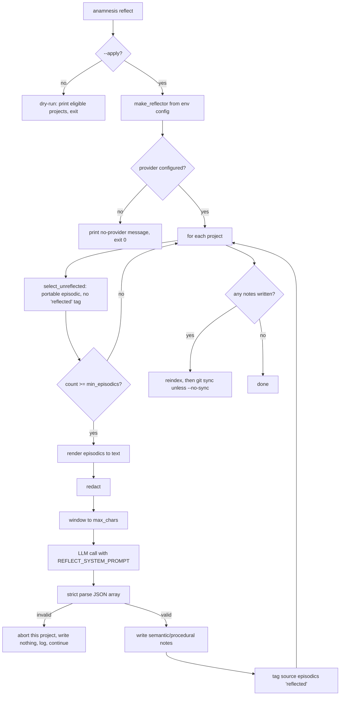
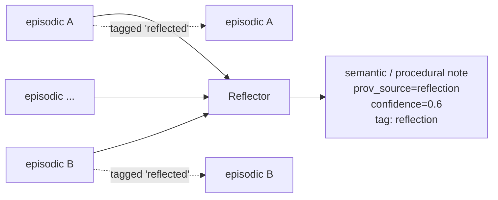
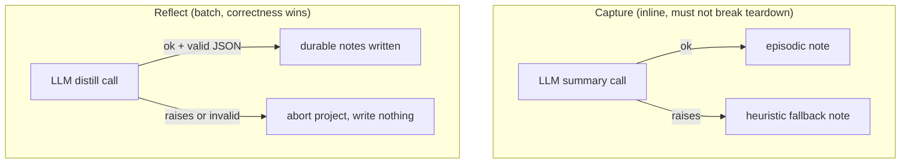
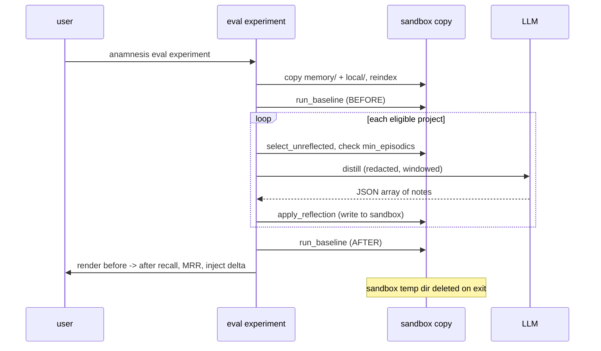

Anamnesis captures one **episodic** note per Claude Code session (see [Capture and injection](./capture-and-injection)). Over time those notes pile up: many of them repeat the same facts, decisions, and procedures. **Reflection** is the offline pass that reads a project's un-reflected episodics and distills them into a smaller set of durable **semantic** and **procedural** notes, so future sessions get a tighter, higher-signal working set instead of a growing stack of raw session logs.

This page is the reference for how that works. It covers the swappable LLM, the exact pipeline, redaction as the enforcement seam, the strict no-fallback policy on bad model output, and the eval suite you use to confirm reflection actually helps recall before you trust it.

The two source files to read alongside this page are `server/src/anamnesis/reflect.py` (the pipeline) and `server/src/anamnesis/llm_summarizer.py` (the LLM client and config). Redaction lives in `server/src/anamnesis/redact.py`, capture-time summarization in `server/src/anamnesis/capture.py`, and the measurement harness in `server/src/anamnesis/eval.py`.

## Two places the model runs

The same swappable LLM serves two distinct jobs. Keep them straight, because their failure policies are opposite.

| Job | Where | Input | Output | On bad/failed output |
| --- | --- | --- | --- | --- |
| Capture-time summary | `llm_summarizer.py` (`LLMSummarizer`) | one raw session transcript | one episodic note (`{skip, title, body}`) | falls back to the deterministic heuristic so teardown never breaks |
| Reflection / distillation | `reflect.py` (`Reflector`) | many episodic notes for one project | zero or more durable notes (a JSON array) | **aborts** that project, writes nothing, never fabricates |

Capture runs inline at session teardown (a `SessionEnd` or `PreCompact` hook), so it must never raise; if the LLM is misconfigured or returns garbage it silently degrades to a deterministic heuristic summary. Reflection is a deliberate, user-invoked batch job, so correctness wins over availability: a bad response aborts rather than inventing memory. Both jobs are detailed below.

## The swappable LLM

The reflection model is **deliberately swappable and never hardcoded**. Nothing in the code names a specific vendor model in a way that the call site depends on: provider, model, base URL, key, timeout, and token budget all come from the environment, and the HTTP layer speaks the generic OpenAI-compatible `/chat/completions` shape. This is an explicit architecture decision so the price/quality frontier can move without code changes.

### Configuration (environment only)

`resolve_reflection_config()` in `llm_summarizer.py` reads everything from the environment. These are machine-local and never synced.

| Variable | Purpose | Default |
| --- | --- | --- |
| `ANAMNESIS_REFLECTION_PROVIDER` | provider label; also the heuristic/LLM switch | `heuristic` |
| `ANAMNESIS_REFLECTION_MODEL` | model id sent in the request body | (empty) |
| `ANAMNESIS_REFLECTION_BASE_URL` | OpenAI-compatible base URL (no trailing `/chat/completions`) | (empty) |
| `ANAMNESIS_REFLECTION_API_KEY` | bearer key; falls back to `DEEPSEEK_API_KEY`, then `OPENAI_API_KEY` | (empty) |
| `ANAMNESIS_REFLECTION_TIMEOUT` | per-request timeout in seconds (float) | `30` |
| `ANAMNESIS_REFLECTION_MAX_TOKENS` | token budget; drives the input char window (`max_tokens * 4`) | `120000` |

A few exact behaviors worth knowing:

- The API key is resolved by `_env(...)` which tries each name in order and returns the first non-empty value, so an existing `DEEPSEEK_API_KEY` or `OPENAI_API_KEY` in your shell is picked up without setting `ANAMNESIS_REFLECTION_API_KEY`.
- `base_url` has any trailing slash stripped and `/chat/completions` appended (`_http_client`).
- `max_tokens` is an **input window budget**, not an output cap. It is multiplied by 4 (the project's ~4-chars-per-token estimate) to produce `max_chars`, the size the content is windowed to before sending. It is not sent to the provider as `max_tokens`.
- `provider` is lowercased and used as the first half of the recorded `prov_model` label (`f"{provider}/{model}"`), so a reflection note's provenance reads like `deepseek/deepseek-chat`.

<Callout type="warn">
The reflection/provider environment is only present in the user's interactive shell (zsh in this setup). It is not visible to a non-interactive subshell, so `anamnesis reflect --apply` and `anamnesis eval build/experiment` must be run from that shell, or the provider will resolve as unconfigured and the command will no-op.
</Callout>

### Default provider heuristic

The provider also selects which summarizer/reflector you get, and the default is intentionally conservative: **no LLM unless you configure one.**

- `ANAMNESIS_REFLECTION_PROVIDER` defaults to `heuristic`. Capture's `resolve_summarizer()` maps `heuristic` to the deterministic `HeuristicSummarizer`, and maps `deepseek`, `openai`, and `local` to the LLM path. Any unknown value also falls back to the heuristic.
- Even when the provider is one of the LLM values, the LLM path only activates if `model`, `base_url`, **and** `api_key` are all non-empty. `make_llm_summarizer()` returns a `HeuristicSummarizer` otherwise, and `make_reflector()` returns `None` otherwise (which the `reflect` command treats as "no provider configured" and exits cleanly).

So the gate is: a recognized provider value, plus a model, plus a base URL, plus a key. Miss any one and capture stays deterministic and reflection stays off.

### The HTTP client

`_http_client(base_url, api_key, model, timeout)` returns a closure that POSTs to `{base_url}/chat/completions` using stdlib `urllib.request` only. There is no SDK and no third-party dependency, so the base (hook) install stays dependency-light. The request body is:

```json
{
  "model": "<ANAMNESIS_REFLECTION_MODEL>",
  "messages": [
    { "role": "system", "content": "<system prompt>" },
    { "role": "user", "content": "<windowed, redacted content>" }
  ],
  "temperature": 0.2,
  "stream": false
}
```

It sets `Content-Type: application/json` and `Authorization: Bearer <api_key>`, applies the configured `timeout`, and returns `body["choices"][0]["message"]["content"]` as a string. Any network error, timeout, or unexpected JSON shape raises out of the closure, where the caller's policy (fallback for capture, abort for reflection) takes over.

## The reflect pipeline

`anamnesis reflect` distills a project's episodic notes. The default run is a **dry-run**; you must pass `--apply` to write anything.

```bash
# dry-run: report which projects have enough un-reflected episodics
anamnesis reflect

# distill one project and write the durable notes (then sync)
anamnesis reflect --project myproj --apply

# distill every eligible project, write notes, but skip the git sync
anamnesis reflect --apply --no-sync
```

### End-to-end flow



### Step by step

**1. Pick projects.** With `--project X` it reflects only `X`. Otherwise it reflects every project that has any portable episodic note: `sorted({m.project for m in store.list(type="episodic", scope="portable")})`.

**2. Select un-reflected episodics.** `select_unreflected(store, project)` returns the project's notes that are `type="episodic"`, `scope="portable"`, and do **not** carry the `reflected` tag. Local-scope notes are never reflected; only portable memory is eligible.

**3. Threshold gate.** `resolve_min_episodics()` reads `ANAMNESIS_REFLECT_MIN_EPISODICS` (default **5**). A project with fewer than that many un-reflected episodics is skipped this run. The idea is to wait until there is enough material to find recurring patterns, rather than distilling one or two sessions into low-value notes. A non-integer env value falls back to 5.

**4. Render, redact, window.** `Reflector.reflect()` joins the selected notes into one text blob (`## {title}\n{body}` per note), runs it through `redact(...)`, then `_window(...)` to bound it to `max_chars` (which is `cfg.max_tokens * 4`, default 480,000 chars at the default token budget). Redaction always runs before windowing, and windowing keeps the head (60%) and tail with an explicit `...[transcript truncated for length]...` marker.

**5. LLM call.** The redacted, windowed content is sent as the user message with `REFLECT_SYSTEM_PROMPT` as the system message. The prompt instructs the model to return only a JSON array where each element is `{"type": "semantic" | "procedural", "title": <string>, "body": <string>}`, to use `semantic` for durable facts/decisions/preferences and `procedural` for repeatable how-tos, to merge points that recur across sessions, to omit one-off chatter and transient state, and to return `[]` if nothing is worth keeping. It also explicitly forbids including secrets, keys, tokens, or credentials.

**6. Strict parse.** `_parse_reflection(text)` strips any markdown code fences, `json.loads` the result, and validates the shape hard:
   - the top level must be a list, else `ValueError("reflection output is not a JSON array")`;
   - each item must be an object;
   - `type` must be exactly `semantic` or `procedural`;
   - both `title` and `body` must be non-empty after stripping.

   Any violation raises `ValueError`. There is no partial acceptance: the whole project's response is rejected.

**7. Write durable notes.** For each parsed `DistilledNote`, `apply_reflection` calls `store.write(...)` with:
   - `type` = `semantic` or `procedural` (as returned by the model);
   - `project` = the project being reflected;
   - `scope="portable"`;
   - `tags=["reflection"]`;
   - `prov_source="reflection"`;
   - `prov_model` = the reflector's `model_label` (`f"{provider}/{model}"`);
   - `confidence=0.6` (the module default `_DEFAULT_CONFIDENCE`).

   The low confidence and the `reflection` tag are how the dashboard surfaces these notes as machine-proposed and reviewable, distinct from human-authored memory (which writes at `confidence=1.0`, `prov_source="human"`).

**8. Tag the sources.** Each source episodic gets the `reflected` tag added (`ep.tags = sorted(set(ep.tags) | {"reflected"})`) and is persisted via `store.put(ep)`. That is what makes reflection idempotent: a re-run will not re-select the same episodics, because they now carry `reflected`. The same episodics are never distilled twice.

**9. Sync.** After a successful `--apply` run that wrote at least one note, the command reindexes and runs a git sync, unless `--no-sync` was passed (in which case it reindexes only). With `--no-sync`, the new notes are written to markdown and indexed locally but not committed.

<Callout type="warn">
`reflect --no-sync` does **not** commit. The notes exist on disk and in the local index, but until you commit them they can be clobbered by a concurrent sync (for example, a `SessionEnd` capture firing in another session, which does commit and push). If you use `--no-sync`, commit the new markdown promptly, or just let the default (sync) run.
</Callout>

### Provenance of a reflection note



A reflection note never deletes or rewrites its source episodics. The episodics stay as-is (just tagged `reflected`); the durable note is additive. This keeps the markdown source of truth append-only and auditable: you can always trace a distilled note back to the sessions that were available when it was written, and you can delete a bad reflection note without losing the underlying history.

## The no-fallback policy

This is the most important behavioral contract of reflection, and it is the opposite of capture-time summarization.

**Reflection aborts; it never fabricates.** In `apply_reflection`, the LLM call happens **first**, before any write. If `reflector.reflect()` raises (a network error, a timeout, or a parse failure from `_parse_reflection`), the exception propagates and nothing has been written for that project. The `reflect` command catches it per project (`reflect: {project}: failed ({exc}); skipped`) so one bad project does not kill the whole run, but the policy inside the pipeline is absolute: a failed or invalid response yields zero notes. The system would rather write nothing than write a hallucinated or malformed memory.

**Capture falls back; it never breaks teardown.** `LLMSummarizer.summarize()` wraps the whole LLM path in a `try/except Exception`. On any failure it logs `capture: llm summary failed (...); using heuristic` to stderr and returns `self.fallback.summarize(session)`, the deterministic `HeuristicSummarizer`. Capture runs inline during session teardown, so it must always produce something (or a clean skip) and must never raise.



The reason for the split: a hallucinated one-line episodic from a single session is low stakes and self-correcting (the next session overwrites the working set anyway), but a hallucinated durable semantic note would be promoted, low-friction, and injected into many future sessions. The cost of a bad durable note is much higher, so reflection refuses to guess.

The eval suite's candidate generation (`build_eval_candidates`) follows the same no-fallback rule: an unparseable query-gen response raises rather than fabricating an eval case.

## Redaction is the enforcement seam

Redaction is the single point where secrets are masked before anything leaves the machine for an external provider. It is not a best-effort sprinkle across the codebase; it is one function, `redact(text)` in `redact.py`, called on the exact content that is about to be sent.

Every path that sends content to the LLM redacts first, immediately before windowing:

- reflection: `Reflector.reflect()` does `_window(redact(_render_episodics(episodics)), self.max_chars)`;
- capture: `LLMSummarizer.summarize()` does `_window(redact(transcript), self.max_chars)`;
- eval query-gen: `build_eval_candidates()` does `_window(redact(f"# {note.title}\n{note.body}"), max_chars)`.

`redact()` is deterministic and conservative. It replaces secret-shaped spans with the literal `[REDACTED]`. The patterns (applied in order, the multi-line key block first) cover:

- PEM private-key blocks (`-----BEGIN ... PRIVATE KEY----- ... -----END ... PRIVATE KEY-----`);
- AWS access key ids (`AKIA` + 16 chars);
- `sk-` / `rk-` / `pk-` style keys (12+ trailing chars);
- GitHub tokens (`ghp_`, `gho_`, `ghs_`, `ghr_`, `ghu_` + 20+ chars);
- Slack tokens (`xoxb-` / `xoxa-` / `xoxp-` / `xoxr-` / `xoxs-`);
- `Bearer <token>` headers (12+ chars).

It also masks key/value assignments for sensitive key names (`password`, `passwd`, `secret`, `token`, `api_key`/`apikey`, `authorization`, `access_key`, `client_secret`), preserving the key name and any surrounding quotes while replacing the value. The prefix capture means a trailing-segment name like `DEEPSEEK_API_KEY=...` still matches.

<Callout type="info">
The reflect and capture system prompts also tell the model never to emit secrets, but that is belt-and-suspenders. The hard guarantee is the deterministic `redact()` pass on the content before the request is built, not the model's cooperation. See [Security](../reference/security) for the full redaction reference.
</Callout>

<Callout type="warn">
Redaction is pattern-based, so it catches secret-shaped spans, not every possible secret. A credential in an unusual format (no recognizable prefix, no `key=value` shape) can slip through. Treat the reflection provider as a place your redacted transcripts go, and prefer a provider and key you are comfortable sending developer notes to.
</Callout>

## The eval suite

Reflection changes your memory store, so before you trust it you want evidence that it improves recall without bloating the per-session working set. `anamnesis eval` is the measurement harness for exactly that. It lives in `eval.py` and has three subcommands.

The two metrics:

- **recall@k** and **MRR** (`recall_at_k`): for each eval case (a query plus the ids of the notes that should answer it), run `store.search(query, k)` and check whether any relevant id appears in the top k. The defaults report recall@1, @3, @5, @8, plus MRR (mean reciprocal rank, using the rank of the first relevant hit). See [Recall](./recall) for how `store.search` ranks.
- **working set**: the estimated token size of the SessionStart inject block per non-global project, plus mean/median and the share of the full corpus a session injects (`inject_working_set`). Tokens are estimated with the ~4-chars-per-token heuristic (`estimate_tokens`); the harness only ever reports ratios and diffs of the same estimator, so the constant factor cancels out.

### build: generate candidate eval cases

```bash
anamnesis eval build --n 30 --types semantic,procedural
```

`build` samples notes from the store (a deterministic round-robin across projects for coverage, no RNG) and, for each, asks the LLM for one realistic paraphrase query that the note answers, using `QUERYGEN_SYSTEM_PROMPT`. The prompt deliberately asks for **different words** from the note so the query tests meaning-based recall, not exact keyword overlap. Each generated case is appended to the eval set with `approved=false` and `source="llm:<provider>/<model>"`. Duplicate queries already in the set are skipped (`append_candidates`).

Defaults and paths:

- `--n` defaults to 30, `--types` defaults to `semantic,procedural`.
- The eval set defaults to `<store-root>/eval/eval.jsonl` (override with `--eval-set`). It lives under the store root, outside the repo.
- `build` requires a configured provider (`make_reflector()`); with none it prints the no-provider message and exits.

<Callout type="warn">
`build` writes candidates as `approved=false`. They are LLM-generated and must be curated by hand. `eval run` and `eval experiment` ignore unreviewed cases unless you pass `--include-unreviewed`. Curating means reading each query, confirming the listed `relevant_ids` really are the right answers, and flipping `approved` to `true` in the JSONL.
</Callout>

### run: measure the current store

```bash
anamnesis eval run            # human-readable report
anamnesis eval run --json     # machine-readable, for tracking over time
```

`run` loads the approved cases, refreshes each case's note titles from the store (warning, not erroring, on any relevant id that is no longer present), and reports recall@k, MRR, and the working-set sizes for the store as it is right now. This is your baseline. Pass `--include-unreviewed` to also score candidates you have not curated yet.

### experiment: before/after reflection, safely

```bash
anamnesis eval experiment
```

`experiment` answers the real question: does running reflection help? It does so **without touching your live store**. `sandbox_store(store)` copies the `memory/` and `local/` markdown trees into a temp directory, builds a fresh `MemoryStore` over the copy, and reindexes it. All reflection then happens on that throwaway copy, which is removed on exit. Your real notes are never modified.



The report shows the inject-token mean per project before and after (with a percent delta), recall@k and MRR before and after (flagging any `REGRESSION` where after is worse than before), the count of projects reflected and notes written, the count skipped for being below the episodic threshold, and any projects that errored during reflection. The `ExperimentReport.recall_regressed` property is `True` if recall dropped at any k, which is your stop signal: if reflection regresses recall on a curated eval set, do not promote it.

`experiment` also requires a configured provider, and like `run` it ignores unreviewed cases unless `--include-unreviewed` is passed.

### Recommended workflow

```bash
# 1. generate candidates (LLM)
anamnesis eval build --n 30

# 2. curate eval.jsonl by hand: verify relevant_ids, set approved=true

# 3. baseline the live store
anamnesis eval run --json > baseline.json

# 4. simulate reflection on a sandbox copy; check for regressions
anamnesis eval experiment

# 5. only if recall holds or improves, run it for real
anamnesis reflect --apply
```

## Defaults and field reference

| Thing | Value | Where |
| --- | --- | --- |
| Min un-reflected episodics to reflect | `5` (`ANAMNESIS_REFLECT_MIN_EPISODICS`) | `resolve_min_episodics` |
| Reflection note confidence | `0.6` | `_DEFAULT_CONFIDENCE` |
| Reflection note `prov_source` | `reflection` | `apply_reflection` |
| Reflection note tag | `reflection` | `apply_reflection` |
| Source episodic tag after reflection | `reflected` | `apply_reflection` |
| Eligible source notes | `type=episodic`, `scope=portable`, not tagged `reflected` | `select_unreflected` |
| Distilled note types | `semantic`, `procedural` | `REFLECT_SYSTEM_PROMPT`, `_parse_reflection` |
| Default input window | `max_tokens * 4` chars (480,000 at defaults) | `make_reflector`, `_window` |
| Request temperature | `0.2`, `stream: false` | `_http_client` |
| Default provider | `heuristic` (no LLM) | `resolve_reflection_config`, `resolve_summarizer` |
| Default timeout | `30` seconds | `resolve_reflection_config` |
| recall@k defaults | k = 1, 3, 5, 8 | `recall_at_k`, `run_baseline` |
| Eval set path | `<store-root>/eval/eval.jsonl` | `_eval_set_path` |

## Related

- [Capture and injection](./capture-and-injection) - where episodic notes come from and how the working set is injected.
- [Recall](./recall) - how `store.search` ranks, which is what the eval recall@k metric measures.
- [Data model](./data-model) - note types, scopes, tags, and provenance fields.
- [Configuration](../reference/configuration) - the full environment-variable reference.
- [CLI](../reference/cli) - the `reflect` and `eval` subcommands and their flags.
- [Security](../reference/security) - redaction and what does and does not leave the machine.
