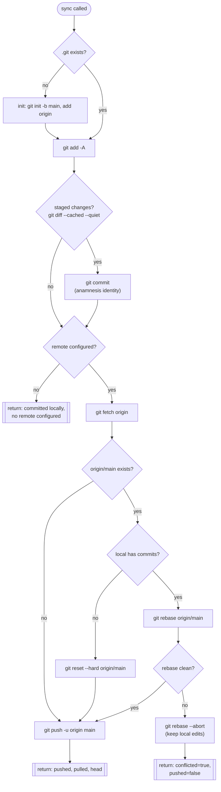
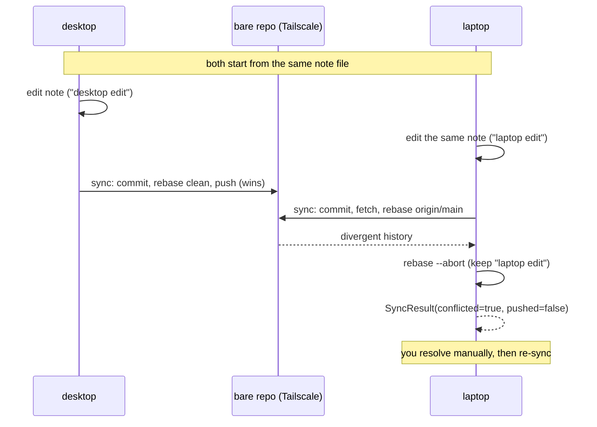
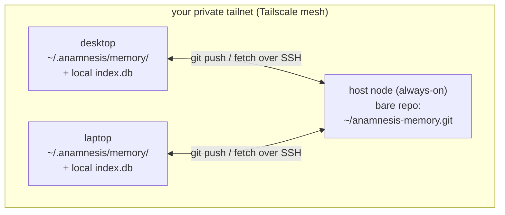

Anamnesis keeps a coding agent's memory in step across every machine you own. The mechanism is deliberately boring: markdown files in a git repo, pushed and pulled over your private Tailscale mesh, with a SQLite FTS5 index rebuilt locally on each machine after every pull. There is no central server, no cloud account, and no database file traveling over the wire.

This page is the reference for that layer. It is grounded in `server/src/anamnesis/sync.py` and its tests in `server/tests/test_sync.py`.

## Where memory lives on disk

A store has a fixed layout under its root (default `~/.anamnesis`), described in `server/src/anamnesis/store.py`:

```text
~/.anamnesis/                 # store root  (MemoryStore.root)
  memory/                     # the git repo  (MemoryStore.memory_dir)  -- SYNCED
    <type>/<id>.md            #   one markdown file per note, the source of truth
  local/                      # machine-local notes  (MemoryStore.local_dir)  -- NEVER SYNCED
    <type>/<id>.md
  index.db                    # derived SQLite index (WAL + FTS5)  -- NEVER SYNCED
```

The single most important structural fact: the git repository is `memory/`, not the store root. `GitSyncBackend` is always constructed against `store.memory_dir`:

```python
backend = GitSyncBackend(store.memory_dir, remote=resolve_remote(), machine_id=resolve_machine_id())
```

Because `local/` and `index.db` live one level up at the store root, they are physically outside the git working tree. They cannot be staged, committed, or pushed, because git never sees them. This is enforced by topology, not by a `.gitignore` rule, which is a stronger guarantee. The test `test_index_db_is_never_tracked` asserts exactly this by running `git ls-files` and checking that `.db` never appears.

<Callout type="info">
Markdown is the source of truth. The SQLite index is fully derived from it and can always be rebuilt with `MemoryStore.reindex()`. That asymmetry is what makes the sync model safe: there is exactly one authoritative copy of memory (the files), and it is the only thing that travels.
</Callout>

## The sync cycle

`GitSyncBackend.sync()` runs one full cycle: commit local changes, integrate the remote, push, and report what happened. The server and CLI both wrap it with a reindex afterward (`sync_memory()` in `server.py`, `_run_sync()` in `cli.py`), so search stays in step with the files that just arrived.



### Step 1: commit local changes

```python
self._git("add", "-A")
committed = self._git("diff", "--cached", "--quiet", check=False).returncode != 0
if committed:
    stamp = datetime.now(UTC).isoformat(timespec="seconds")
    self._git("commit", "-m", f"anamnesis: sync from {self.machine_id} at {stamp}")
```

`git add -A` stages everything in `memory/`. `git diff --cached --quiet` returns a nonzero exit code when there is something staged, which is how the backend decides whether a commit is needed. The commit message is `anamnesis: sync from <machine_id> at <ISO-8601 UTC timestamp>`, for example `anamnesis: sync from desktop at 2026-06-24T14:03:00+00:00`.

Every commit is authored by a fixed anamnesis identity, regardless of your personal git config. `_git()` injects four environment variables on every invocation:

```python
ident = {
    "GIT_AUTHOR_NAME": "anamnesis",
    "GIT_AUTHOR_EMAIL": f"anamnesis@{self.machine_id}",
    "GIT_COMMITTER_NAME": "anamnesis",
    "GIT_COMMITTER_EMAIL": f"anamnesis@{self.machine_id}",
}
```

So author and committer name are both `anamnesis`, and the email encodes the originating machine, for example `anamnesis@desktop`. This keeps the history clean, machine-attributable, and independent of whatever `user.name` / `user.email` you happen to have set globally.

### Step 2: integrate the remote, then push

If no remote is configured (the `--local-only` case), `sync()` stops here and returns `SyncResult(pushed=False, pulled=0, conflicted=False, head=<sha>, detail="committed locally; no remote configured")` (or `nothing to commit; no remote configured` when there was nothing staged).

With a remote, the backend fetches and then integrates `origin/main`. The branch is always `main` (the module constant `_BRANCH = "main"`):

```python
self._git("fetch", "origin", check=False)
pulled = 0
if self._remote_has_branch():
    before = self._head()
    if not self._has_commits():
        self._git("reset", "--hard", f"origin/{_BRANCH}")
    else:
        rebase = self._git("rebase", f"origin/{_BRANCH}", check=False)
        ...
```

There are two integration paths, chosen by whether the local repo has any commits yet:

- **Fresh clone-equivalent (no local commits):** `git reset --hard origin/main`. A brand-new machine that has never committed simply adopts the remote history wholesale. There is nothing local to preserve, so a hard reset is correct and cheap. This is the path a second machine takes the first time it syncs (see `test_round_trip_write_on_A_appears_on_B`, where store B pulls A's commit).
- **Established machine (has local commits):** `git rebase origin/main`. Local commits are replayed on top of the remote tip, producing a linear history with no merge commits.

After integration, `pulled` is computed as the number of commits the local HEAD advanced by, using `git rev-list --count before..after`. This is the count surfaced to you as "how many commits did this pull bring in."

Finally the push:

```python
push = self._git("push", "-u", "origin", _BRANCH, check=False)
if push.returncode != 0:
    raise SyncError(f"git push failed: {push.stderr.strip()}")
pushed = "up-to-date" not in (push.stderr + push.stdout).lower()
```

A failed push raises `SyncError` (an unrecoverable failure, surfaced to the caller). A successful push reports `pushed=True` unless git said the remote was already up to date, in which case `pushed=False`. On success the result is `SyncResult(pushed, pulled, conflicted=False, head=<sha>, detail="synced")`.

### Step 3: reindex (in the callers)

`sync()` itself does not touch the SQLite index; that is the caller's job, done immediately after a sync so search reflects the files that just arrived:

```python
# server/src/anamnesis/server.py
r = backend.sync()
indexed = store.reindex()
```

```python
# server/src/anamnesis/cli.py
result = backend.sync()
store.reindex()
```

`reindex()` walks both trees (`memory/` as `portable`, `local/` as `machine-local`), reads every `*.md`, and rebuilds the FTS5 tables from scratch. The index is disposable by design, so a rebuild after every pull is the normal, safe operation. `test_round_trip_write_on_A_appears_on_B` shows the full chain: write on A, push, pull into B, `store_b.reindex()` returns `1`, and the note is then searchable on B.

## The conflict policy: surface, never silently drop

The single hardest part of any sync system is divergent edits to the same file. Anamnesis's v0 policy is intentionally simple and safe: **if a rebase cannot apply cleanly, abort it, keep the local edits exactly as they are, and report the conflict back to the caller. Never silently drop a change.**

```python
rebase = self._git("rebase", f"origin/{_BRANCH}", check=False)
if rebase.returncode != 0:
    # v0 policy: surface the conflict, never silently drop. Abort the
    # rebase (local edits stay in place) and leave it for resolution.
    self._git("rebase", "--abort", check=False)
    return SyncResult(
        False,
        0,
        True,
        self._head(),
        "conflict on rebase; kept local edits, did not push - resolve and re-sync",
    )
```

When this fires:

- `git rebase --abort` returns the working tree to its pre-rebase state, so your local edit is still on disk, untouched.
- The result is `SyncResult(pushed=False, pulled=0, conflicted=True, head=<sha>, detail="conflict on rebase; kept local edits, did not push - resolve and re-sync")`.
- Nothing is pushed. The remote is left as it was, so the other machine's already-pushed version is also intact.

This is the contract that `test_conflicting_edit_is_surfaced_not_silently_dropped` pins down. Two machines edit the same note file divergently. Desktop pushes first and wins the race to the remote. The laptop then syncs, its rebase fails, and the test asserts both `res_b.conflicted` is `True` and that `"laptop edit"` is still present in the file. The local edit survives.



<Callout type="warn">
A `conflicted` result is not an error and does not raise. It is a normal return value telling you a human (or the dashboard) needs to reconcile the two versions before the next sync can push. Until then your local edit is safe but not shared. Resolve the divergence in `memory/`, then run sync again.
</Callout>

The two structures that carry this information out of the backend:

```python
@dataclass
class SyncResult:
    pushed: bool      # did this cycle push new commits to the remote?
    pulled: int       # how many commits did integrating origin/main bring in?
    conflicted: bool  # did a rebase conflict abort the push?
    head: str         # short SHA of local HEAD after the cycle
    detail: str       # human-readable summary

@dataclass
class SyncState:
    initialized: bool   # is memory/ a git repo yet?
    remote: str | None  # the configured remote URL, or None for local-only
    head: str           # short SHA, or "" before the first commit
    dirty: bool         # are there uncommitted changes in memory/?
    detail: str
```

`SyncState` is what `memory_status` surfaces. `state()` returns `SyncState(False, remote, "", False, "not initialized")` before `memory/` is a git repo, and otherwise reports the live remote, short HEAD, and whether the working tree is dirty (computed from `git status --porcelain`).

## Initialization

`init()` is idempotent and is called automatically on the first `sync()` if `memory/` is not yet a repo:

```python
def init(self) -> None:
    if not self._is_git():
        self._git("init", "-b", _BRANCH)
    if self.remote is not None:
        if self._git("remote", "get-url", "origin", check=False).returncode == 0:
            self._git("remote", "set-url", "origin", self.remote)
        else:
            self._git("remote", "add", "origin", self.remote)
```

It initializes the repo on branch `main`, and either adds `origin` or updates it to the configured remote. Re-running it is safe: an existing repo is left alone, and an existing `origin` is repointed rather than duplicated. This is why re-running `anamnesis init` to add or change a remote later "just works" without any other changes.

## Topology: a bare repo on your tailnet

There is no Anamnesis server in the loop. Sync is plain git over SSH to a bare repository hosted on one always-on machine in your [Tailscale](https://tailscale.com) mesh (a desktop, a home server, a NAS). Tailscale gives every machine a stable MagicDNS name on a private, encrypted network, so the remote URL is reachable from anywhere without exposing anything to the public internet.



Setting this up once, per the README:

1. Put every machine on the same tailnet (`tailscale up`), and pick one always-on machine to host the shared repo. Note its MagicDNS name from `tailscale status`, for example `host.your-tailnet.ts.net`.

2. Create one shared bare repo on that host:

   ```bash
   git init --bare -b main ~/anamnesis-memory.git
   ```

3. Point each machine at it when you run the installer:

   ```bash
   uv run anamnesis init --remote 'you@host.your-tailnet.ts.net:anamnesis-memory.git'
   ```

   The host node itself can use a local path instead of an SSH URL:

   ```bash
   uv run anamnesis init --remote "$HOME/anamnesis-memory.git"
   ```

The bare repo is the rendezvous point: every machine pushes its commits there and fetches everyone else's. Because the branch is always `main` and integration is rebase-only, the shared history stays linear.

<Callout type="info">
The tests prove this is genuinely a plain-git design with no Anamnesis-specific server. `test_sync.py` stands up a real `git init --bare -b main` repo via `_bare_remote()` as the remote, so the entire round trip (write on A, push, pull into B, reindex, search on B) runs hermetically with no network and no daemon. The bare repo in production is the same thing, just reachable over your tailnet.
</Callout>

To work on a single machine for now, run `anamnesis init --local-only` and add a remote later by re-running `init`. In that mode `sync()` commits locally and returns immediately with `pushed=False`.

## Why the database is never synced

It would be tempting to sync `index.db` directly and skip the rebuild. Anamnesis deliberately does not, and this is a load-bearing architecture decision, not an oversight.

A SQLite database is not a single logical value that merges cleanly. It is binary pages plus a write-ahead log, and concurrent writers expect file locks they can actually take. Syncing that file through a folder-sync mechanism (Dropbox, iCloud, a naive git of the binary) interleaves partial writes from two machines and corrupts the database. That is the "claude-brain corruption lesson" the codebase repeatedly refers to, and it is why the project rule is unambiguous: never sync the raw DB file.

Anamnesis sidesteps the whole problem by syncing only the markdown source of truth and treating the index as a local, disposable cache:

- `index.db` lives at the store root, outside the `memory/` git tree, so git cannot pick it up.
- After every pull, the caller runs `reindex()` to rebuild the FTS5 index from the freshly arrived markdown.
- If an index is ever damaged or stale, deleting it and reindexing recovers fully, because the files are authoritative.

`test_durability_over_many_sync_cycles` is the guard rail here: it runs 24 consecutive write -> push -> pull -> reindex cycles across two stores and asserts that all notes converge on both machines and that the files are uncorrupted at the end (`store_b.get(...).body == "durable body 0"`). The index is rebuilt every cycle and never drifts from the files.

<Callout type="error">
Do not put `index.db` inside `memory/`, and do not configure any folder-sync tool to mirror it between machines. The index is derived state. Syncing it is the exact failure mode this design exists to avoid.
</Callout>

## Sync evolution: git now, more only if needed

Git-as-sync is the v0 layer, chosen because it is simple, already battle-tested, version-controlled, human-readable, and good enough for a single user's own fleet. The backend is intentionally pluggable: `SyncBackend` is a `Protocol` with just `init()`, `sync()`, and `state()`, and `GitSyncBackend` is one implementation of it.

```python
class SyncBackend(Protocol):
    """Pluggable sync mechanism (git-over-Tailscale today; P2P/libSQL later)."""
    def init(self) -> None: ...
    def sync(self) -> SyncResult: ...
    def state(self) -> SyncState: ...
```

That seam exists so the sync mechanism can evolve without touching the server, the CLI, or the dashboard, all of which depend only on the `SyncBackend` protocol and the `SyncResult` / `SyncState` shapes:

- **Now:** git over Tailscale (this page).
- **Later, only if and when it is actually needed:** a Turso / libSQL embedded-replica path, or direct peer-to-peer sync, could slot in as another `SyncBackend`.
- **CRDTs:** considered only if true concurrent multi-writer editing ever becomes a real requirement, which the single-user, one-machine-at-a-time usage pattern does not currently demand.

The guiding principle is to stay local-first and simple, and not to introduce a database server, a graph DB, or heavier sync machinery "just in case." The current design earns its keep; anything more waits for evidence that it is needed.

## Surfaces that drive sync

The same backend is reached three ways, all running the identical `sync()` plus reindex:

- `memory_sync` MCP tool (a write tool, not auto-approved), returning `pushed`, `pulled`, `conflicted`, `head`, `indexed`, and `detail`.
- `anamnesis sync` CLI command, printing `sync: pushed=... pulled=... conflicted=... head=... (detail)`.
- The SessionStart background sync hook, so a note written on one machine is searchable on the others by the next session with no manual step.

## Related pages

- [Architecture overview](./architecture)
- [Data model and note format](./data-model)
- [Recall: FTS5 and BM25](./recall)
- [The MCP server](./mcp-server)
- [Capture and injection hooks](./capture-and-injection)
