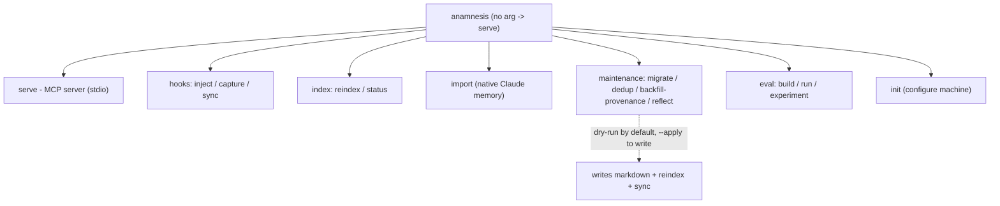
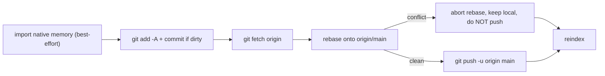
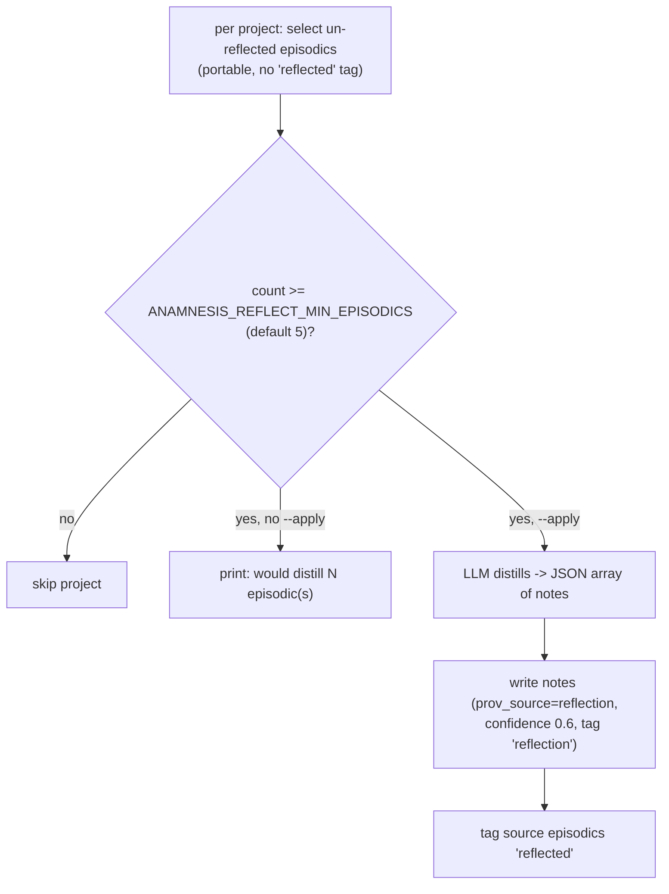
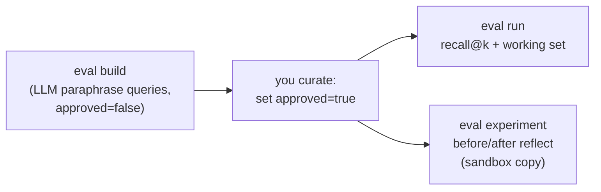
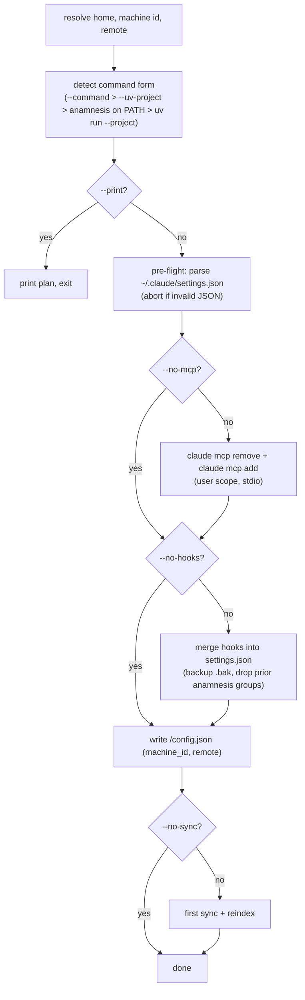

The `anamnesis` command is a single console entry point (`anamnesis.cli:main`) that dispatches a
subcommand. It is deliberately kept free of FastMCP outside of `serve`, so the hooks that Claude Code
calls on the hot path (`inject`, `capture`, `sync`) run without the optional `mcp` extra installed.

When you give no subcommand, it defaults to `serve` (the MCP server over stdio). Everything else is an
explicit verb.

## Invocation

There is no published PyPI package yet. Until one ships, run the CLI from the editable checkout:

```bash
cd server
uv venv --python 3.12
uv pip install -e ".[mcp,dev]"

uv run anamnesis <subcommand> [flags]
```

The README notes that once the package is published you will be able to do
`uv tool install anamnesis-memory && anamnesis init` (the planned PyPI distribution name is
`anamnesis-memory`; the installed command stays `anamnesis`). That one-liner is not available yet.

<Callout type="info">
The store lives at `~/.anamnesis` by default (`ANAMNESIS_HOME` overrides it). Inside it: `memory/`
holds the markdown source of truth (one file per note, `memory/<type>/<id>.md`), `local/` holds
machine-local notes, `index.db` is the derived SQLite index (WAL + FTS5, rebuilt locally and never
synced), and `config.json` holds machine-local config (`machine_id`, `remote`) written by `init`.
</Callout>

## Command map



## Subcommand summary

| Command | One-line behavior | Mutates the store? |
| --- | --- | --- |
| `serve` (default) | Run the MCP server over stdio. | No (read/write via tools) |
| `sync` | Run one git sync cycle (import native, commit, pull --rebase, push) then reindex. | Yes (commits, may pull) |
| `reindex` | Rebuild the SQLite index from markdown. No git. | Index only |
| `status` | Print store stats and sync state. | No |
| `inject` | Print top notes for the project as SessionStart context. | No |
| `capture` | Write an episodic note from a transcript, then sync. | Yes |
| `import` | Import Claude Code's native per-project memory, then sync. | Yes |
| `migrate` | Re-key note projects from a JSON map. | Yes, with `--apply` |
| `dedup` | Remove notes with a byte-identical body. | Yes, with `--apply` |
| `backfill-provenance` | Infer `prov_source` from tags and rewrite front-matter. | Yes, with `--apply` |
| `reflect` | Distill episodic notes into durable notes via the LLM. | Yes, with `--apply` |
| `eval build` | Generate candidate eval cases via the LLM. | Eval set file only |
| `eval run` | Report recall@k + inject token size on the current store. | No |
| `eval experiment` | Before/after reflect on a sandbox copy. | No (sandbox only) |
| `init` | Configure Claude Code (MCP + hooks), the store, and first sync. | Config + first sync |

<Callout type="warn">
Four commands are dry-run by default and write nothing until you pass `--apply`: `migrate`, `dedup`,
`backfill-provenance`, and `reflect`. Without `--apply` they only print the changes they would make.
</Callout>

## serve (default)

Run the MCP server over stdio. This is the only path that imports FastMCP (lazily, inside `cmd_serve`),
so the hook commands stay dependency-light.

```bash
uv run anamnesis serve
# or simply:
uv run anamnesis
```

It builds a `MemoryStore` over `ANAMNESIS_HOME` and runs the server, exposing the MCP tools
(`memory_search`, `memory_list`, `memory_status`, `memory_write`, `memory_sync`). In normal use you do
not run this by hand; `anamnesis init` registers it with Claude Code via `claude mcp add`. No flags.

## sync

One full sync cycle, then reindex.

```bash
uv run anamnesis sync
```

The cycle (`_run_sync`) is: mirror Claude Code's native memory into the store (best-effort; disable with
`ANAMNESIS_IMPORT_NATIVE=0`), then `git add -A`, commit if dirty, `fetch`, `pull --rebase` against
`origin/main`, `push`, and finally `store.reindex()` to rebuild the FTS5 index from the pulled markdown.



Output reports the `SyncResult` fields: `pushed`, `pulled`, `conflicted`, `head` (short SHA), and a
`detail` string, for example:

```
sync: pushed=True pulled=2 conflicted=False head=3237e8f (synced)
```

<Callout type="warn">
Conflict policy is fail-loud, not fail-silent. If the rebase conflicts, the backend aborts the rebase,
keeps your local edits in place, does not push, and returns `conflicted=True` with the detail
`conflict on rebase; kept local edits, did not push - resolve and re-sync`. Resolve the conflict in
`~/.anamnesis/memory/` and run `sync` again. No flags.
</Callout>

## reindex

Rebuild the derived SQLite index from the markdown source of truth, without touching git.

```bash
uv run anamnesis reindex
```

This is the cheap, safe operation the dashboard calls after writing markdown directly: it refreshes the
FTS5 index without a sync. It prints the number of notes indexed (`reindex: indexed N note(s)`). Sync
stays a separate, explicit step. No flags.

## status

Print store statistics and the current sync state.

```bash
uv run anamnesis status
```

Output:

```
store: /home/you/.anamnesis
notes: 142  by_type={'semantic': 30, 'procedural': 12, 'episodic': 100}  by_scope={'portable': 138, 'machine-local': 4}
sync: initialized=True remote=you@host.ts.net:anamnesis-memory.git head=3237e8f dirty=False (ok)
```

It reads `StoreStats` (`total`, `by_type`, `by_scope`) and the `SyncState`
(`initialized`, `remote`, `head`, `dirty`, `detail`). No flags.

## inject

Print the top notes for a project as a markdown block, for the SessionStart hook to inject as context.

```bash
uv run anamnesis inject --project github.com/oscardvs/anamnesis --k 8
```

| Flag | Default | Behavior |
| --- | --- | --- |
| `--project` | `None` | Project key to inject for. When omitted, derived from the hook payload's `cwd` via `resolve_project_key`. |
| `--k` | `8` | Project-note budget (global notes are always included in full, on top of this budget). |

Selection (`select_inject`) returns all `global` notes in full, plus up to `k` project notes:
recent durable (`procedural`/`semantic`) notes fill the budget first, reserving up to two
(`_MAX_EPISODIC = 2`) of the most recent episodic notes for the "what I last did" thread. Superseded
notes are hidden, already-reflected episodics are dropped, and confidence breaks recency ties. When
there are no notes, it prints nothing.

The project key (`resolve_project_key`) is resolved in this order: a `.anamnesis/project` marker file
searched up-tree (stopping below `$HOME`), else the normalized `origin` git remote, else the repo-root
directory name, else the cwd basename (lowercased; `global` if empty).

## capture

Write an episodic note from a Claude Code transcript, then sync unless told not to. This is the
SessionEnd and PreCompact hook.

```bash
uv run anamnesis capture --transcript /path/to/session.jsonl --source session-end
```

| Flag | Default | Behavior |
| --- | --- | --- |
| `--transcript` | `None` | Path to the transcript JSONL. Falls back to the hook payload's `transcript_path`. |
| `--project` | `None` | Project key. Falls back to the transcript's `cwd`, then the payload `cwd`, via `resolve_project_key`. |
| `--source` | `session-end` | Recorded as a tag on the note. The PreCompact hook passes `precompact`. |
| `--no-sync` | off | Write the note but do not run a sync cycle. |

`parse_transcript` deterministically extracts the first user prompt, last assistant outcome, files
touched (from `Edit`/`Write`/`MultiEdit`/`NotebookEdit` tool calls), git branch, cwd, and session id.
`write_episodic` skips trivial sessions (no files touched plus empty/short outcome, or a lone slash
command) and otherwise calls the configured summarizer. Both `session-end` and `precompact` are stamped
with `prov_source=session-end`; the `--source` value is added as a tag alongside `session`.

<Callout type="info">
The summarizer is selected by `ANAMNESIS_REFLECTION_PROVIDER` (default `heuristic`, which needs no API
key and produces a deterministic note). With `deepseek`, `openai`, or `local`, an OpenAI-compatible LLM
summarizer is used; any LLM failure falls back to the heuristic so capture never breaks session
teardown. The PreCompact hook uses `--source precompact --no-sync` so a mid-session compaction does not
trigger a network sync.
</Callout>

## import

Import Claude Code's native per-project memory into the store, then sync unless `--no-sync`.

```bash
uv run anamnesis import --claude-home ~/.claude
```

| Flag | Default | Behavior |
| --- | --- | --- |
| `--claude-home` | `None` | Claude config dir to import from. Falls back to `CLAUDE_CONFIG_DIR`, else `~/.claude`. |
| `--no-sync` | off | Import only, do not sync afterward. |

This is the explicit, one-shot entry point and the way to seed a machine the first time. The same import
runs automatically at the start of every sync cycle (best-effort; disabled by
`ANAMNESIS_IMPORT_NATIVE=0`). Output reports `imported`, `updated`, and `skipped` counts plus the source
directory.

## migrate

Re-key note `project` fields from a JSON map. Dry-run unless `--apply`.

```bash
# Preview (writes nothing):
uv run anamnesis migrate --map /path/to/map.json

# Apply:
uv run anamnesis migrate --map /path/to/map.json --apply
```

| Flag | Default | Behavior |
| --- | --- | --- |
| `--map` | required | Path to the JSON map (see below). |
| `--apply` | off | Without it, dry-run: prints each note that would change. With it, rewrites the markdown. |
| `--no-sync` | off | After `--apply`, reindex but do not sync (otherwise it syncs). |

The map JSON has two optional keys: `projects` (old key -> new key, applied to any note in that project)
and `notes` (note id -> new key, a per-note override that wins over `projects`):

```json
{
  "projects": { "anamnesis": "github.com/oscardvs/anamnesis" },
  "notes": { "01J...": "global" }
}
```

Only the front-matter `project:` line changes; body, `updated_at`, and every other field are preserved,
so `git diff` shows exactly one line per note and the memory repo's history is the undo. Notes with no
mapping, or already at their target, are skipped.

## dedup

Collapse notes whose body is byte-identical to one keeper. Dry-run unless `--apply`.

```bash
uv run anamnesis dedup           # preview
uv run anamnesis dedup --apply   # delete duplicates
```

| Flag | Default | Behavior |
| --- | --- | --- |
| `--apply` | off | Without it, dry-run: prints each removal that would happen. With it, deletes the duplicate markdown files. |
| `--no-sync` | off | After `--apply`, reindex but do not sync. |

Notes are grouped by a SHA-256 hash of their stripped body (project is deliberately excluded, so
cross-project and cross-machine duplicates collapse). It keeps one per group, preferring `global` notes,
then the earliest `created_at`, then the lowest id. It operates on the synced `memory/` tree only;
machine-local notes in `local/` are left alone. Reversible via the memory repo's git history.

## backfill-provenance

Infer `prov_source` from a note's tags and rewrite its front-matter. Dry-run unless `--apply`.

```bash
uv run anamnesis backfill-provenance           # preview
uv run anamnesis backfill-provenance --apply   # rewrite front-matter
```

| Flag | Default | Behavior |
| --- | --- | --- |
| `--apply` | off | Without it, dry-run: prints each note whose inferred `prov_source` differs. With it, rewrites the front-matter. |
| `--no-sync` | off | After `--apply`, reindex but do not sync. |

Inference precedence (`_infer_source`): an `import` tag yields `prov_source=import`; else a `session` tag
yields `session-end`; else `human`. It scans both `memory/` (portable) and `local/` (machine-local).
One-time and reversible via git. Notes already carrying the inferred value are left untouched.

## reflect

Distill a project's un-reflected episodic notes into durable semantic/procedural notes via the
configured LLM. Dry-run unless `--apply`.

```bash
# Preview across all projects:
uv run anamnesis reflect

# Apply for one project:
uv run anamnesis reflect --project github.com/oscardvs/anamnesis --apply
```

| Flag | Default | Behavior |
| --- | --- | --- |
| `--project` | `None` | Reflect a single project. When omitted, reflects every project that has portable episodic notes. |
| `--apply` | off | Without it, dry-run: prints how many episodics would be distilled per project. With it, calls the LLM and writes notes. |
| `--no-sync` | off | After `--apply`, reindex but do not sync. |



A project is reflected only when its un-reflected episodic count reaches
`ANAMNESIS_REFLECT_MIN_EPISODICS` (default `5`). With `--apply`, a reflection provider must be
configured (`ANAMNESIS_REFLECTION_PROVIDER` plus model/base-url/key) or the command prints a message and
exits without writing. Distilled notes are written with `prov_source=reflection`, a confidence of `0.6`,
and a `reflection` tag, so they are clearly reviewable; the source episodics are then tagged `reflected`
so they are excluded from injection and from the next reflection pass. There is no fallback: a failed or
invalid LLM response aborts that one project (the others still run) rather than fabricating a note.

<Callout type="warn">
`reflect --no-sync` writes notes and reindexes but does not commit. A concurrent sync (for example a
SessionStart background sync) can overwrite uncommitted output. Prefer `--apply` without `--no-sync` so
the new notes are committed and pushed in the same run, or commit immediately after.
</Callout>

## eval

The measurement harness: retrieval recall and working-set (inject token) size. It has three
subcommands, dispatched on the second positional argument.

```bash
uv run anamnesis eval build
uv run anamnesis eval run
uv run anamnesis eval experiment
```

The eval set defaults to `<home>/eval/eval.jsonl` (`ANAMNESIS_HOME/eval/eval.jsonl`); `--eval-set`
overrides the path. It is JSONL, one `EvalCase` per line with fields `query`, `relevant_ids`,
`note_titles`, `approved`, and `source`.



### eval build

Generate candidate eval cases via the LLM: one paraphrased query per sampled note.

```bash
uv run anamnesis eval build --types semantic,procedural --n 30
```

| Flag | Default | Behavior |
| --- | --- | --- |
| `--eval-set` | `<home>/eval/eval.jsonl` | Output JSONL path. |
| `--types` | `semantic,procedural` | Comma-separated note types to sample from. |
| `--n` | `30` | Number of candidate cases to generate. |

It samples notes round-robin across projects for coverage, asks the LLM for a paraphrased query per
note, and appends candidates with `approved=false` (skipping queries already present). You then curate
the file (set `approved=true`) before running. Requires a reflection provider; without one it prints a
message and exits.

### eval run

Report recall@k and inject token size on the current store.

```bash
uv run anamnesis eval run
uv run anamnesis eval run --json --include-unreviewed
```

| Flag | Default | Behavior |
| --- | --- | --- |
| `--eval-set` | `<home>/eval/eval.jsonl` | Eval set path. Exits with code 2 if it does not exist. |
| `--include-unreviewed` | off | Include cases with `approved=false` (otherwise only approved cases are scored). |
| `--json` | off | Emit machine-readable JSON instead of the text report. |

It computes recall@k and MRR over `ks = (1, 3, 5, 8)` using `store.search`, and a working-set report:
per-project inject-block token size (`~4 chars/token`), mean and median across non-global projects, plus
a full-corpus token denominator. Missing relevant ids produce warnings, not errors.

### eval experiment

Measure recall and working set before and after `reflect --apply`, on a throwaway sandbox copy.

```bash
uv run anamnesis eval experiment
```

| Flag | Default | Behavior |
| --- | --- | --- |
| `--eval-set` | `<home>/eval/eval.jsonl` | Eval set path. Exits with code 2 if it does not exist. |
| `--include-unreviewed` | off | Include unapproved cases. |

It copies `memory/` and `local/` into a temp directory, builds a fresh store over the copy, measures the
baseline, runs reflection there, and measures again. The live store is never touched. The report shows
the inject-token delta, recall@k before/after with a `REGRESSION` flag per k, MRR, and how many projects
were reflected, skipped (below threshold), or failed. Requires a reflection provider.

## init

Configure Claude Code on this machine (MCP server + lifecycle hooks), write store config, and run a
first sync. Idempotent: it backs up `settings.json` to `settings.json.bak` and never duplicates a hook.

```bash
# Interactive (prompts for store dir, machine id, remote, command form):
uv run anamnesis init

# Dry-run, prints the full plan and writes nothing:
uv run anamnesis init --print

# Non-interactive with a remote:
uv run anamnesis init --yes --remote 'you@host.ts.net:anamnesis-memory.git'
```

### All flags

| Flag | Default | Behavior |
| --- | --- | --- |
| `--home` | `~/.anamnesis` | Store root. Passed into config only when it differs from the default. |
| `--machine-id` | hostname | This machine's id (embedded in hook/MCP env and `config.json`). |
| `--remote` | prompt / none | Sync remote URL. Mutually exclusive with `--local-only`. |
| `--local-only` | off | Configure with no remote. Mutually exclusive with `--remote`. |
| `--command` | autodetected | Override the base argv used to invoke `anamnesis` (shell-split). Mutually exclusive with `--uv-project`. |
| `--uv-project` | autodetected | Invoke via `uv run --project <path> anamnesis`. Mutually exclusive with `--command`. |
| `--name` | `anamnesis` | MCP server registration name. |
| `--no-mcp` | off | Skip registering the MCP server. |
| `--no-hooks` | off | Skip installing the lifecycle hooks. |
| `--no-sync` | off | Skip the first sync. |
| `--yes` | off | Non-interactive: take all defaults, no prompts. |
| `--print` | off | Dry-run: print the plan and exit without writing anything. |

### What it does



The command form is resolved in order: explicit `--command`; then `--uv-project`; then an installed
`anamnesis` found on `PATH`; else a `uv run --project <server-dir> anamnesis` fallback. Hooks are written
to `CLAUDE_CONFIG_DIR/settings.json` (or `~/.claude/settings.json`):

- **SessionStart** (`startup|resume|clear`): `inject`, timeout 15s.
- **SessionStart** (`startup|resume`): `sync`, async (background).
- **SessionEnd**: `capture`, timeout 120s.
- **PreCompact**: `capture --source precompact --no-sync`, timeout 60s.

The MCP server is registered at user scope over stdio via `claude mcp add` (after a best-effort
`claude mcp remove` for idempotency), with the `ANAMNESIS_*` env inlined. If `claude` is not on `PATH`,
`init` prints the exact command for you to run instead. The machine-local `config.json` (`machine_id`
plus `remote`) lets the MCP server and dashboard find the remote even when launched without inline env.

<Callout type="info">
`init` only writes the configured `ANAMNESIS_*` env when set: `ANAMNESIS_MACHINE_ID` always,
`ANAMNESIS_GIT_REMOTE` when a remote is given, and `ANAMNESIS_HOME` only when home differs from
`~/.anamnesis`. After running it, start a new Claude Code session for the MCP server and hooks to take
effect. A first sync that fails (bad remote) does not abort `init`: it prints a message telling you to
fix the remote and run `anamnesis sync`.
</Callout>

## Environment variables used by the CLI

| Variable | Used by | Default |
| --- | --- | --- |
| `ANAMNESIS_HOME` | all | `~/.anamnesis` |
| `ANAMNESIS_MACHINE_ID` | all (origin stamp) | store config, else hostname |
| `ANAMNESIS_GIT_REMOTE` | `sync`, `capture`, `import`, etc. | store config, else none |
| `CLAUDE_CONFIG_DIR` | `import`, `init` | `~/.claude` |
| `ANAMNESIS_IMPORT_NATIVE` | every sync cycle | `1` (set `0` to disable native import) |
| `ANAMNESIS_REFLECTION_PROVIDER` | `capture`, `reflect`, `eval` | `heuristic` |
| `ANAMNESIS_REFLECTION_MODEL` | LLM path | (none) |
| `ANAMNESIS_REFLECTION_BASE_URL` | LLM path | (none) |
| `ANAMNESIS_REFLECTION_API_KEY` | LLM path | falls back to `DEEPSEEK_API_KEY`, then `OPENAI_API_KEY` |
| `ANAMNESIS_REFLECTION_TIMEOUT` | LLM path | `30` (seconds) |
| `ANAMNESIS_REFLECTION_MAX_TOKENS` | LLM path | `120000` |
| `ANAMNESIS_REFLECT_MIN_EPISODICS` | `reflect`, `eval experiment` | `5` |

See the configuration reference for the full set.

## Related

- [Configuration reference](./configuration)
- [MCP tools reference](./mcp-tools)
- [Capture and injection internals](../internals/capture-and-injection)
- [Reflection internals](../internals/reflection)
- [Sync internals](../internals/sync)
