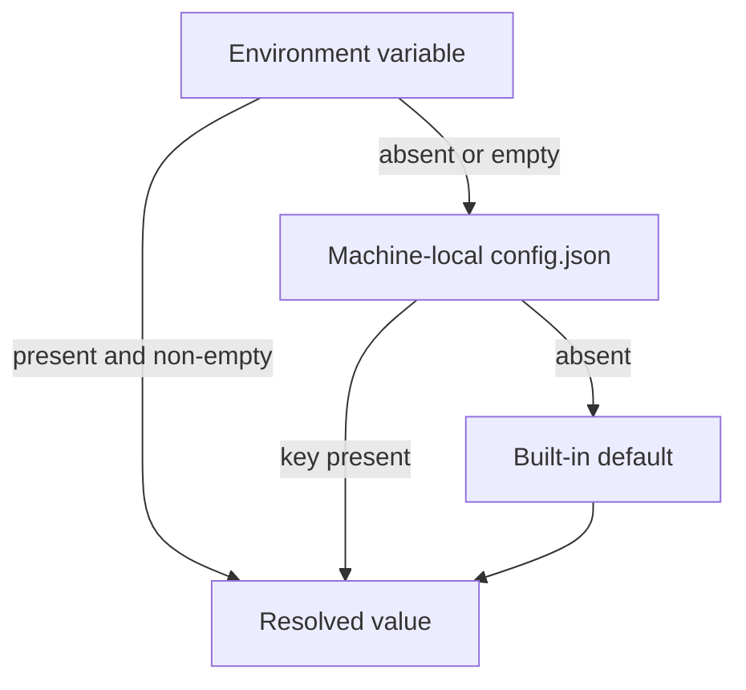
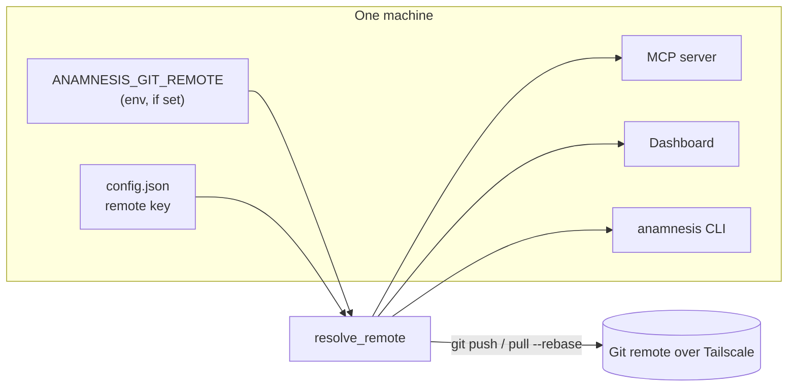
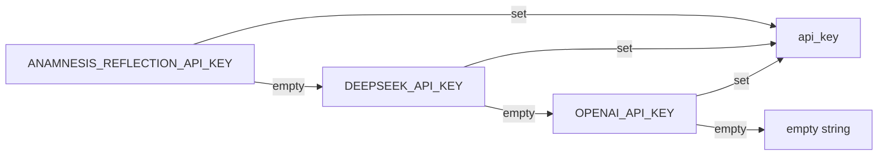
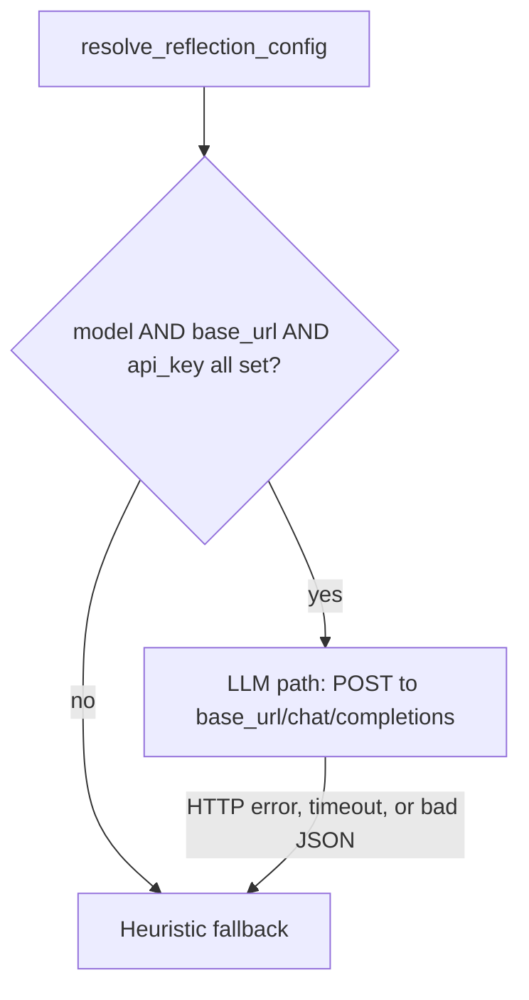
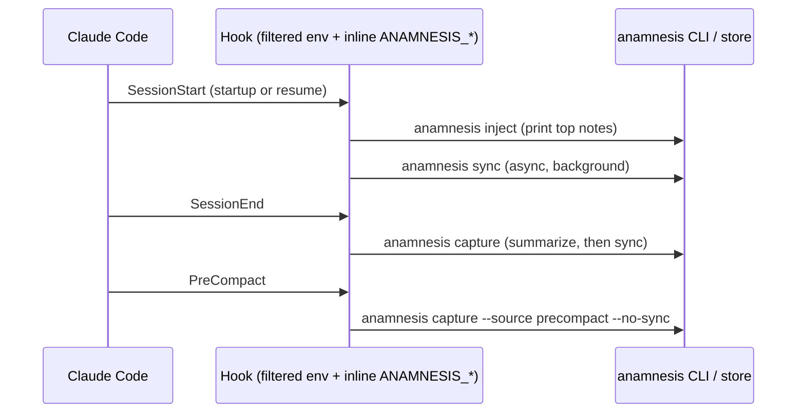
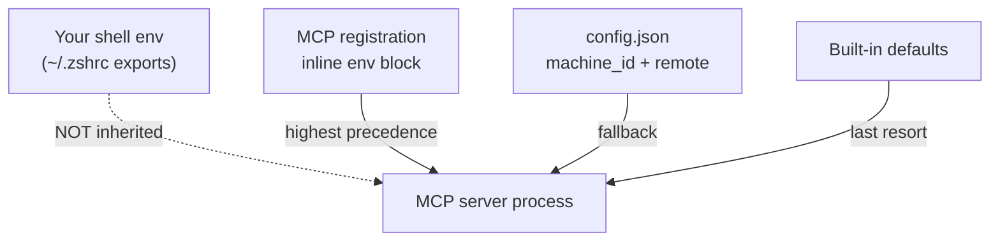

Anamnesis is configured entirely through environment variables and two small JSON files. There is no central config file you hand-edit for behavior: defaults are baked into the code, the environment overrides them, and a machine-local `config.json` (written by `anamnesis init`) acts as a fallback so the MCP server and dashboard can find your sync remote even when no shell environment reaches them.

This page is the canonical reference for every knob. Every variable name, default, and threshold below is read directly from the source: `server/src/anamnesis/config.py`, `server/src/anamnesis/llm_summarizer.py`, `server/src/anamnesis/reflect.py`, `server/src/anamnesis/onboard.py`, and `.env.example`.

## How configuration resolves

Three layers feed every setting, in this precedence order:



The `config.json` fallback only exists for two values, `machine_id` and `remote`. Everything else resolves from the environment or a hardcoded default. The reflection settings have no `config.json` fallback at all: they come from the environment or they fall back to the deterministic heuristic.

<Callout type="warn">
When Claude Code launches the MCP server it uses a **filtered environment**. Your interactive shell variables (`.zshrc`, `.bashrc`, exported `ANAMNESIS_*`) are **not** inherited by the server process. This is why the inline `env` block in the MCP registration and the machine-local `config.json` exist. See [The filtered-environment caveat](#the-filtered-environment-caveat) below.
</Callout>

## Store and identity variables

These are read in `config.py` and control where memory lives, what machine stamp goes on notes you write, and where to sync.

| Variable | Default | Purpose |
| --- | --- | --- |
| `ANAMNESIS_HOME` | `~/.anamnesis` | Root of the local store. Holds `memory/` (synced markdown, the source of truth), `local/` (machine-local markdown, never synced), `index.db` (the derived SQLite FTS5 index), and `config.json`. A leading `~` is expanded. |
| `ANAMNESIS_MACHINE_ID` | this host's `socket.gethostname()` | The machine-of-origin stamped on every note you write. Resolution order is env, then `config.json` `machine_id`, then hostname, then the literal `"unknown"`. |
| `ANAMNESIS_GIT_REMOTE` | unset (local-only) | Git remote used to sync the markdown store across your machines. Resolution order is env, then `config.json` `remote`, then `None` (commit locally, never push). With Tailscale this is typically an SSH path to another node, for example `git@desktop.tailnet-name.ts.net:anamnesis-memory.git`. |
| `CLAUDE_CONFIG_DIR` | `~/.claude` | Claude Code's config directory. Its `projects/<slug>/memory` trees hold Claude's native per-project memory, which the importer mirrors into the Anamnesis store. `anamnesis init` writes hooks into `<CLAUDE_CONFIG_DIR>/settings.json`. |

The store layout that `ANAMNESIS_HOME` points at:

```text
~/.anamnesis/
  memory/        # SOURCE OF TRUTH - synced markdown, one file per note
  local/         # machine-local markdown, kept OUT of the synced memory/ tree
  index.db       # DERIVED - SQLite (WAL mode, FTS5), rebuildable any time
  config.json    # machine-local: machine_id + remote (never synced)
```

<Callout type="info">
`index.db` is derived and never synced. It is rebuilt from the markdown with `anamnesis reindex` (or automatically after every sync). Markdown in `memory/` is the only source of truth. Do not sync `index.db` across machines.
</Callout>

### Resolution functions

For the precise behavior, these are the resolver functions in `config.py`:

- `resolve_home()` reads `ANAMNESIS_HOME`, else `~/.anamnesis`.
- `resolve_claude_home()` reads `CLAUDE_CONFIG_DIR`, else `~/.claude`.
- `resolve_machine_id()` reads `ANAMNESIS_MACHINE_ID`, else `config.json` `machine_id`, else `socket.gethostname()`, else `"unknown"`.
- `resolve_remote()` reads `ANAMNESIS_GIT_REMOTE`, else `config.json` `remote`, else `None`.

## The machine-local config.json fallback

`anamnesis init` writes a small `config.json` at `<ANAMNESIS_HOME>/config.json` (via `write_store_config` in `onboard.py`). It lives **outside** the synced `memory/` repo on purpose: the remote URL differs per machine, so it must never be committed or synced.

It holds at most two string keys:

```json
{
  "machine_id": "desktop-amsterdam",
  "remote": "git@desktop.tailnet-name.ts.net:anamnesis-memory.git"
}
```

The `remote` key is only written when a remote was configured (local-only installs omit it). A missing or malformed file is read as `{}`, so resolution never fails on a bad config (the `_store_config()` reader swallows `OSError` and `ValueError`).

Why it matters: the MCP server is launched without any inline `ANAMNESIS_GIT_REMOTE` in the bare `.mcp.json` form, and the dashboard is a separate process. The `config.json` fallback is what lets an in-session `memory_sync` actually **push** to your remote rather than only committing locally. Environment variables still take precedence over `config.json`.



## Reflection and summarizer variables

The reflection (compression) model is the swappable LLM that distills sessions into notes. It is read by `resolve_reflection_config()` in `llm_summarizer.py` and reused by `reflect.py`. Nothing about any provider is hardcoded: provider, model, base URL, and key all come from the environment.

| Variable | Default | Purpose |
| --- | --- | --- |
| `ANAMNESIS_REFLECTION_PROVIDER` | `heuristic` | Provider label, lowercased. `heuristic` (or unset) uses the deterministic builder with no network call. A cloud value like `deepseek`, `openai`, or `local` is used only as a label (it becomes the `prov_model` stamp as `<provider>/<model>`); it does not select an SDK. |
| `ANAMNESIS_REFLECTION_MODEL` | empty | The provider's model id, for example a DeepSeek or OpenAI chat model. Required to enable the LLM path. |
| `ANAMNESIS_REFLECTION_BASE_URL` | empty | An OpenAI-compatible base URL, for example `https://api.deepseek.com`. The client POSTs to `<base_url>/chat/completions`. Required to enable the LLM path. |
| `ANAMNESIS_REFLECTION_TIMEOUT` | `30` | HTTP timeout in seconds for the chat completion. SessionEnd capture runs inline, so this bounds how long teardown can block. Parsed as a float; a non-numeric value falls back to `30.0`. |
| `ANAMNESIS_REFLECTION_MAX_TOKENS` | `120000` | Transcript size budget in tokens. The transcript is windowed to `max_tokens * 4` characters (the approximate 4 chars-per-token ratio) before being sent. Parsed as an int; a non-numeric value falls back to `120000`. |
| `ANAMNESIS_REFLECTION_API_KEY` | empty | Provider-neutral bearer token. Sent as `Authorization: Bearer <key>`. First in the key fallback chain. |
| `DEEPSEEK_API_KEY` | empty | Fallback API key, second in the chain (after `ANAMNESIS_REFLECTION_API_KEY`). |
| `OPENAI_API_KEY` | empty | Fallback API key, third (last) in the chain. |

The API key resolves by trying each name in order and taking the first non-empty value:



### When the LLM path activates

The LLM summarizer and the reflector both require **all three** of model, base URL, and key to be present. If any is missing, the summarizer (`make_llm_summarizer`) silently returns the deterministic `HeuristicSummarizer`, and the reflector (`make_reflector`) returns `None`.



Two important behavioral differences between the two consumers of this config:

- **Capture (SessionEnd) never breaks.** `LLMSummarizer.summarize` catches every exception, prints `capture: llm summary failed (...); using heuristic` to stderr, and falls back to the heuristic builder. Session teardown always succeeds.
- **Reflect has no fallback.** A failed or invalid LLM response aborts that project's reflection rather than fabricating a note. In `anamnesis reflect`, one project failing prints `reflect: <project>: failed (...); skipped` and the run continues to the next project.

<Callout type="warn">
Setting `ANAMNESIS_REFLECTION_PROVIDER` alone does nothing. The provider string is just a label. You must also set `ANAMNESIS_REFLECTION_MODEL`, `ANAMNESIS_REFLECTION_BASE_URL`, and one of the API key variables, or the LLM path stays off.
</Callout>

The chat request is fixed at `temperature: 0.2` and `stream: false`, sent over stdlib `urllib` (no extra dependency in the base hook install). The system prompts forbid emitting secrets, keys, tokens, or credentials, and the transcript is redacted and size-windowed before the request.

### Reflection threshold

| Variable | Default | Purpose |
| --- | --- | --- |
| `ANAMNESIS_REFLECT_MIN_EPISODICS` | `5` | Minimum number of un-reflected episodic notes a project must have before `anamnesis reflect` will distill it. Read by `resolve_min_episodics()` in `reflect.py`. A non-numeric value falls back to `5`. |

A note is "un-reflected" if it is a portable episodic note that does **not** carry the `reflected` tag. After reflection, the source episodics are tagged `reflected` and the distilled notes are written with `prov_source=reflection` and confidence `0.6` (the `_DEFAULT_CONFIDENCE` in `reflect.py`), so the output is reviewable.

## Native-import toggle

| Variable | Default | Purpose |
| --- | --- | --- |
| `ANAMNESIS_IMPORT_NATIVE` | `1` (enabled) | Set to `0` to disable mirroring Claude Code's native per-project memory (under `<CLAUDE_CONFIG_DIR>/projects/<slug>/memory`) into the Anamnesis store. The import otherwise runs automatically inside every sync cycle. |

This is the only accepted "off" value: the check in `cli.py` is literally `== "0"`. Any other value (including unset) leaves the import enabled. Import failures never break a sync: they are reported to stderr (`import: skipped native import (...)`) and the sync proceeds.

## The .mcp.json shape

The repository ships a minimal project-scoped `.mcp.json` at the repo root:

```json
{
  "mcpServers": {
    "anamnesis": {
      "command": "uv",
      "args": ["run", "--project", "server", "anamnesis", "serve"]
    }
  }
}
```

This bare form has **no** `env` block, so the server inherits only Claude Code's filtered environment. It works for local development from the repo root (the relative `--project server` path resolves there) and for a local-only store where no remote is needed.

For a real install, `anamnesis init` does not use this bare form. It registers the server at **user scope** with an inline `env` block via `claude mcp add`, embedding the resolved `ANAMNESIS_*` values so the filtered-environment server still knows your machine id and remote. The argv it builds (`build_mcp_add_argv` in `onboard.py`) looks like this:

```bash
claude mcp add --scope user --transport stdio anamnesis \
  -e ANAMNESIS_MACHINE_ID=desktop-amsterdam \
  -e ANAMNESIS_GIT_REMOTE=git@desktop.tailnet-name.ts.net:anamnesis-memory.git \
  -- uv run --project /abs/path/to/server anamnesis serve
```

A few details that matter:

- The server name (`anamnesis`) comes **before** the `-e` flags. Claude's `-e/--env` is variadic, so placing the name after it would let the parser swallow the name as an env value.
- The command to run follows a `--` separator.
- `ANAMNESIS_MACHINE_ID` is always embedded (`build_env` always sets it). `ANAMNESIS_GIT_REMOTE` is embedded only when a remote was configured. `ANAMNESIS_HOME` is embedded only when the store home differs from the `~/.anamnesis` default.
- The base command (`uv run --project <server> anamnesis` versus a bare `anamnesis` on PATH) is auto-detected by `detect_command`; you can override it with `--command` or `--uv-project`.

A registered user-scope MCP server ends up in Claude Code's own config (managed by the `claude` CLI, not in this repo's `.mcp.json`). The equivalent stored shape is a `mcpServers` entry with a `command`, `args`, and an `env` object.

## Lifecycle hooks

`anamnesis init` also installs four lifecycle hook groups into `<CLAUDE_CONFIG_DIR>/settings.json` (built by `build_hooks` in `onboard.py`). Each hook command is prefixed inline with the same `ANAMNESIS_*` env values, for the same filtered-environment reason.

| Event | Matcher | Command | Timeout |
| --- | --- | --- | --- |
| `SessionStart` | `startup\|resume\|clear` | `anamnesis inject` | 15 s |
| `SessionStart` | `startup\|resume` | `anamnesis sync` | async (no timeout) |
| `SessionEnd` | (none) | `anamnesis capture` | 120 s |
| `PreCompact` | (none) | `anamnesis capture --source precompact --no-sync` | 60 s |

`merge_hooks` installs these idempotently: it drops any prior Anamnesis hook groups (identified by the `ANAMNESIS_` prefix or the `anamnesis inject|sync|capture` markers), keeps every other key and any non-Anamnesis hooks, then inserts the current set. Whenever an existing `settings.json` is rewritten it is first copied to `settings.json.bak` (the prior backup is overwritten each time).



## The filtered-environment caveat

This is the single most common source of confusion, so it is worth restating precisely.

When Claude Code spawns the MCP server (and the hook commands), it does **not** pass your interactive shell environment. Exporting `ANAMNESIS_GIT_REMOTE` in your `~/.zshrc` will let `anamnesis sync` work when you run it by hand in a terminal, but it will **not** reach the MCP server that Claude Code launches. There are exactly three ways a value reaches that server, in precedence order:

1. The inline `env` block in the user-scope MCP registration (what `anamnesis init` writes).
2. The machine-local `config.json` (the `remote` and `machine_id` fallbacks).
3. The built-in default.



Practical implications:

- The reflection variables (`ANAMNESIS_REFLECTION_*`, `DEEPSEEK_API_KEY`, `OPENAI_API_KEY`) have **no** `config.json` fallback. If you want the LLM summarizer or reflector to run from inside a Claude Code session, you must add those keys to the MCP server's inline `env` block (or run `anamnesis reflect` by hand from a shell where they are exported). Running reflect by hand in your terminal is the simplest path.
- The `.env.example` file is for running the CLI and tooling **by hand**. Copying it to `.env` (which is git-ignored) does not make the MCP server pick it up; nothing in the code reads a `.env` file. It documents the variables for your own reference.

## The .env.example reference

The shipped `.env.example` documents the variables for manual tooling. Nothing in it is required to run Anamnesis: every default is sensible for local use. The commented entries map one-to-one to the variables above:

```bash
# Where the local memory store + index live (default: ~/.anamnesis)
# ANAMNESIS_HOME=~/.anamnesis

# Machine-of-origin stamped on notes you write (default: this host's hostname).
# ANAMNESIS_MACHINE_ID=desktop-amsterdam

# Git remote used to sync the markdown memory store across your machines.
# ANAMNESIS_GIT_REMOTE=git@desktop.tailnet-name.ts.net:anamnesis-memory.git

# Reflection/compression model for the SessionEnd episodic summary.
# ANAMNESIS_REFLECTION_PROVIDER=heuristic   # heuristic | deepseek | openai | local
# ANAMNESIS_REFLECTION_MODEL=               # provider's model id
# ANAMNESIS_REFLECTION_BASE_URL=            # OpenAI-compatible base, e.g. https://api.deepseek.com
# ANAMNESIS_REFLECTION_TIMEOUT=30           # seconds; SessionEnd capture is inline
# ANAMNESIS_REFLECTION_MAX_TOKENS=120000    # transcript is windowed above this
# DEEPSEEK_API_KEY=
# Or a provider-neutral key: ANAMNESIS_REFLECTION_API_KEY=
```

## Quick recipes

Enable the LLM summarizer and reflector with DeepSeek (set in your shell for hand-run tooling):

```bash
export ANAMNESIS_REFLECTION_PROVIDER=deepseek
export ANAMNESIS_REFLECTION_MODEL=deepseek-chat
export ANAMNESIS_REFLECTION_BASE_URL=https://api.deepseek.com
export DEEPSEEK_API_KEY=sk-...

# Preview which projects would be distilled (dry-run, no LLM call):
uv run --project server anamnesis reflect

# Actually distill (requires the model/base-url/key above):
uv run --project server anamnesis reflect --apply
```

Lower the reflection threshold so smaller projects get distilled:

```bash
export ANAMNESIS_REFLECT_MIN_EPISODICS=3
```

Turn off native import for a single sync:

```bash
ANAMNESIS_IMPORT_NATIVE=0 uv run --project server anamnesis sync
```

Inspect the resolved init plan without writing anything:

```bash
uv run --project server anamnesis init --print
```

## See also

- [Install and setup](../guide/install)
- [Sync internals](../internals/sync)
- [Reflection internals](../internals/reflection)
- [CLI reference](./cli)
