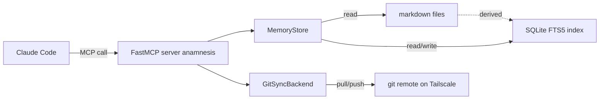
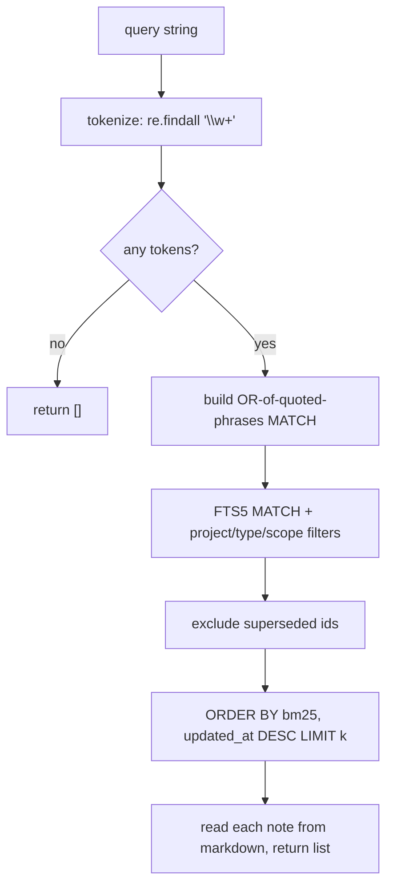
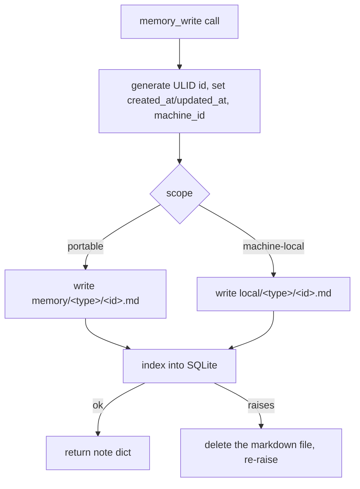
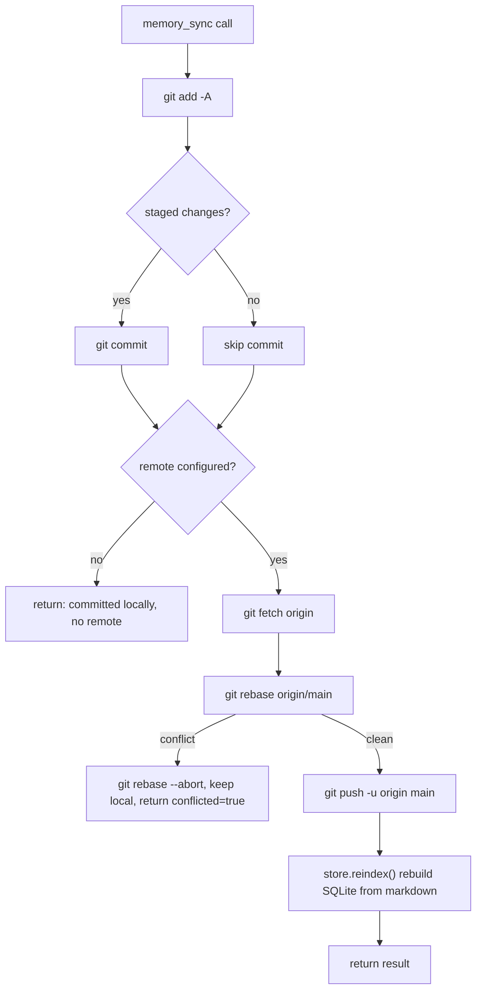

Anamnesis exposes its memory store to Claude Code through a [FastMCP](https://github.com/jlowin/fastmcp) server named `anamnesis`. The server is thin: it maps Model Context Protocol tool calls onto a `MemoryStore` (markdown source of truth plus a derived SQLite FTS5 index) and a git sync backend, and holds no state of its own. This page is the field-level reference for the five tools it registers.

Everything below is taken from `server/src/anamnesis/server.py` and the supporting modules `store.py`, `sync.py`, and `config.py`. For the design and concurrency model behind the server, see [the MCP server internals page](../internals/mcp-server). For the underlying recall pipeline, see [recall internals](../internals/recall).

## The five tools at a glance

The tools split into two groups by whether they mutate the store. Read-only tools carry a `readOnlyHint` annotation so a client can auto-approve them; the two writers are flagged for confirmation.

| Tool | Signature | Mutates store | Annotation | Auto-approvable |
| --- | --- | --- | --- | --- |
| `memory_search` | `(query, project?, type?, scope?, k=8)` | no | `readOnlyHint=True, openWorldHint=False` | yes |
| `memory_list` | `(project?, type?, scope?)` | no | `readOnlyHint=True, openWorldHint=False` | yes |
| `memory_status` | `()` | no | `readOnlyHint=True, openWorldHint=False` | yes |
| `memory_write` | `(type, title, body, project="global", tags?, scope="portable")` | yes | `readOnlyHint=False, destructiveHint=False` | no (confirm) |
| `memory_sync` | `(force=False)` | yes (git + reindex) | `readOnlyHint=False, openWorldHint=True` | no (confirm) |

The annotations come straight from the `@mcp.tool(annotations=...)` decorators in `server.py`. The three read-only tools share one constant:

```python
_READ_ONLY = ToolAnnotations(readOnlyHint=True, openWorldHint=False)
```

`memory_write` is annotated `destructiveHint=False` (it only adds notes, it does not delete or overwrite existing ones), but it still has `readOnlyHint=False`, so it is not auto-approved. `memory_sync` is annotated `openWorldHint=True` because it talks to a git remote outside the local machine.



<Callout type="info">
Markdown under `memory/` (and `local/`) is the source of truth. The SQLite index at `index.db` is fully derived and is rebuilt locally, so it is never synced. A note's parameters map directly onto the YAML front matter of its markdown file.
</Callout>

## Shared parameters

Three filters recur across `memory_search` and `memory_list`. All three are optional and default to `None` (no filter):

- `project` (string): filters to notes whose `project` field equals this value exactly. Notes default to the `"global"` project when written without one.
- `type` (string): one of `"procedural"`, `"semantic"`, or `"episodic"`. These are the only values the SQLite schema accepts (`CHECK (type IN ('procedural','semantic','episodic'))`).
- `scope` (string): `"portable"` (synced to your other machines) or `"machine-local"` (stays on this machine only, never synced). These are the only values the schema accepts (`CHECK (scope IN ('portable','machine-local'))`).

`type` is typed as `MemoryType` in the pure functions, which is just an alias for `str`; the value is validated by the SQLite `CHECK` constraint at index time, not by the tool signature.

## The common return shape

Every tool that returns notes renders each note with the internal `_memory_dict` helper. With the body included, one note is:

```json
{
  "id": "01J...ULID",
  "type": "procedural",
  "title": "Run reflect safely",
  "project": "anamnesis",
  "machine_id": "odesha",
  "scope": "portable",
  "tags": ["reflect", "sync"],
  "created_at": "2026-06-24T12:00:00+00:00",
  "updated_at": "2026-06-24T12:00:00+00:00",
  "body": "full markdown body here"
}
```

`memory_list` omits the `body` key (it is called with `include_body=False`); `memory_search` and `memory_write` include it. `created_at` and `updated_at` are ISO 8601 strings at second precision (UTC). `id` is a ULID generated at write time. `machine_id` is the machine of origin recorded on the note, not necessarily the current machine.

Note that the front matter holds more fields than the tool returns. Provenance fields (`prov_source`, `prov_model`, `prov_session`, `confidence`, `supersedes`) live in the markdown and the index but are not part of the MCP return dict.

---

## memory_search

Keyword search over the FTS5 index, ranked by BM25.

**Signature**

```python
memory_search(query: str, project: str | None = None,
              type: str | None = None, scope: str | None = None,
              k: int = 8) -> list[dict[str, object]]
```

**Docstring (verbatim)**

> Search memory by keyword (FTS5 BM25), optionally scoped by project/type/scope.
>
> Read-only. Returns up to `k` ranked notes, each with its body and metadata (id, type, project, machine of origin, scope, tags, timestamps). `scope` filters to "portable" (synced) or "machine-local" (this machine only).

**Parameters**

| Name | Type | Default | Notes |
| --- | --- | --- | --- |
| `query` | string | required | Free text. Tokenized to words; see the matching rule below. |
| `project` | string or null | `None` | Exact-match project filter. |
| `type` | string or null | `None` | `procedural`, `semantic`, or `episodic`. |
| `scope` | string or null | `None` | `portable` or `machine-local`. |
| `k` | int | `8` | Maximum number of ranked notes returned. |

**Returns** a list of up to `k` note dicts, each including `body`. Empty list if there are no word tokens in `query` (the matcher returns `""` and `search` short-circuits to `[]`).

**Matching rule.** The query is split into word tokens (`\w+`), each token is wrapped in quotes, and the tokens are joined with `OR`, then ranked by BM25. `OR` (not `AND`) is deliberate: ANDing every token requires one note to contain all of a natural-language query's words, which measured 0% recall on real paraphrase queries. `OR` plus BM25 surfaces the best-overlapping notes first and recovered recall to about 94% on the same eval set. FTS5-special characters (`-`, `:`, `*`, `"`, and so on) are neutralized so arbitrary text cannot break the query parser.

**Ranking and superseding.** Results are ordered by `bm25(memories_fts)`, then `updated_at DESC` as a tiebreak. Notes that another note has marked as superseded (via a `supersedes` field) are excluded from results.



**Example call**

```jsonc
// tool: memory_search
{
  "query": "how do I run reflect without losing notes",
  "project": "anamnesis",
  "type": "procedural",
  "k": 5
}
```

---

## memory_list

List notes newest-first, with metadata but no bodies.

**Signature**

```python
memory_list(project: str | None = None, type: str | None = None,
            scope: str | None = None) -> list[dict[str, object]]
```

**Docstring (verbatim)**

> List memory notes newest-first (titles + metadata, no bodies).
>
> Read-only. Optionally scoped by project, type, and/or scope ("portable" vs "machine-local").

**Parameters**

| Name | Type | Default | Notes |
| --- | --- | --- | --- |
| `project` | string or null | `None` | Exact-match project filter. |
| `type` | string or null | `None` | `procedural`, `semantic`, or `episodic`. |
| `scope` | string or null | `None` | `portable` or `machine-local`. |

**Returns** a list of note dicts ordered by `updated_at DESC, id DESC`, each **without** the `body` key. Unlike `memory_search`, there is no `k` cap: this returns every matching note.

<Callout type="info">
Use `memory_list` to enumerate or audit notes (it is cheap, body-free, and ordered by recency). Use `memory_search` when you want the most relevant notes including their bodies.
</Callout>

---

## memory_status

Report store health and git sync state. Takes no parameters.

**Signature**

```python
memory_status() -> dict[str, object]
```

**Docstring (verbatim)**

> Report store health: counts by type/project, store paths, sync state.
>
> Read-only.

**Returns** a single dict combining `MemoryStore.stats()` with the sync backend's `state()`:

```json
{
  "root": "/home/you/.anamnesis",
  "db_path": "/home/you/.anamnesis/index.db",
  "total": 142,
  "by_type": { "procedural": 60, "semantic": 50, "episodic": 32 },
  "by_project": { "global": 40, "anamnesis": 102 },
  "by_scope": { "portable": 130, "machine-local": 12 },
  "sync": {
    "initialized": true,
    "remote": "ssh://node.tailnet/~/anamnesis.git",
    "head": "3237e8f",
    "dirty": false,
    "detail": "ok"
  }
}
```

**Field reference**

| Field | Source | Meaning |
| --- | --- | --- |
| `root` | `store.root` | Store root, default `~/.anamnesis` (overridable with `ANAMNESIS_HOME`). |
| `db_path` | `store.db_path` | Path to the derived SQLite index, `<root>/index.db`. |
| `total` | `stats.total` | Total indexed notes. |
| `by_type` | `stats.by_type` | Count per `type`. |
| `by_project` | `stats.by_project` | Count per `project`. |
| `by_scope` | `stats.by_scope` | Count per `scope`. |
| `sync.initialized` | `state.initialized` | `true` once `memory/` is a git repo. |
| `sync.remote` | `state.remote` | Configured remote URL, or `null` if none. |
| `sync.head` | `state.head` | Short HEAD commit hash, or `""` before the first commit. |
| `sync.dirty` | `state.dirty` | `true` if there are uncommitted changes in `memory/`. |
| `sync.detail` | `state.detail` | `"ok"`, or `"not initialized"` before the repo exists. |

---

## memory_write

Create a durable note: write the markdown file, then index it. This is a write tool and is not auto-approved.

**Signature**

```python
memory_write(type: str, title: str, body: str,
             project: str = "global", tags: list[str] | None = None,
             scope: str = "portable") -> dict[str, object]
```

**Docstring (verbatim)**

> Create a durable memory note: write the markdown file and index it.
>
> Use `type` = procedural (verified how-tos, decisions, fixes), semantic (facts, preferences, conventions), or episodic (what happened). `scope` = "portable" (default; syncs to your other machines) or "machine-local" (stays on this machine only, never synced). The note is tagged with this machine as its origin. Returns the created note's metadata. This modifies the store, so it is not auto-approved.

**Parameters**

| Name | Type | Default | Notes |
| --- | --- | --- | --- |
| `type` | string | required | `procedural`, `semantic`, or `episodic`. Rejected by the schema otherwise. |
| `title` | string | required | Note title (indexed in FTS5). |
| `body` | string | required | Markdown body (indexed in FTS5). |
| `project` | string | `"global"` | Project key the note belongs to. |
| `tags` | list of strings or null | `None` | Stored as `tags` front matter and indexed; `None` becomes an empty list. |
| `scope` | string | `"portable"` | `portable` (synced) or `machine-local` (never synced). |

**Returns** the created note's dict, including `body`.

**What it does, in order.** The store generates a ULID `id`, sets `created_at` and `updated_at` to now (UTC, second precision), and records the current machine as `machine_id`. The markdown file is written to `<type>/<id>.md` under the tree chosen by `scope`: `memory/` for `portable`, `local/` for `machine-local`. Then the note is indexed into SQLite. If indexing raises, the just-written markdown file is removed so the store does not end up with an orphaned, unindexed file.



<Callout type="warn">
`scope="machine-local"` notes are written under `local/`, which sits **outside** the git-synced `memory/` tree, so they are never pushed to your other machines. Choose the scope deliberately: portable notes leave your machine on the next `memory_sync`.
</Callout>

<Callout type="info">
`memory_write` always creates a new note (a fresh ULID); it never edits or overwrites an existing one. That is why its annotation is `destructiveHint=False`. Replacing a note in place (with a caller-supplied id) is a store-level operation (`MemoryStore.put`) used by the importer, not an MCP tool.
</Callout>

---

## memory_sync

Run one git sync cycle, then rebuild the index. This is a write tool and talks to a remote, so it is not auto-approved.

**Signature**

```python
memory_sync(force: bool = False) -> dict[str, object]
```

**Docstring (verbatim)**

> Sync memory across machines: commit local notes, pull --rebase, push.
>
> Uses git over the remote in ANAMNESIS_GIT_REMOTE (a bare repo on your Tailscale mesh); with no remote set it just commits locally. On a conflicting edit it surfaces the conflict and keeps local edits rather than dropping either side. The `force` flag is reserved for future use.

**Parameters**

| Name | Type | Default | Notes |
| --- | --- | --- | --- |
| `force` | bool | `False` | Reserved for future use. It is accepted but not read by the current implementation. |

**Returns**

```json
{
  "pushed": true,
  "pulled": 2,
  "conflicted": false,
  "head": "a1b2c3d",
  "indexed": 142,
  "detail": "synced"
}
```

| Field | Type | Meaning |
| --- | --- | --- |
| `pushed` | bool | Whether the push moved the remote (false if already up to date). |
| `pulled` | int | Number of commits integrated from the remote this cycle. |
| `conflicted` | bool | `true` if a rebase conflict was hit; the rebase is aborted and local edits are kept. |
| `head` | string | Short HEAD commit hash after the cycle. |
| `indexed` | int | Number of notes reindexed from markdown after the sync. |
| `detail` | string | Human-readable status, for example `"synced"` or `"committed locally; no remote configured"`. |

**What it does.** The backend runs `git add -A`, commits if there is anything staged, then (if a remote is configured) `git fetch origin`, integrates the remote with `git rebase origin/main`, and `git push -u origin main`. After git returns, the SQLite index is rebuilt from the (now updated) markdown with `store.reindex()`, because pulling can bring in notes from other machines and the index is derived.



<Callout type="warn">
On a conflicting edit the backend does not merge or drop either side. It aborts the rebase, keeps your local edits in place, does not push, and returns `conflicted=true` with the detail `"conflict on rebase; kept local edits, did not push - resolve and re-sync"`. Resolve the conflict by hand in `memory/`, then sync again.
</Callout>

The remote is resolved from `ANAMNESIS_GIT_REMOTE`, falling back to the per-store `config.json` written by `anamnesis init`. With no remote set anywhere, `memory_sync` only commits locally. See [the sync internals page](../internals/sync) and [configuration reference](./configuration) for the full resolution chain.

---

## How the server is launched

The project ships a `.mcp.json` at the repo root that registers the server with Claude Code:

```json
{
  "mcpServers": {
    "anamnesis": {
      "command": "uv",
      "args": ["run", "--project", "server", "anamnesis", "serve"]
    }
  }
}
```

`anamnesis serve` is the console entry point that builds the FastMCP server over a store at `ANAMNESIS_HOME` (default `~/.anamnesis`) and runs it over stdio. `serve` is also the default subcommand when none is given.

<Callout type="info">
Claude Code launches MCP servers with a filtered environment, so your shell exports are not inherited. Set `ANAMNESIS_HOME`, `ANAMNESIS_MACHINE_ID`, and `ANAMNESIS_GIT_REMOTE` in the `.mcp.json` `"env"` block, or rely on the per-store `config.json` fallback that `anamnesis init` writes. See the [configuration reference](./configuration).
</Callout>

To install and register everything in one command, run `anamnesis init` (see the [CLI reference](./cli)). A single-line install via the published PyPI package (`uv tool install anamnesis-memory && anamnesis init`) is described in the README as available once the package is published; until then, install from source with `uv pip install -e ".[mcp,dev]"` in `server/`.

## See also

- [MCP server internals](../internals/mcp-server) - the pure functions behind each tool, annotations, and the concurrency model.
- [Recall internals](../internals/recall) - the FTS5 BM25 pipeline used by `memory_search`.
- [Sync internals](../internals/sync) - the git-over-Tailscale backend behind `memory_sync`.
- [Data model](../internals/data-model) - the full note schema and front matter fields.
- [Configuration reference](./configuration) - `ANAMNESIS_HOME`, `ANAMNESIS_MACHINE_ID`, `ANAMNESIS_GIT_REMOTE`, and the `config.json` fallback.
