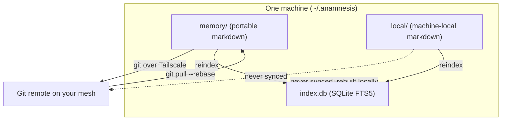
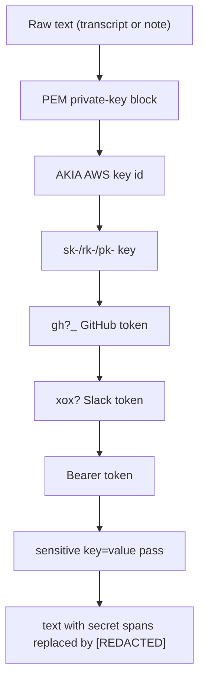
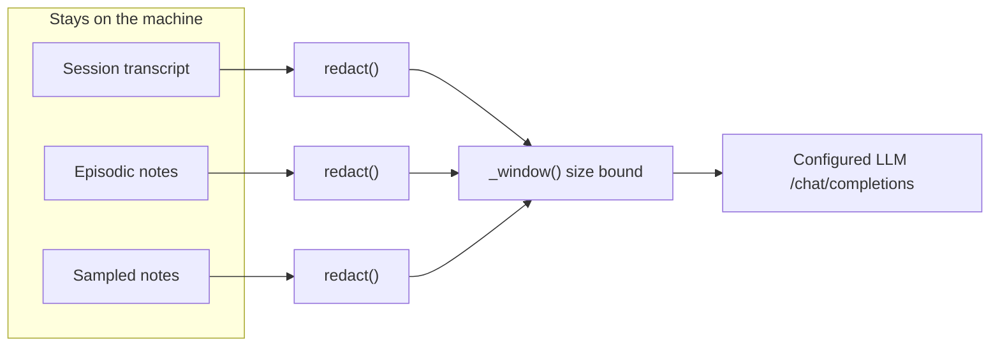
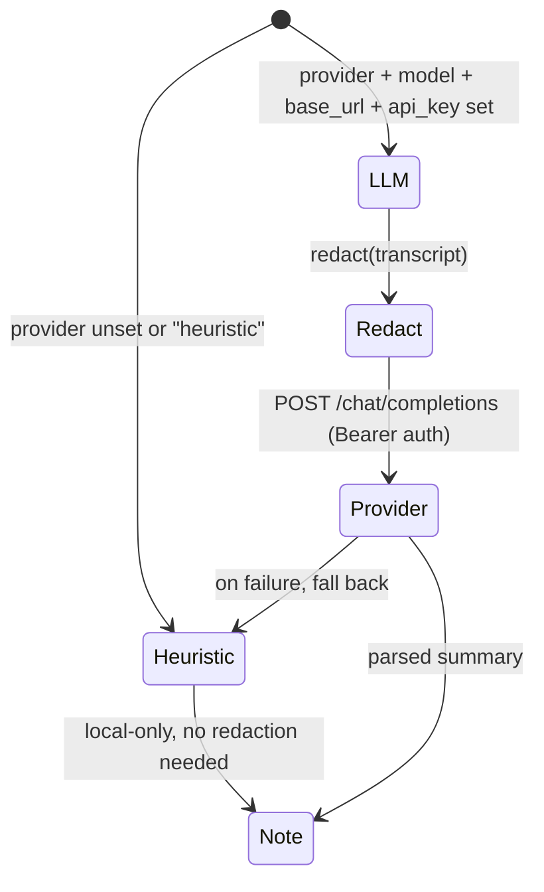

Anamnesis is a local-first memory layer. Your memory lives as plain markdown files on disk, the search index is a local SQLite database, and sync moves files between your own machines over your own network. The two places where data can leave a machine are (1) the optional reflection provider you point it at, and (2) the git remote you sync to. This page documents both precisely: what is filtered, what is sent, what is stored where, and what each protection does and does not cover.

## The short version

- Memory is markdown files in `~/.anamnesis/memory/` (portable) and `~/.anamnesis/local/` (machine-local). The SQLite index is `~/.anamnesis/index.db`.
- A conservative, deterministic redaction pass strips secret-shaped spans before any transcript or note text is sent to an LLM. It runs in capture summarization, reflection, and eval candidate generation.
- Only portable markdown under `memory/` syncs (via git). Machine-local notes under `local/` and the `index.db` file never leave the machine.
- The default summarizer is the heuristic, which is fully local and contacts no network. Redaction only matters once you configure an LLM provider.
- The git repository is public; the project's private documents are git-ignored and never pushed. This is an open-source (Apache-2.0) tool, so you control every endpoint it talks to.

<Callout type="warn">
Redaction is a best-effort secret filter, not a guarantee. It catches a fixed set of secret shapes (private keys, common API key prefixes, vendor tokens, Bearer tokens, and sensitive `key=value` pairs). A novel credential format that does not match those patterns can pass through to whatever LLM provider you have configured. Treat the reflection provider as a trusted third party, and prefer a provider whose data handling you accept.
</Callout>

## Where data lives

The store root defaults to `~/.anamnesis`. Three things live under it, and each has a different trust and sync posture. The relevant code is `MemoryStore.__init__` in `server/src/anamnesis/store.py`.

```text
~/.anamnesis/
  memory/            # SOURCE OF TRUTH, portable. A git repo. Syncs across machines.
    <type>/<id>.md
  local/             # SOURCE OF TRUTH, machine-local. NEVER synced. Outside the git repo.
    <type>/<id>.md
  index.db           # DERIVED. SQLite (WAL + FTS5). NEVER synced. Rebuilt locally.
```



A note's scope is determined by which tree it lives in, and that mapping is authoritative. In `MemoryStore.reindex` the indexer walks `memory/` as `portable` and `local/` as `machine-local`, overwriting whatever the front matter claimed:

```python
for base, scope in ((self.memory_dir, "portable"), (self.local_dir, "machine-local")):
    for path in sorted(base.rglob("*.md")):
        mem = _deserialize(path.read_text(encoding="utf-8"))
        mem.scope = scope
        ...
```

`MemoryStore._dir_for_scope` writes a note to `local/` if its scope is `machine-local`, otherwise to `memory/`. So a note marked `scope: machine-local` is physically placed outside the synced git tree and cannot be pushed.

## What syncs and what never leaves

| Data | Location | Syncs across machines? | Notes |
| --- | --- | --- | --- |
| Portable notes | `~/.anamnesis/memory/` | Yes, via git | The source of truth that moves between machines. |
| Machine-local notes | `~/.anamnesis/local/` | No | Lives outside the git repo. Never pushed. |
| Search index | `~/.anamnesis/index.db` | No | Derived from markdown, rebuilt locally on each machine. |
| Reflection config | Environment variables / config | No | Provider URL, model, and API key are machine-local and never written into notes. |

Two design rules enforce this:

1. **Never sync the raw DB file.** The index is fully derived and is rebuilt locally with `MemoryStore.reindex`. `sync.py` syncs the `memory/` directory only and explicitly leaves the index out, with the rationale recorded in its module docstring: the SQLite index "is never synced: it lives outside `memory/` and is rebuilt locally, per the claude-brain corruption lesson." The repo `.gitignore` also blocks `*.db`, `*.sqlite`, `*-wal`, and `*-shm` so a stray copy cannot be committed.
2. **Machine-local notes stay out of the synced tree.** They are written to `local/`, which is not part of the git repo that `sync.py` operates on, so `git add -A` inside `memory/` never sees them.

<Callout type="info">
Putting a note in `local/` is the mechanism for "this should never leave this machine." Anything you do not want on your other machines (or on the git remote) should be a machine-local note. Portable notes will be pushed to your remote the next time you sync.
</Callout>

## How sync moves data

Sync is git over your Tailscale mesh. `GitSyncBackend.sync` in `server/src/anamnesis/sync.py` runs an ordinary commit, then `git fetch origin`, `git rebase origin/main`, then `git push -u origin main` (the branch constant `_BRANCH` is `"main"`). Commits are authored as `anamnesis` with an email of `anamnesis@<machine_id>`, set per-invocation through `GIT_AUTHOR_*` / `GIT_COMMITTER_*` env vars, so the machine that produced each note is recorded in history.

The remote is whatever git URL you configure (a bare repo on an always-on node, or another machine directly). Anamnesis does not host anything and does not phone home for sync; the data only travels to the remote you point it at, over the network you put it on. There is no cloud service in this path.

```mermaid
sequenceDiagram
  participant L as Local memory/ (git)
  participant R as Your git remote
  L->>L: git add -A; commit if dirty
  L->>R: git fetch origin
  R-->>L: origin/main
  L->>L: git rebase origin/main
  alt rebase conflicts
    L->>L: git rebase --abort (keep local edits)
    Note over L: returns conflicted=True, does NOT push
  else clean
    L->>R: git push -u origin main
  end
```

On a rebase conflict the v0 policy is to abort, keep local edits in place, and return a `SyncResult` with `conflicted=True` and the detail `"conflict on rebase; kept local edits, did not push - resolve and re-sync"`. It never silently drops or pushes over a conflict.

## Redaction: the secret filter before anything reaches an LLM

All redaction lives in `server/src/anamnesis/redact.py`. It is a pure, deterministic function, `redact(text) -> str`, that replaces secret-shaped spans with the literal token `[REDACTED]`. It is unit-tested with synthetic secrets only (`server/tests/test_redact.py`). It keeps ordinary prose and structure intact; it only rewrites spans that match one of its patterns.

### What it strips

`redact()` first applies an ordered list of regex patterns (`_PATTERNS`), then a final `key=value` pass (`_KV`). The patterns, in execution order:

| What it catches | Pattern (real regex from `redact.py`) | Notes |
| --- | --- | --- |
| Private-key blocks (PEM) | `-----BEGIN [A-Z ]*PRIVATE KEY-----.*?-----END [A-Z ]*PRIVATE KEY-----` (DOTALL) | Multi-line; runs first so the whole block is masked as one span. Matches RSA, EC, OPENSSH, and plain `PRIVATE KEY` headers. |
| AWS access key IDs | `\bAKIA[0-9A-Z]{16}\b` | The `AKIA` prefix plus 16 uppercase alphanumeric chars. |
| `sk-` / `rk-` / `pk-` keys | `\b(?:sk\|rk\|pk)-[A-Za-z0-9]{12,}\b` | Covers OpenAI-style `sk-`, restricted `rk-`, and publishable `pk-` keys; needs at least 12 trailing chars. |
| GitHub tokens | `\bgh[posru]_[A-Za-z0-9]{20,}\b` | `gho_`, `ghp_`, `ghs_`, `ghr_`, `ghu_` token prefixes with 20+ trailing chars. |
| Slack tokens | `\bxox[baprs]-[A-Za-z0-9-]{10,}\b` | `xoxb-`, `xoxa-`, `xoxp-`, `xoxr-`, `xoxs-` bot/app/user tokens. |
| Bearer tokens | `(?i)\bBearer\s+[A-Za-z0-9._\-]{12,}` | Case-insensitive `Bearer` followed by a 12+ char token. |

After those, the `_KV` pattern masks sensitive `key=value` and `"key": "value"` pairs while preserving the key name so the text still reads sensibly. It is case-insensitive and matches these key names (optionally as the trailing segment of a longer name, so `DEEPSEEK_API_KEY` matches via the optional prefix group):

`password`, `passwd`, `secret`, `token`, `api_key` / `api-key` / `apikey`, `authorization`, `access_key` / `access-key`, `client_secret` / `client-secret`.

The value can be quoted (single or double) or bare up to the next whitespace, comma, `}`, or `)`. The replacement keeps the original key, separator, and any surrounding quotes, and substitutes `[REDACTED]` for the value. For example, `api_key="sk-abc123..."` becomes `api_key="[REDACTED]"`.



### What it does not catch

This is a fixed-pattern allowlist of known secret shapes, not a general entropy or PII detector. It does **not** redact:

- Secrets in formats it does not recognize (for example a custom token that is not Bearer-prefixed and is not under a sensitive key name).
- Personal data, file paths, internal URLs, hostnames, names, or business content. These are ordinary prose to the filter and pass through.
- Anything outside the three LLM call sites below. Redaction is not applied to notes at rest, to sync, or to the dashboard. Notes are stored and synced verbatim.

<Callout type="error">
Do not rely on redaction to make it safe to paste secrets into Claude Code. It reduces accidental leakage of common credential shapes to your reflection provider; it is not a sanitizer for the markdown you keep or sync. If a secret lands in a note, it stays in that note (and will sync if the note is portable) until you remove it.
</Callout>

### Where redaction is applied

`redact()` is called at exactly three points. In each, the text is redacted first and the redacted result is then size-bounded by `_window(...)` before it is handed to the LLM client (the call is `_window(redact(...), max_chars)`, so redaction runs on the full input, not just the windowed slice):

1. **Capture summarization** (`server/src/anamnesis/llm_summarizer.py`, `LLMSummarizer.summarize`): `content = _window(redact(transcript), self.max_chars)`. The full session transcript is redacted before it is sent to summarize a session into an episodic note.
2. **Reflection** (`server/src/anamnesis/reflect.py`, `Reflector.reflect`): `content = _window(redact(_render_episodics(episodics)), self.max_chars)`. The concatenated episodic notes are redacted before being distilled into durable semantic/procedural notes.
3. **Eval candidate generation** (`server/src/anamnesis/eval.py`, `build_eval_candidates`): `content = _window(redact(f"# {note.title}\n{note.body}"), max_chars)`. Each sampled note is redacted before the LLM generates a paraphrase query for the recall eval.



<Callout type="info">
The system prompts in all three pipelines also instruct the model to never echo secrets, API keys, tokens, or credentials in its output. That is a second, softer layer; the deterministic `redact()` on the input is the enforcement point.
</Callout>

### The default path sends nothing to an LLM

Redaction only matters once you opt into an LLM provider. The default summarizer is the deterministic `HeuristicSummarizer` (`server/src/anamnesis/capture.py`), selected when `ANAMNESIS_REFLECTION_PROVIDER` is unset or `heuristic`. It builds the episodic note from extracted facts (the first prompt, branch, files touched, last outcome) entirely in process and contacts no network. It does not call `redact()` because nothing leaves the machine to redact.

You switch to an LLM by setting the provider plus a model, base URL, and API key (see [Configuration](./configuration)). When configured, `_http_client` in `llm_summarizer.py` POSTs the redacted, size-bounded text to `<base_url>/chat/completions` with an `Authorization: Bearer <api_key>` header. The provider, model, and URL come entirely from your config; nothing about any provider is hardcoded, and that endpoint is the only network destination in the reflection path. If the LLM call fails or returns an unparseable response, capture falls back to the heuristic so session teardown never breaks.



<Callout type="warn">
The reflection config (provider, base URL, model, and especially the API key) is read from machine-local environment variables and is never written into a note or synced. Keep those values out of files that live under `memory/`. The `.gitignore` already blocks `.env`, `*.pem`, `*.key`, and `secrets.*` in the repo, but your store root is separate, so do not commit or sync credentials there either.
</Callout>

## The public-repo, private-strategy boundary

The Anamnesis repository at [github.com/oscardvs/anamnesis](https://github.com/oscardvs/anamnesis) is public and the local-first core is Apache-2.0. The project's `.gitignore` and `CLAUDE.md` draw a hard line between public code and private material: roadmap, research, business case, and any personal-data handling code are git-ignored and never pushed. The ignore rules cover `/docs/`, `/private/`, any nested `**/private/`, `*.private.md`, and `NOTES.local.md`.

For you as a user, the relevant guarantee is simpler and is a property of the architecture, not a policy: because Anamnesis is open source and local-first, there is no Anamnesis-operated server in the loop. The only places your data goes are endpoints you choose:

- The **git remote** you configure for sync (your own machine or node on your own mesh).
- The **LLM provider** you configure for summarization and reflection (and only after redaction).

If you set neither, nothing leaves the machine at all: capture uses the heuristic, and with no remote configured `sync()` returns `"committed locally; no remote configured"` after committing to the local git repo.

## Verifying the protections yourself

Because everything is local files and an open codebase, you can audit each claim directly.

```bash
# See what is in the synced (portable) tree vs the machine-local tree:
ls -R ~/.anamnesis/memory
ls -R ~/.anamnesis/local

# Confirm the index is not in the git repo and is ignored:
git -C ~/.anamnesis/memory status --porcelain
git -C ~/.anamnesis/memory ls-files | grep -c 'index.db'   # expect 0

# Inspect what the redaction filter actually does, against the source:
python -c "from anamnesis.redact import redact; print(redact('api_key=sk-ABCDEFGHIJKL token: ghp_0123456789ABCDEFGHIJ'))"

# Read the redaction patterns and the redact() function itself:
sed -n '13,49p' server/src/anamnesis/redact.py
```

<Callout type="info">
The `python -c` snippet above needs the `anamnesis` package importable (run it from an environment where you installed the server, for example `uv pip install -e ".[mcp,dev]"` inside `server/`). A one-line `uv tool install` from PyPI is planned but not yet published, so install from source for now.
</Callout>

## Threat model summary

| Concern | Covered? | How |
| --- | --- | --- |
| Common secret shapes reaching the LLM provider | Mostly | `redact()` on transcript, episodics, and eval notes before the only network POST. |
| Novel/unknown secret formats reaching the LLM provider | No | Fixed pattern set; unrecognized shapes pass through. |
| Personal/business content reaching the LLM provider | No | Treated as prose; use the heuristic provider to send nothing. |
| Machine-local notes leaving the machine | Yes | Stored in `local/`, outside the synced git repo. |
| The SQLite index leaking or corrupting via sync | Yes | Never synced; derived and rebuilt locally; ignored by git. |
| Data going to a vendor you did not choose | Yes | No project-operated server; only your git remote and your configured LLM endpoint. |
| Credentials ending up in committed notes | Partly | Reflection config is env-only and never written to notes; but a secret you put in a note yourself stays and syncs if portable. |

## Related

- [Configuration](./configuration) - the environment variables that pick a provider, model, base URL, and API key.
- [Sync internals](../internals/sync) - how the git-over-Tailscale backend commits, rebases, and handles conflicts.
- [Reflection](../internals/reflection) - the distillation pass that consumes episodic notes.
- [Data model](../internals/data-model) - note types, scope, and provenance fields.
